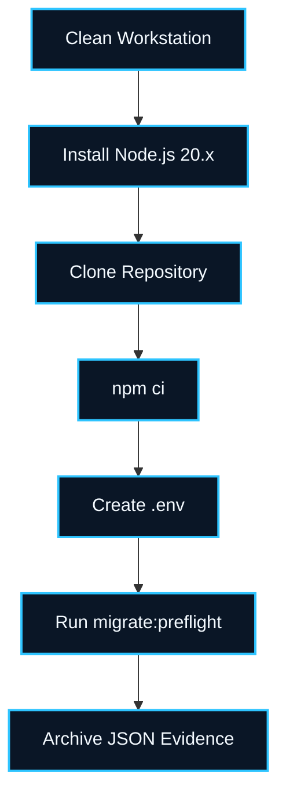
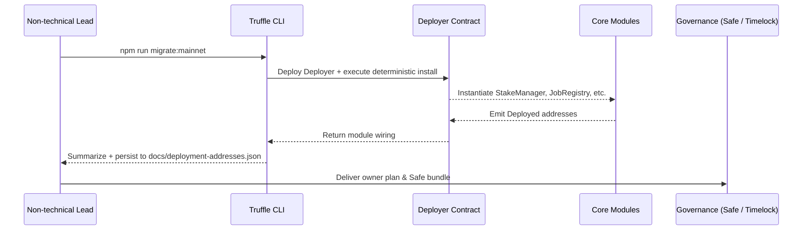

# AGIJobs v0 Institutional Mainnet Deployment – Non-Technical Playbook

> **Audience:** Non-technical launch coordinators trusted with taking AGIJobs v0 to Ethereum Mainnet using Truffle. This guide distills the engineering playbooks into a sequential, checklist-driven recipe with built-in validation, diagrams, and references to the exact scripts you must run. Follow every step in order; never skip a validation gate.

## 1. Mission Timeline at a Glance

```mermaid
gantt
    dateFormat  HH:mm
    axisFormat  %H:%M
    section Preparation
    Secure workstation ready           :done,    prep1, 00:00, 00:05
    Secrets + config review            :crit,    prep2, 00:05, 00:25
    Automated preflight                :active,  prep3, 00:25, 00:40
    section Launch Execution
    Dry-run fork rehearsal             :         exec1, 00:40, 01:10
    Mainnet migration (Truffle)        :crit,    exec2, 01:10, 01:25
    Post-flight verification           :milestone, exec3, 01:25, 01:40
    section Governance Handover
    Owner control plan archive         :         gov1, 01:40, 02:00
    Safe / Timelock execution review   :         gov2, 02:00, 02:20
```



The Gantt timeline assumes a single focused session. Build extra contingency time for auditing and stakeholder sign-off.

## 2. Zero-Trust Preparation



1. **Hardware security:** use a dedicated, access-controlled machine. Disable clipboard syncing and auto updates during the launch window.
2. **Install prerequisites:**
   - Node.js ≥ 20.12.0 (`node -v`).
   - Git (`git --version`).
   - Latest Truffle CLI (`npx truffle version`).
3. **Clone the repository:** `git clone https://github.com/MontrealAI/AGIJobsv0.git`.
4. **Install dependencies:**
   ```bash
   cd AGIJobsv0
   npm ci
   ```
5. **Create `.env` securely:**
   ```ini
   MAINNET_PRIVATE_KEY=0xYOUR_HARDWARE_WALLET_EXPORT
   MAINNET_RPC_URL=https://mainnet.infura.io/v3/YOUR_PROJECT_ID
   ETHERSCAN_API_KEY=your_etherscan_api_key
   GOVERNANCE_ADDRESS=0xYourTimelockOrSafe
   WIRE_VERIFY_RPC_URL=https://mainnet.infura.io/v3/YOUR_PROJECT_ID
   ```
   Store `.env` in an encrypted vault; never commit it.
6. **Synchronize configuration files:** review and update if necessary:
   - `config/agialpha.mainnet.json`
   - `config/fee-pool.json`
   - `config/job-registry.json`
   - `config/platform-registry.json`
   - `config/tax-policy.json`
   - `deployment-config/mainnet.json`
   - `docs/deployment-addresses.json` (keep empty until after launch)
7. **Run the deterministic preflight:**
   ```bash
   npm run migrate:preflight -- --network mainnet --json > preflight.mainnet.json
   ```
   Treat any ❌ as a launch blocker. Archive the generated JSON evidence.

## 3. Fork Rehearsal (Mandatory)

1. **Start a Mainnet fork:**
   ```bash
   npx hardhat node --fork $MAINNET_RPC_URL --no-deploy &
   sleep 5
   ```
2. **Execute the full Truffle migration against the fork:**
   ```bash
   TRUFFLE_NETWORK=mainnet \
   MAINNET_RPC_URL=http://127.0.0.1:8545 \
   MAINNET_PRIVATE_KEY=0xYOUR_LOCAL_TEST_KEY \
   npm run migrate:mainnet
   ```
3. **Verify wiring and governance locally:**
   ```bash
   npm run wire:verify
   npm run owner:dashboard -- --config-network mainnet --json > fork-dashboard.json
   npm run owner:health
   ```
4. **Practice owner updates:** run the wizard end-to-end in rehearsal mode to understand prompts.
   ```bash
   npm run owner:wizard -- --network mainnet --dry-run
   ```
5. **Document findings:** file and store `fork-dashboard.json`, CLI output logs, and screenshots for sign-off.

## 4. Production Deployment Sequence



1. **Final health check:** rerun `npm run migrate:preflight -- --network mainnet`. Proceed only on a clean pass.
2. **Compile with the production constants:**
   ```bash
   npm run compile:mainnet
   ```
3. **Run the mainnet migration (single command):**
   ```bash
   npm run migrate:mainnet
   ```
   This sequentially executes:
   - `migrations/1_initial_migration.js`
   - `migrations/2_deploy_protocol.js`
   - `migrations/3_wire_protocol.js`
   - `migrations/4_configure_ens.js`
   - `migrations/5_transfer_ownership.js`
4. **Capture module addresses:** the migration auto-updates `docs/deployment-addresses.json`. Review, then duplicate the file for offline storage.
5. **Run post-deploy verification commands on mainnet:**
   ```bash
   npm run wire:verify
   npm run owner:dashboard -- --config-network mainnet --json > mainnet-dashboard.json
   npm run owner:health
   ```
6. **Archive artifacts:** save `preflight.mainnet.json`, `mainnet-dashboard.json`, migration logs, and the raw CLI output to an immutable storage solution (Safe attachments or encrypted vault).

## 5. Owner Control – Full Parameter Authority

The protocol grants the governance timelock (or Safe) complete authority to adjust economic knobs, module wiring, and emergency controls. Use the following scripts to plan and execute updates safely:

| Purpose | Command | Notes |
| ------- | ------- | ----- |
| Snapshot live configuration | `npm run owner:dashboard -- --config-network mainnet --json > owner-snapshot.json` | Produces machine-readable inventory of every module, treasury, and threshold. |
| Guided parameter changes | `npm run owner:wizard -- --network mainnet` | Interactive prompts cover fees, burn %, staking thresholds, ENS registries, platform registry metadata, and more. |
| Governance plan generation | `npm run owner:plan -- --network mainnet --json --out owner-plan.mainnet.json` | Generates an ordered transaction list; safe to review offline. |
| Safe transaction bundle | `npm run owner:plan:safe` | Produces `owner-safe-bundle.json` for upload to the Safe Transaction Service. |
| Direct script control | `npx hardhat run scripts/v2/updatePlatformRegistry.ts --network mainnet` (example) | All module updaters live under `scripts/v2/`. Each script validates inputs before broadcasting. |
| SystemPause wiring & emergency readiness | `npx hardhat run scripts/v2/updateSystemPause.ts --network mainnet --execute` | Re-syncs module ownership/pauser roles so the owner can call `pauseAll`/`unpauseAll` through the governance timelock or Safe. |

**Verification discipline:** After executing any owner action, rerun `npm run owner:dashboard` and store the JSON diff.

## 6. Non-Technical Monitoring & Alerts

1. **Subscribe to CI:** ensure GitHub Actions `CI` workflow remains green. The workflow automatically performs linting, unit tests, coverage enforcement, `wire:verify`, `owner:health`, Slither, and Echidna smoke testing.
2. **Set up block explorers:** add every module address from `docs/deployment-addresses.json` to an Etherscan watchlist.
3. **Logbook:** maintain a deployment log capturing timestamps, command outputs, and sign-offs from governance and security stakeholders.

## 7. Institutional Sign-off Checklist

- [ ] Preflight JSON stored and reviewed by security.
- [ ] Dry-run fork artifacts archived.
- [ ] Mainnet migration console output stored in immutable form.
- [ ] `docs/deployment-addresses.json` verified and duplicated offline.
- [ ] Owner control plan (`owner-plan.mainnet.json`) and Safe bundle stored in governance vault.
- [ ] Post-deploy `owner:health` passes without warnings.
- [ ] Governance (Safe / Timelock) sign-off captured with signatures.

## 8. Rapid Reference Card

```text
npm ci
npm run migrate:preflight -- --network mainnet --json > preflight.mainnet.json
npx hardhat node --fork $MAINNET_RPC_URL --no-deploy &
TRUFFLE_NETWORK=mainnet MAINNET_RPC_URL=http://127.0.0.1:8545 npm run migrate:mainnet
npm run wire:verify
npm run owner:dashboard -- --config-network mainnet --json > mainnet-dashboard.json
npm run owner:plan:safe
```

Tape this quick card next to your workstation. When in doubt, re-run the dashboard and consult the engineering team before approving any on-chain change.

