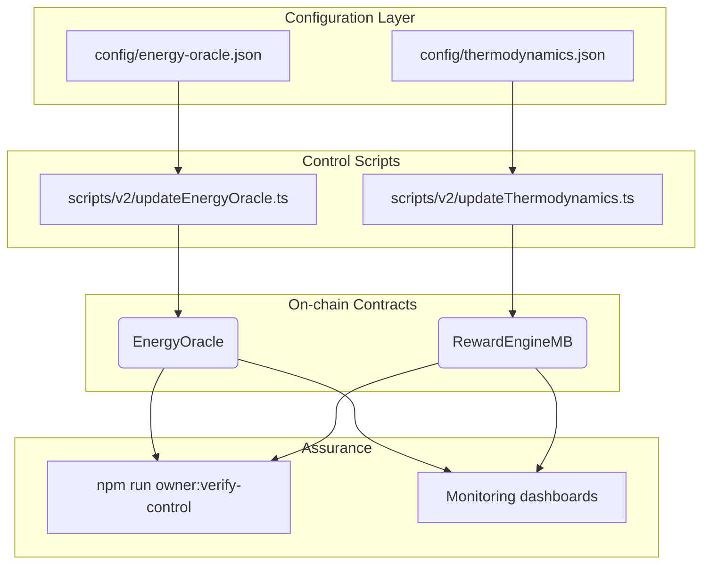
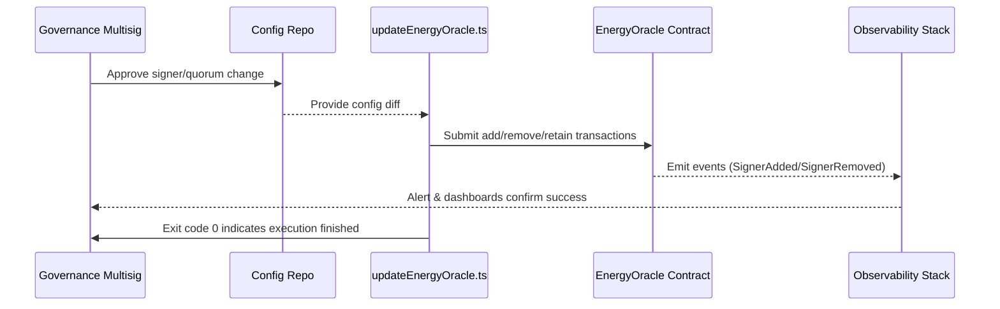

# Energy Oracle Operations Guide

The Energy Oracle secures the thermodynamic reward engine by attesting to task
energy, entropy and timestamp data. This guide equips owners and operators with
precise, audit-ready procedures for onboarding or retiring signers, rotating
quorum thresholds and validating end-to-end observability.



## Key responsibilities

| Persona | Primary focus | Tooling |
| ------- | ------------- | ------- |
| Governance owner | Approves signer changes and quorum policy. | `npm run owner:update-all`, Gnosis Safe or timelock |
| Operations engineer | Executes helper scripts, validates configs, monitors telemetry. | `npx hardhat`, `npm run owner:verify-control` |
| Auditor / compliance | Verifies signer provenance and stores evidence. | Parameter matrix reports, monitoring exports |

## Configuration reference

`config/energy-oracle.json` contains per-network signer configuration and quorum
targets. A typical structure:

```jsonc
{
  "signers": [
    {
      "address": "0xabc...",
      "label": "North America",
      "pgpFingerprint": "1A2B3C...",
      "endpoint": "https://oracle-na.example.com/attest"
    },
    {
      "address": "0xdef...",
      "label": "EU",
      "pgpFingerprint": "4D5E6F...",
      "endpoint": "https://oracle-eu.example.com/attest"
    }
  ],
  "quorum": 2,
  "retainUnknown": true,
  "threshold": {
    "entropyMax": "900000000000000000",
    "latencyToleranceMs": 8000
  }
}
```

- **`signers`** – Authorised addresses. Labels & metadata help auditors trace
  real-world operators.
- **`quorum`** – Minimum signer count required per energy attestation.
- **`retainUnknown`** – When `true`, existing on-chain signers not listed in the
  configuration remain whitelisted (useful during gradual rotation).
- **`threshold`** – Optional guard-rails for entropy variance and reporting
  latency.

Network-specific overrides live in `config/networks/<network>/energy-oracle.json`.
The loader merges overrides automatically when you supply `--network`.

## End-to-end workflow

1. **Pre-change assessment**
   - Run `npm run owner:surface -- --network <network> --only=rewardEngine` to
     capture the live signer list and quorum.
   - Perform due diligence on new signers (legal agreements, infrastructure
     review, PGP fingerprint verification).

2. **Edit configuration**
   - Update the JSON file(s) with the desired signer set and quorum.
   - Use descriptive `label` values so the parameter matrix output is readable.
   - Commit the changes for peer review.

3. **Dry run the helper**
   - Execute:
     ```bash
     npx hardhat run scripts/v2/updateEnergyOracle.ts --network <network>
     ```
   - The script prints a diff table showing additions, removals and retained
     signers. Ensure the planned transactions match the approved governance
     intent.

4. **Execute on-chain**
   - Re-run the helper with `--execute` from the authorised governance signer or
     through the Gnosis Safe transaction bundle:
     ```bash
     npx hardhat run scripts/v2/updateEnergyOracle.ts --network <network> --execute
     ```
   - Record transaction hashes for the governance log.

5. **Update dependent thermodynamics**
   - If quorum or signer latency affects reward smoothing, tune
     `config/thermodynamics.json` accordingly and run
     `npx hardhat run scripts/v2/updateThermodynamics.ts --network <network> [--execute]`.

6. **Verification**
   - Run `npm run owner:verify-control -- --network <network> --modules=rewardEngine`
     to ensure the on-chain configuration matches the JSON.
   - Generate a fresh parameter matrix report for auditors:
     ```bash
     npm run owner:parameters -- --network <network> --out reports/<network>/energy-oracle-matrix.md
     ```
   - Export monitoring snapshots (latency histograms, signer uptime) for
     compliance archives.

7. **Operational monitoring**
   - Confirm each signer emits heartbeats and attestation telemetry. Update the
     runbooks in `docs/operator-telemetry.md` if thresholds change.
   - Configure alerts for signer downtime or quorum failure. Suggested metrics:
     - Attestations per minute per signer
     - Percentage of tasks meeting the entropy threshold
     - RPC latency to each signer endpoint

## Governance sequence diagram



## Safety checklist

- [ ] Governance approval recorded with signer legal names + wallets.
- [ ] Dry-run output archived before execution.
- [ ] Transactions executed from authorised key / Safe.
- [ ] Post-change verification (`owner:verify-control`) stored with logs.
- [ ] Monitoring alerts re-armed after signer rotation.

## Incident response quick actions

| Issue | Impact | Immediate action | Follow-up |
| ----- | ------ | ---------------- | --------- |
| Signer goes offline | Reduced redundancy; quorum may fail. | Toggle `retainUnknown` to true and redeploy config to keep backup signers. | Engage operator, capture RCA, update telemetry doc. |
| Incorrect signer added | Potentially malicious attestations. | Execute helper with corrected config to remove signer; trigger emergency pause if suspicious activity detected. | Review approval process; update due diligence checklist. |
| Quorum too high | Attestations stall, rewards halt. | Lower `quorum` in config and redeploy; ensure governance sign-off. | Update governance documentation to reflect new risk model. |

## Reference links

- [docs/owner-control-command-center.md](owner-control-command-center.md)
- [docs/owner-parameter-matrix.md](owner-parameter-matrix.md)
- [docs/thermodynamics-operations.md](thermodynamics-operations.md)
- [docs/operator-telemetry.md](operator-telemetry.md)
- [docs/reward-settlement-process.md](reward-settlement-process.md)

With this guide, the contract owner retains full control over the Energy Oracle
while ensuring every signer change is deliberate, transparent, and verifiable by
non-technical stakeholders.
