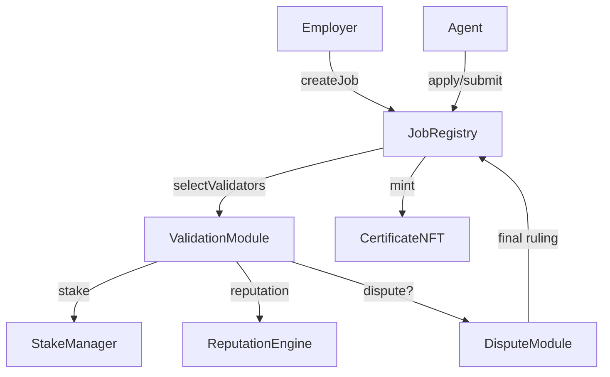

# Etherscan Interaction Guide

## Quick Links
- AGIJobManager v0: [Etherscan](https://etherscan.io/address/0x0178b6bad606aaf908f72135b8ec32fc1d5ba477#code) | [Blockscout](https://blockscout.com/eth/mainnet/address/0x0178b6bad606aaf908f72135b8ec32fc1d5ba477/contracts)
- $AGI Token: [Etherscan](https://etherscan.io/address/0xf0780F43b86c13B3d0681B1Cf6DaeB1499e7f14D#code) | [Blockscout](https://eth.blockscout.com/address/0xf0780F43b86c13B3d0681B1Cf6DaeB1499e7f14D?tab=contract)

> **Tax Note:** The contracts and their owner are globally tax‑exempt; employers, agents, and validators shoulder all tax duties. Each module exposes `isTaxExempt()` for verification.

## Module Addresses & Roles
| Module | Address | Role |
| --- | --- | --- |
| JobRegistry | *TBD* | Posts jobs, escrows payouts, tracks lifecycle |
| ValidationModule | *TBD* | Selects validators and runs commit‑reveal voting |
| StakeManager | *TBD* | Custodies collateral and executes slashing |
| ReputationEngine | *TBD* | Updates reputation scores and applies penalties |
| DisputeModule | *TBD* | Handles appeals and renders final rulings |
| CertificateNFT | *TBD* | Mints ERC‑721 certificates for completed jobs |
| TaxPolicy | *TBD* | Stores tax disclaimer URI and acknowledgement helper |

> Addresses will be published after deployment. Always verify each on multiple explorers before interacting.

## Module Diagram

## Role-based Instructions

Before performing any on-chain action, employers, agents, and validators must call `JobRegistry.acknowledgeTaxPolicy` and verify `isTaxExempt()`—all taxes fall on participants while the contracts and owner remain globally exempt.

### Employers
1. Open the `JobRegistry` address on Etherscan.
2. In **Write Contract**, connect an employer wallet and execute **acknowledgeTaxPolicy**.
3. In **Read Contract**, confirm **isTaxExempt()** returns `true`.
4. Call **createJob** with job parameters and escrowed token amount.
5. Monitor **JobCreated** events to confirm posting.

### Agents
1. On `JobRegistry`, execute **acknowledgeTaxPolicy** and verify **isTaxExempt()**.
2. Open `StakeManager`; in **Read Contract** confirm **isTaxExempt()**, then stake with **depositStake(0, amount)** (role `0` = Agent).
3. Use **applyForJob** and **completeJob** as needed.
4. Call **requestJobCompletion** when work is ready for validation.

### Validators
1. On `JobRegistry`, execute **acknowledgeTaxPolicy** and verify **isTaxExempt()**.
2. Stake required AGI via **StakeManager.depositStake(1, amount)** after confirming **StakeManager.isTaxExempt()**.
3. During validation, open `ValidationModule`, confirm **isTaxExempt()**, and send hashed votes with **commitValidation(jobId, commitHash)**.
4. Reveal decisions using **revealValidation(jobId, approve, salt)** before the window closes.

### Tax Policy
The `TaxPolicy` contract is informational only: it never holds funds and imposes no tax liability on the infrastructure or its owner. The contracts and owner are globally tax‑exempt while employers, agents, and validators shoulder all tax duties and must acknowledge the policy before staking, voting, or appealing.

**Etherscan steps**

1. Open the `JobRegistry` address in Etherscan.
2. Under **Read Contract**, call **taxPolicyDetails** to fetch the current disclaimer text and canonical URI.
3. Switch to **Write Contract** and execute **acknowledgeTaxPolicy** to record acceptance of the active policy.
4. Return to **Read Contract** and call **isTaxExempt** to confirm the contract's perpetual exemption and **taxAcknowledgedVersion(address)** to ensure you accepted the latest **taxPolicyVersion**.
5. Owners update the text or URI via **setPolicyURI**, **setAcknowledgement**, or **setPolicy** on `TaxPolicy`, then call **bumpTaxPolicyVersion** on `JobRegistry` to require fresh acknowledgements.

### Disputers
1. Ensure you've acknowledged the tax policy and confirmed **isTaxExempt()** on both `JobRegistry` and `DisputeModule`.
2. In `JobRegistry` **Write Contract**, call **dispute(jobId)** with the required `appealFee`; the registry forwards to `DisputeModule.appeal(jobId)`.
3. After the ruling, verify **DisputeResolved** in the `DisputeModule` and `JobRegistry` event logs.

## Parameter Glossary

| Parameter | Description |
| --- | --- |
| `commitWindow` | Seconds allowed for validators to submit hashed votes. |
| `revealWindow` | Seconds validators have to reveal votes. |
| `reviewWindow` | Delay before validation begins. |
| `resolveGracePeriod` | Buffer after reveal before anyone can resolve a stalled job. |
| `burnPercentage` | Portion of payout burned on job finalization (basis points). |
| `validationRewardPercentage` | Share of payout granted to correct validators. |
| `cancelRewardPercentage` | Share awarded to the caller when cancelling expired jobs. |

## Security Warnings
- Contracts are unaudited; interact at your own risk.
- Verify contract and token addresses on multiple explorers.
- Prefer hardware wallets for privileged actions.

## Governance Notes
- All modules are owned by a community multisig. Only the owner may call parameter‑setting functions.
- To update parameters, open the module's **Write** tab and submit the relevant setter transaction from the multisig.
- After each change, verify emitted events and new values on at least two block explorers.

## Verification Checklist
- [ ] Confirm addresses and bytecode match official releases.
- [ ] Cross-check transactions on at least two block explorers.
- [ ] Review parameter settings via read functions before calling write methods.
- [ ] Ensure the AGI token address `0xf0780F43b86c13B3d0681B1Cf6DaeB1499e7f14D` matches the token in your wallet.
