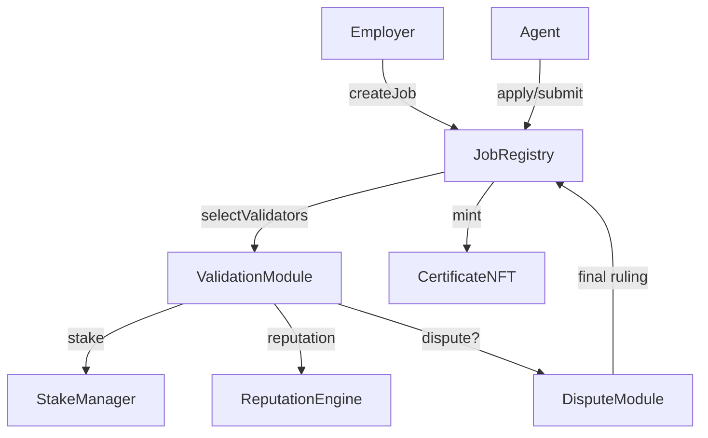

# Etherscan Interaction Guide

## Quick Links
- AGIJobManager v0: [Etherscan](https://etherscan.io/address/0x0178b6bad606aaf908f72135b8ec32fc1d5ba477#code) | [Blockscout](https://blockscout.com/eth/mainnet/address/0x0178b6bad606aaf908f72135b8ec32fc1d5ba477/contracts)
- $AGI Token: [Etherscan](https://etherscan.io/address/0xf0780F43b86c13B3d0681B1Cf6DaeB1499e7f14D#code) | [Blockscout](https://eth.blockscout.com/address/0xf0780F43b86c13B3d0681B1Cf6DaeB1499e7f14D?tab=contract)

## Module Diagram

## Role-based Instructions

### Employers
1. Open the AGIJobManager v0 address on Etherscan.
2. In **Write Contract**, connect an employer wallet.
3. Call **createJob** with job parameters and escrowed token amount.
4. Monitor **JobCreated** events to confirm posting.

### Agents
1. Visit the same contract address.
2. Under **Write Contract**, connect your agent wallet.
3. Use **applyForJob** and **submitWork** as needed.
4. Call **requestJobCompletion** when work is ready for validation.

### Validators
1. Navigate to the contract and connect a validator wallet.
2. Stake required AGI via **stake**.
3. During validation, send hashed votes with **commitVote**.
4. Reveal decisions using **revealVote** before the window closes.

### Moderators
1. Watch for **DisputeRaised** events on the `DisputeModule`.
2. In **Write Contract**, connect the moderator wallet.
3. Call **resolve(jobId, employerWins)** to finalize the dispute.
4. Verify the transaction emits **DisputeResolved** and the corresponding `JobRegistry` event.

## Parameter Glossary

| Parameter | Description |
| --- | --- |
| `commitWindow` | Seconds allowed for validators to submit hashed votes. |
| `revealWindow` | Seconds validators have to reveal votes. |
| `reviewWindow` | Delay before validation begins. |
| `resolveGracePeriod` | Buffer after reveal before anyone can resolve a stalled job. |
| `burnPercentage` | Portion of payout burned on job finalization (basis points). |
| `validationRewardPercentage` | Share of payout granted to correct validators. |
| `cancelRewardPercentage` | Share awarded to the caller when cancelling expired jobs. |

## Security Warnings
- Contracts are unaudited; interact at your own risk.
- Verify contract and token addresses on multiple explorers.
- Prefer hardware wallets for privileged actions.

## Verification Checklist
- [ ] Confirm addresses and bytecode match official releases.
- [ ] Cross-check transactions on at least two block explorers.
- [ ] Review parameter settings via read functions before calling write methods.
- [ ] Ensure the AGI token address `0xf0780F43b86c13B3d0681B1Cf6DaeB1499e7f14D` matches the token in your wallet.
