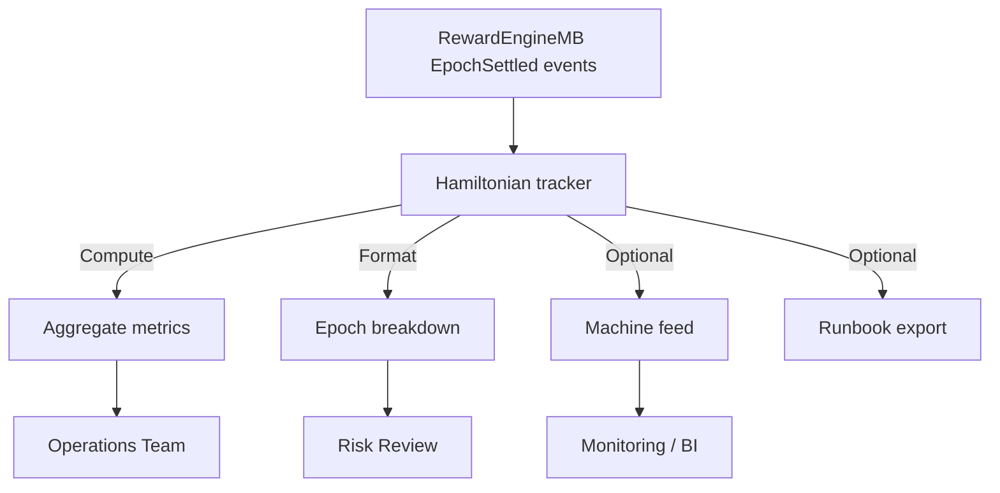
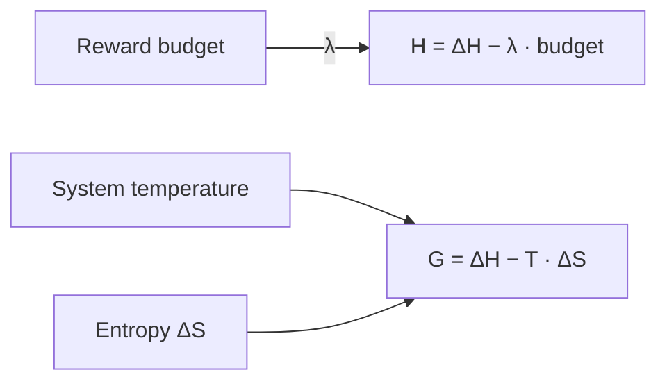

# Hamiltonian Monitor Operations Guide

> **Audience:** Protocol owners, risk officers, and operations engineers who need a
> production-ready view of the reward Hamiltonian without exporting raw logs
> manually.
>
> **Purpose:** Turn the `EpochSettled` events emitted by `RewardEngineMB` into a
> rich, auditable report—complete with Markdown tables, CSV exports, or JSON feeds
> that can plug directly into monitoring dashboards.

---

## 1. Quick start

```bash
# Display a human-readable console digest
npm run hamiltonian:report -- \
  --engine 0xRewardEngineAddress \
  --from 18_900_000 \
  --lambda 2

# Generate a Markdown playbook with timestamps for change-management
npm run hamiltonian:report -- \
  --engine 0xRewardEngineAddress \
  --format markdown \
  --timestamps \
  --out reports/mainnet/hamiltonian-$(date +%Y%m%d).md

# Produce a machine-readable JSON payload for dashboards
npm run hamiltonian:report -- \
  --engine 0xRewardEngineAddress \
  --format json \
  --limit 30 \
  --order desc \
  --out runtime/hamiltonian-latest.json
```

- **No RPC gymnastics.** The helper uses the active Hardhat network configuration
  (`--network` works as usual) and validates the engine address before querying.
- **Safe by default.** Every run starts in dry-report mode: no transactions are
  sent, and the tool refuses obviously malformed parameters.
- **One command, many formats.** Switch between human-readable, Markdown, CSV, or
  JSON outputs without duplicating logic.

---

## 2. Output anatomy



Each report contains three layers of insight:

1. **Metadata** – engine address, block range, λ (lambda) scaling factor, and the
   timestamp when the report was generated.
2. **Aggregate metrics** – total reward budget processed, average Hamiltonian
   value, and free-energy ranges to surface systemic drift.
3. **Per-epoch breakdown** – token-normalised budget, ΔH, ΔS, temperature, and
   derived Hamiltonian/free energy plus block, timestamp, and tx hash columns for
   forensic traceability.

---

## 3. CLI parameters

| Flag | Description | Default |
| ---- | ----------- | ------- |
| `--engine <address>` | **Required.** Address of the deployed `RewardEngineMB`. | – |
| `--from <block>` / `--to <block>` | Restrict the block range queried. | `0` → latest |
| `--lambda <int>` | Scaling factor applied to the reward budget in the Gibbs relation. | `1` |
| `--format <human\|markdown\|json\|csv>` | Output renderer. | `human` |
| `--out <file>` | Write the report to disk (directories are created automatically). | stdout |
| `--limit <n>` | Only include the latest `n` epochs after filtering. | All |
| `--order <asc\|desc>` | Sort chronological (`asc`) or reverse-chronological (`desc`). | `asc` |
| `--decimals <n>` | Token decimal precision for formatting budgets. | `18` |
| `--unit-label <symbol>` | Friendly token label in the report (e.g. `$AGIALPHA`). | `$AGIALPHA` |
| `--timestamps` | Fetch block timestamps and add ISO-8601 columns. | Disabled |
| `--help` | Print usage instructions. | – |

---

## 4. Example Markdown snippet

```markdown
# Hamiltonian Monitor Report

- **Engine:** `0x1234...beef`
- **λ (lambda):** `2`
- **Block range:** `18900000 → 18912345`
- **Events analysed:** `12`
- **Unit label:** `$AGIALPHA`
- **Epoch span:** `421 → 432`

## Aggregate metrics

- Total budget: **1,240.532 $AGIALPHA**
- Average budget: 103.377 $AGIALPHA
- Average H: `-182830008124530002`
- H range: `-311509913840000000 → -78210100312000000`
- Free energy range: `-255120001234500000 → -8812000112300000`



| Epoch | Budget ($AGIALPHA) | ΔH | ΔS | T | H | Free energy | Block | Timestamp | Tx hash |
| ---: | ---: | ---: | ---: | ---: | ---: | ---: | ---: | ---: | --- |
| 432 | 102.430 | 220000000000000000 | -95000000000000000 | 1100000000000000000 | -182830008124530002 | -12000000000000000 | 18912345 | 2024-03-12T18:42:02.000Z | `0xabcd…` |
| … | … | … | … | … | … | … | … | … | … |
```

Use the rendered table for stakeholder reviews or as an attachment to production
change records. CSV/JSON exports share the same data schema, making it trivial to
pipe into BI dashboards or risk analytics notebooks.

---

## 5. Operational checklist

1. **Snapshot** – Run `npm run hamiltonian:report -- --format markdown --timestamps`
   and archive the output under `reports/<network>/` alongside other owner
   artefacts.
2. **Compare** – Monitor the free-energy band over successive runs; sudden spikes
   indicate anomalous entropy measurements or temperature tuning drift.
3. **Escalate** – If `H` drifts outside the expected window, coordinate with the
   Thermostat operators and replay the reward settlement process to diagnose the
   root cause.
4. **Document** – Attach the Markdown or JSON output to your change ticket before
   adjusting thermodynamic parameters. The report makes governance reviews and
   audits trivial.

---

## 6. Troubleshooting

| Symptom | Likely cause | Remedy |
| ------- | ------------ | ------ |
| "Missing required --engine" | Address omitted. | Pass `--engine <reward_engine>` and ensure the network is configured. |
| "call exception" when querying | Engine address incorrect for the selected network. | Double-check `--network` and verify the contract on the target chain. |
| Empty report | No `EpochSettled` events in the block range. | Relax `--from/--to` bounds or remove `--limit`. |
| Timestamps column missing | `--timestamps` flag not set. | Re-run with `--timestamps`. |

---

With these upgrades the Hamiltonian tracker is production ready: it is scriptable,
mermaid-friendly, and designed so a non-technical owner can obtain a full physics
snapshot in under a minute.
