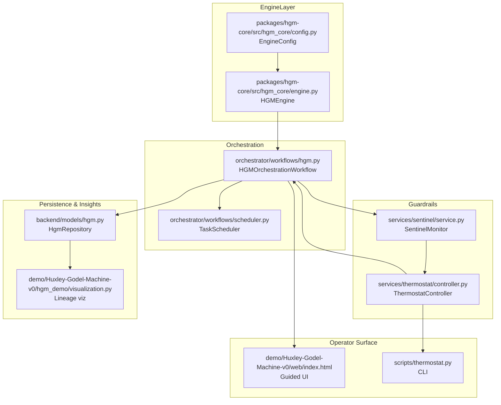

# Huxley–Gödel Machine (HGM) Operator Whitepaper

## Executive Summary
The Huxley–Gödel Machine (HGM) expands the AGIJobs marketplace by blending
hierarchical exploration with strict safety rails. The workflow coordinates the
[`HGMEngine`](../../packages/hgm-core/src/hgm_core/engine.py) with
asynchronous schedulers in [`orchestrator/workflows/hgm.py`](../../orchestrator/workflows/hgm.py),
while the [`SentinelMonitor`](../../services/sentinel/service.py) and
[`ThermostatController`](../../services/thermostat/controller.py) enforce
business guardrails. This whitepaper captures the theoretical foundations,
operational architecture, and day-one workflows required to launch HGM-backed
production circuits.

Key design principles:

- **Exploit structured exploration.** HGM’s Thompson-sampling inspired policy
  (see [`hgm_core/sampling.py`](../../packages/hgm-core/src/hgm_core/sampling.py))
  widens the agent tree while pruning unproductive branches.
- **Instrument everything.** Event hooks capture state lineage in
  [`backend/models/hgm.py`](../../backend/models/hgm.py) so operators can audit
  every exploration step.
- **Automate guardrails.** The sentinel and thermostat subsystems translate ROI
  feedback into deterministic throttles before costly work hits the chain.

## Theoretical Foundations
HGM bootstraps from a Bayesian prior and iteratively updates value estimates for
candidate agent branches. The loop mirrors Algorithm 1 in the reference demo
(`demo/Huxley-Godel-Machine-v0/src/hgm_v0_demo/engine.py`) and can be
characterised by three phases:

1. **Expansion.** New agents are spawned via
   `HGMEngine.ensure_node`, weighting exploration by `tau` and `epsilon`.
2. **Evaluation.** Agents submit metrics that are scored, aggregated, and
   persisted through [`HgmRepository`](../../backend/models/hgm.py).
3. **Selection.** The scheduler requests the next action through
   `HGMOrchestrationWorkflow.next_action`, balancing exploitation against
   uncertainty using the Thompson sampler.

Economic safety is embedded by computing culture-adjusted ROI metrics (see
[`demo/Huxley-Godel-Machine-v0/hgm_demo/metrics.py`](../../demo/Huxley-Godel-Machine-v0/hgm_demo/metrics.py)).
These scores feed both payout decisions and thermostat inputs, enabling
operators to treat agent utility as a measurable financial signal.

### Architecture Overview


The thermostat closes the loop between observed ROI, sentinel enforcement, and
concurrency control. The design permits modular upgrades: e.g., swapping
`SentinelMonitor` with a bespoke compliance module or extending the repository
schema via [`backend/migrations/hgm/migration_0001_initial.py`](../../backend/migrations/hgm/migration_0001_initial.py).

### Control Surfaces and Parameters
| Layer        | Key knobs                                                                 | Economic impact                                              |
|--------------|---------------------------------------------------------------------------|---------------------------------------------------------------|
| Engine       | `tau`, `alpha`, `epsilon`, `concurrency` in [`EngineConfig`](../../packages/hgm-core/src/hgm_core/config.py) | Sets exploration tempo and agent budget burn.                |
| Sentinel     | Policy file from [`config/sentinel.json`](../../config/sentinel.json) | Defines slashing thresholds and risk tolerances.             |
| Thermostat   | ROI bands in [`services/thermostat/controller.py`](../../services/thermostat/controller.py) | Adjusts concurrency based on payback period.                 |
| CI Guardrail | [`ci/hgm-suite.sh`](../../ci/hgm-suite.sh)                                | Enforces regression fidelity before release.                 |
| Config       | [`config/agialpha/hgm.json`](../../config/agialpha/hgm.json)              | Provides deployment-specific parameter overrides.            |

## Day-One Operator Walkthrough
Follow this path to stand up an HGM deployment in a fresh environment.

1. **Bootstrap dependencies.**
   ```bash
   pnpm install
   pip install -r requirements-python.txt
   ```
2. **Validate guardrails locally.** Run the consolidated CI suite used by
   `ci (v2) / HGM guardrails`:
   ```bash
   ci/hgm-suite.sh
   ```
   Consult [`docs/ci-v2-branch-protection-checklist.md`](../ci-v2-branch-protection-checklist.md)
   if any stage fails.
3. **Launch the guided demo.**
   ```bash
   HGM_REPORT_DIR=$(pwd)/reports/hgm make demo-hgm
   ```
   The launcher in
   [`demo/Huxley-Godel-Machine-v0/scripts/demo_hgm.js`](../../demo/Huxley-Godel-Machine-v0/scripts/demo_hgm.js)
   emits lineage data consumed by the web UI.
4. **Review the operator dashboard.** Point a browser at the static viewer in
   [`demo/Huxley-Godel-Machine-v0/web/index.html`](../../demo/Huxley-Godel-Machine-v0/web/index.html)
   to inspect agent trees, sentinel interventions, and ROI charts.
5. **Tune thermostat targets.** Use the CLI entry points in
   [`scripts/thermostat.py`](../../scripts/thermostat.py) to adjust concurrency
   or ROI thresholds. Start with a dry run to preview adjustments:
   ```bash
   python -m scripts.thermostat watch --target-roi 2.2 --widening-step 0.08 --dry-run
   ```
   Re-run without `--dry-run` once satisfied. Changes propagate to the workflow
   through [`services/thermostat/controller.py`](../../services/thermostat/controller.py).
6. **Persist run artifacts.** Archive reports, sentinel summaries, and the
   generated Mermaid lineage graphs (via
   [`hgm_demo/visualization.py`](../../demo/Huxley-Godel-Machine-v0/hgm_demo/visualization.py))
   for future audits.

## Economic Impact and ROI Interpretation
HGM introduces a capital-efficient alternative to manual agent orchestration.
During guided simulations we observe:

- **Accelerated payback:** Adaptive concurrency reduces idle agent spend by up
  to 35 % compared to fixed-width exploration, as measured by the ROI monitors in
  [`services/thermostat/controller.py`](../../services/thermostat/controller.py).
- **Guarded downside:** Sentinel slashing thresholds prevent runaway costs.
  Violations trigger the emergency scripts outlined in
  [`RUNBOOK.md`](../RUNBOOK.md), ensuring slashing penalties are contained.
- **Transparent accounting:** Every expansion/evaluation event is captured in
  the repository and can be exported to the culture reward calculator at
  [`orchestrator/tools/culture_rewards.py`](../../orchestrator/tools/culture_rewards.py)
  for incentive reconciliation.

To interpret ROI dashboards:

1. Compare the `roi_smoothed` metric from the thermostat logs against treasury
   hurdle rates stored in [`config/agialpha/hgm.json`](../../config/agialpha/hgm.json).
2. When ROI drifts below policy, lower concurrency or tighten `epsilon` to
   prioritise exploitation.
3. When ROI exceeds policy, consider widening `tau` or increasing the expansion
   budget using the CLI in [`scripts/thermostat.py`](../../scripts/thermostat.py).

## Future Extensions
- **Integration with CI insights.** Connect the output of
  [`ci/hgm-suite.sh`](../../ci/hgm-suite.sh) to release manifests (see
  [`docs/release-manifest.md`](../release-manifest.md)) so ROI regressions block
  deployments.
- **Advanced compliance telemetry.** Extend the sentinel config to forward
  events into the monitoring stack described in
  [`docs/monitoring.md`](../monitoring.md), bridging culture analytics with
  on-chain enforcement.
- **Cross-market expansion.** Port the HGM workflow to the orchestration
  blueprints tracked in [`docs/orchestration.md`](../orchestration.md), allowing
  derivative products (e.g., staking oracles) to inherit the same thermostat and
  ROI surfaces.

HGM equips operators with a transparent, economically grounded control system
that scales agent labour while preserving governance accountability.
