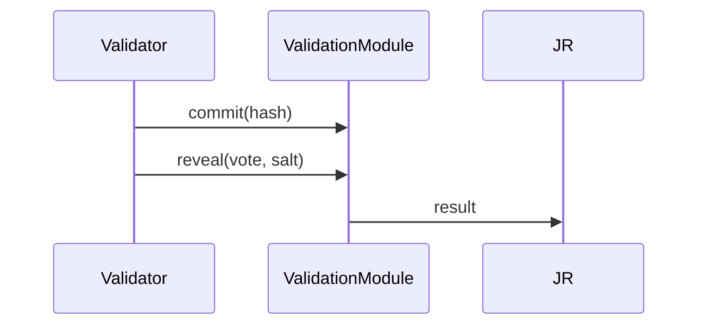

# Incentive Analysis – AGIJobManager v2

AGIJobManager v2 restructures the marketplace around standalone modules and calibrates their incentives so honest behaviour is the dominant strategy for every actor.

## Roles and Stakes
- **Agents** lock collateral via `StakeManager` equal to a percentage of job reward.
- **Validators** stake separately and are randomly selected by `ValidationModule`.
- **Employers** escrow payouts in `JobRegistry` and may claim a share of slashed collateral on failure.

## Voting and Settlement
Validators follow a commit–reveal scheme and outcomes finalise by majority:

Majority approval releases rewards; any minority can escalate to the `DisputeModule` by paying a dispute fee.

## Slashing & Redistribution
Slashing percentages exceed potential rewards. When misbehaviour occurs:
- A portion of the agent’s slashed stake reimburses the employer.
- The remainder routes to a treasury address, raising the system’s enthalpy and discouraging deviations.

## Reputation Dynamics
`ReputationEngine` adds or subtracts points per job outcome. Falling below owner‑set thresholds auto‑blacklists addresses, removing future earning opportunities.

## Statistical Physics Analogy
The protocol behaves like a thermodynamic system seeking minimum Gibbs free energy,
\[ G = H - T S \]
where:
- **H** (Hamiltonian) is stake at risk; high slashing raises the energy cost of cheating.
- **S** (entropy) stems from random validator selection and commit–reveal timing.
- **T** (temperature) is tuned via owner‑set parameters, weighting the impact of randomness.

Honest execution minimises \(G\); any attempt to cheat requires additional “energy” and is disincentivised.

## Nash Equilibrium
For Agents and Validators, expected loss from slashing outweighs any potential gain from collusion. Employers receive compensation when jobs fail, aligning incentives across roles. This configuration drives the system toward an equilibrium where cooperation is rational for all participants.
