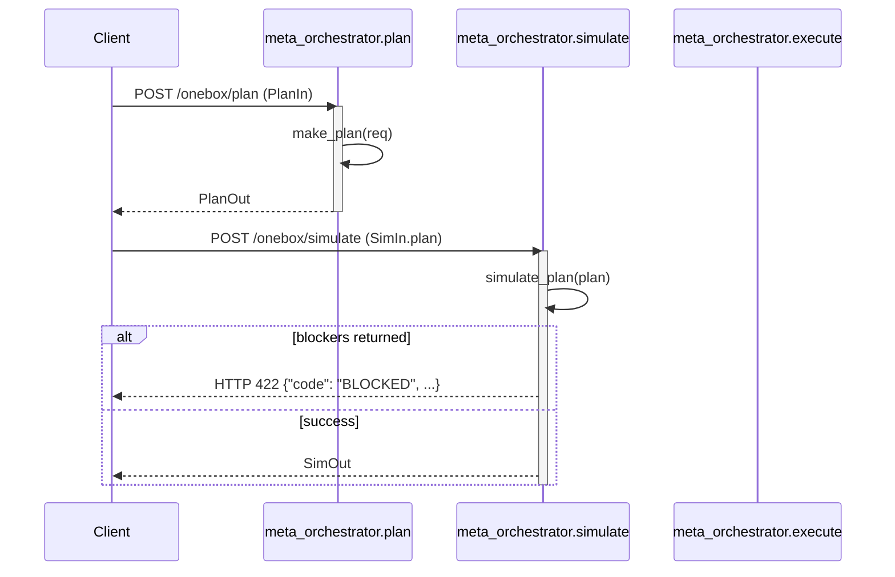
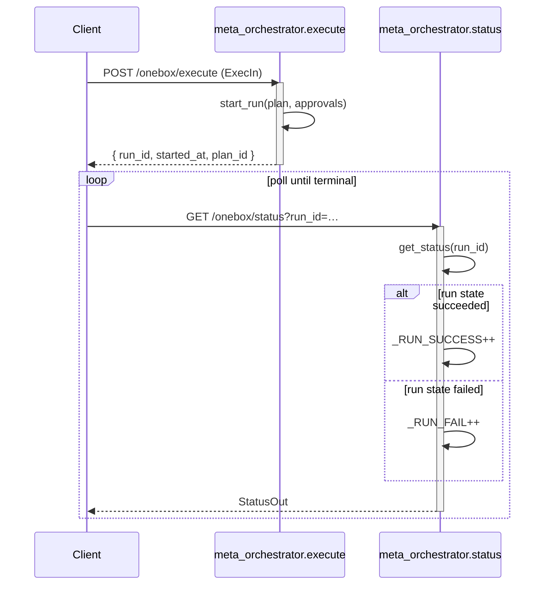

# Planner → Simulator → Runner Contract

This document captures the interaction contract enforced by the FastAPI meta-orchestrator router exposed in [`routes/meta_orchestrator.py`](../routes/meta_orchestrator.py).

## Overview

The orchestrator exposes four core endpoints that implement the `plan → simulate → execute → status` lifecycle for automation jobs:

- `POST /onebox/plan` validates operator intent and emits a typed plan (`PlanOut`).
- `POST /onebox/simulate` replays the plan against risk and policy checks, raising a 422 with blockers when the run cannot proceed.
- `POST /onebox/execute` hands the approved plan to the runner, which starts a tracked run and returns the `run_id` and timestamps.
- `GET /onebox/status` retrieves the runner state machine, updating success/failure counters.

The following sections describe the request/response choreography and metrics emitted during each step.

## Sequence diagrams

## Contract guarantees

- **Latency metrics** – The router measures planning, simulation and execution latency with Prometheus histograms, providing guardrails for SLO dashboards (`plan_latency_seconds`, `simulate_latency_seconds`, `execute_step_latency_seconds`).
- **Run accounting** – Every terminal status update increments the `run_success_total` or `run_fail_total` counter, ensuring downstream telemetry is consistent with client-observed results.
- **Error semantics** – Simulation blockers are always communicated via a structured 422 error payload so that clients can surface actionable messages before attempting execution.
- **Traceability** – Each endpoint logs the `plan_id` (and `run_id` for execution/status) to the shared logger, enabling distributed traces to correlate planner/simulator/runner calls.

## Implementation pointers

- The router is mounted under the `/onebox` prefix and protects endpoints with the `require_api` dependency when available.
- `PlanIn`, `SimIn`, `ExecIn` and `StatusOut` share the same Pydantic models as the internal planner, simulator and runner modules, guaranteeing schema parity between services.
- The metrics and logging helpers are defined inside `routes/meta_orchestrator.py` so any refactor must keep their module-level lifetimes intact.
