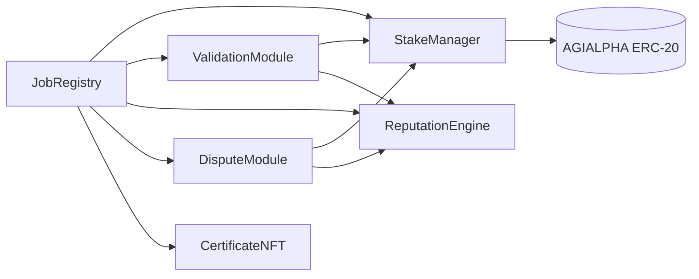

# Modular AGIJobs v2 Architecture

AGIJobs v2 replaces the monolithic manager with immutable, single‑purpose modules.  Each contract is deployed once, owns its
state, and exposes a minimal interface.  The owner (ideally a multisig) may update parameters or swap module addresses without
redeploying the entire suite, delivering governance composability while keeping on‑chain logic simple enough for Etherscan
interactions.

## Module Graph


## Interfaces
Example Solidity interfaces (Solidity ^0.8.20):
```solidity
interface IJobRegistry {
    event JobCreated(uint256 indexed jobId, address employer, uint256 reward);
    function createJob(string calldata details, uint256 reward) external;
    function setModules(
        address validation,
        address stake,
        address reputation,
        address dispute,
        address certificate
    ) external;
}

interface IStakeManager {
    event TokenUpdated(address newToken);
    function depositStake(uint256 amount) external;
    function lockReward(address from, uint256 amount) external;
    function payReward(address to, uint256 amount) external;
    function slash(address offender, address beneficiary, uint256 amount) external;
    function setToken(address newToken) external;
}

interface IValidationModule {
    function commit(uint256 jobId, bytes32 hash) external;
    function reveal(uint256 jobId, bool verdict, bytes32 salt) external;
    function finalize(uint256 jobId) external;
    function setParameters(
        uint256 commitWindow,
        uint256 revealWindow,
        uint256 minValidators
    ) external;
}

interface IReputationEngine {
    function addSuccess(address user, uint256 weight) external;
    function addFailure(address user, uint256 weight) external;
    function reputationOf(address user) external view returns (uint256);
    function blacklist(address user, bool status) external;
}

interface IDisputeModule {
    function raiseDispute(uint256 jobId, string calldata reason) external;
    function resolveDispute(uint256 jobId, bool uphold) external;
    function setAppealFee(uint256 fee) external;
}

interface ICertificateNFT {
    function mintCertificate(address employer, uint256 jobId) external;
}
```

## Solidity Structure Recommendations
- Mark module addresses `immutable` where possible and cache them in local variables during calls.
- Use `uint64` or `uint128` for counters and timestamps to pack storage slots.
- Favor `external` and `calldata` for user‑facing functions; use custom errors instead of revert strings.
- Wrap arithmetic in `unchecked` blocks when bounds are enforced elsewhere to save gas.
- Guard external state‑changing functions with `nonReentrant` in `StakeManager` and `JobRegistry`.
- Emit events for every parameter change to aid off‑chain governance tracking.

## Incentive & Physics Analogy
Stakes create potential energy \(H\); commit‑reveal voting injects entropy \(S\).  Owner‑tuned parameters act as temperature
\(T\), so the system seeks to minimise the Gibbs free energy \(G = H - T S\).  Honest behaviour is the ground state: any attempt
to cheat raises expected stake loss, increasing \(H\) and making deviation economically unattractive.

## Token Configuration
The `StakeManager` stores the ERC‑20 used for rewards, staking and dispute fees.  By default it references
[`$AGIALPHA`](https://etherscan.io/address/0x2e8fb54c3ec41f55f06c1f082c081a609eaa4ebe) (6 decimals), but the owner can switch
currencies via `setToken(newToken)` without redeploying other modules.  All amounts must be provided in base units (1 token =
1e6 units).

## Explorer‑Friendly Design
All public methods use simple data types so employers, agents and validators can interact through Etherscan's **Write** tab.
Deployment and configuration steps for $AGIALPHA appear in [docs/deployment-agialpha.md](deployment-agialpha.md).

