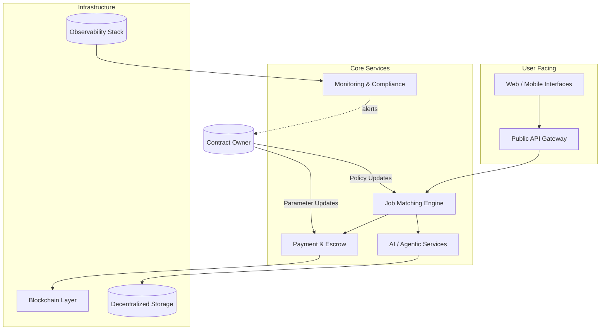
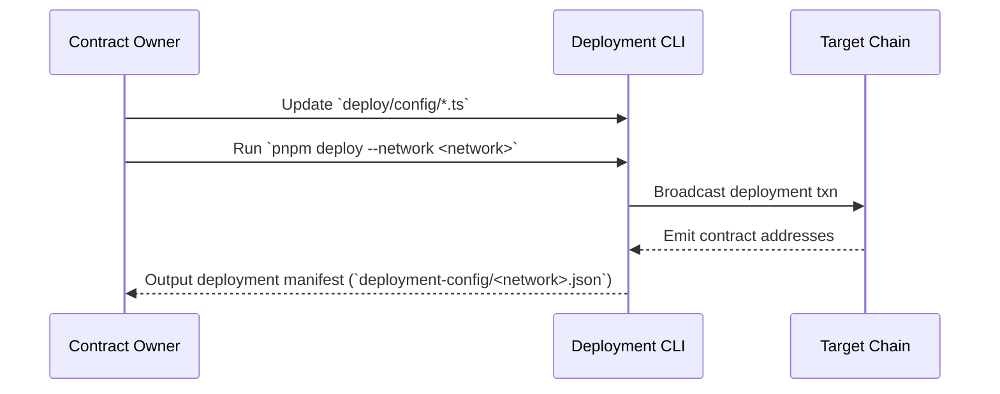

# AGI Jobs Platform Operations Guide

This guide distills day-to-day operations, deployment, and customization tasks for the AGI Jobs platform. It is designed so that a non-technical contract owner can confidently manage production environments while retaining full control over configurable parameters.

## Platform Overview

### Key Components

| Component | Location | Description | Owner Controls |
|-----------|----------|-------------|----------------|
| Smart Contracts | `contracts/` | On-chain logic for escrow, attestation, and verification. | Update parameters in deployment configs and upgradeable contract proxies. |
| Off-chain Services | `services/`, `apps/`, `backend/` | REST, GraphQL, and worker services orchestrating AI-driven job workflows. | Tune env vars, service configs, horizontal scaling. |
| Data Pipelines | `simulation/`, `storage/`, `packages/` | Data ingestion, feature computation, and agent training flows. | Manage datasets, schedules, retention. |
| Monitoring & Compliance | `monitoring/`, `docs/` | Dashboards, alerts, audit procedures. | Customize alert thresholds, review logs. |

## Operational Playbooks

### 1. Configure Environment Variables

1. Duplicate `deployment-config/.env.example` to `.env.production`.
2. Set API keys, RPC URLs, and private keys using a secure secrets manager.
3. Review optional toggles in `config/runtime.ts` for feature flags (AI-assisted vetting, on-chain attestations, auto-matching).
4. Validate configuration with `pnpm run config:validate` (see testing section below).

### 2. Deploy Smart Contracts

**Parameter Control:**

- All configurable values (fees, match thresholds, escrow release criteria) live in `deploy/config/*` files.
- Contracts use upgradeable patterns (see `contracts/proxies/`). Upgrades require multisig approval; refer to `docs/governance.md` for signing flows.

### 3. Rolling Out Service Updates

1. Commit code changes following repo coding standards.
2. Bump semantic version in `package.json` and relevant service manifests.
3. Run CI checks locally (see testing section).
4. Deploy using the orchestrator scripts: `pnpm exec turbo run deploy --filter=<service>`.
5. Monitor dashboards in `monitoring/dashboards/` for anomalies.

### 4. Emergency Procedures

- **Pause Matching:** Trigger the `pauseMatching()` function via the admin UI (`apps/admin`) or CLI `pnpm exec scripts/pause-matching.ts`.
- **Escrow Freeze:** Use the on-chain guardian multisig to call `setEscrowStatus(false)`.
- **Incident Response:** Follow the runbook in `docs/incident-response.md`; ensure alerts in `monitoring/alerts.yaml` point to on-call rotations.

## Testing & Verification Suite

| Command | Description |
|---------|-------------|
| `pnpm test` | Runs unit and integration tests across contracts and services. |
| `pnpm lint` | Enforces code quality and style. |
| `pnpm typecheck` | TypeScript type validation for all packages. |
| `pnpm exec hardhat test` | Targeted contract testing. |
| `pnpm run config:validate` | Validates environment configuration schemas. |

> **Triple Verification Tip:** Run tests in watch mode (`pnpm test --watch`) during active development, then rerun the full suite before deployment.

## Observability and Audit Readiness

- Centralized logging is shipped to the stack configured in `monitoring/otel-collector.yaml`.
- Service-level objectives (SLOs) defined in `monitoring/slo/` map to dashboard panels; adjust thresholds to match business SLAs.
- For chain activities, the `attestation/` package provides proof bundles. Regenerate with `pnpm exec attestation:build`.

## Customization Checklist for Contract Owners

| Area | Action | Tooling |
|------|--------|---------|
| Fees & Incentives | Edit `deploy/config/pricing.ts` values, redeploy or upgrade proxy. | `pnpm deploy` |
| Matching Logic | Update AI policy in `services/matcher/policy.ts`; redeploy service. | `pnpm exec turbo run deploy --filter=matcher` |
| Verification Pipelines | Toggle modules in `config/verifier.ts`. | `pnpm run config:validate` |
| Token Integrations | Configure allowed tokens in `contracts/tokens/allowlist.json`. | On-chain multisig call |
| AI Model Settings | Adjust runtime prompts and weights in `packages/ai-config/*.yaml`. | Redeploy affected services |

## Documentation & Support

- Browse `docs/` for governance, security, and upgrade guides.
- Use the `internal_docs/` folder for engineering deep dives.
- Submit issues via GitHub or reach out to the maintainer email listed in `SECURITY.md` for urgent matters.

---

**Maintainer Note:** Keep this guide updated after every major release. The contract owner should review it quarterly to ensure alignment with evolving business requirements.
