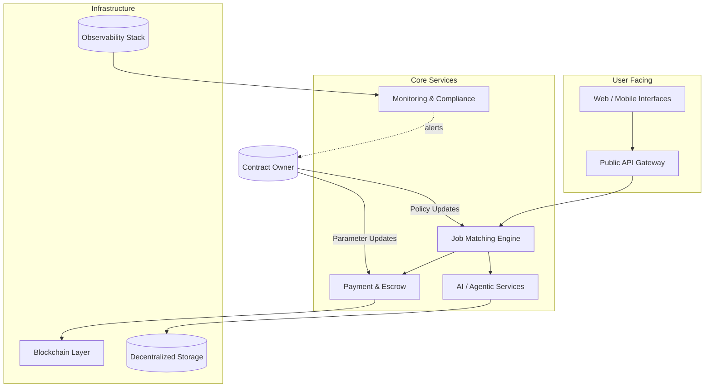
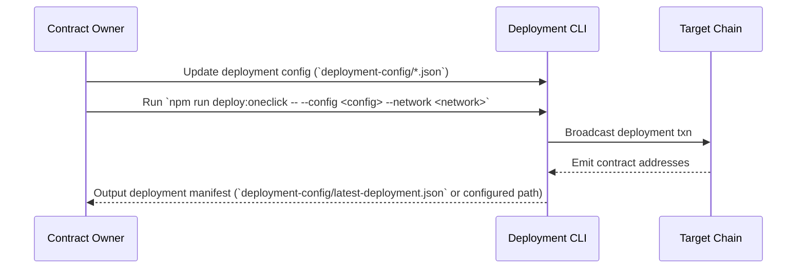

# AGI Jobs Platform Operations Guide

This guide distills day-to-day operations, deployment, and customization tasks for the AGI Jobs platform. It is designed so that a non-technical contract owner can confidently manage production environments while retaining full control over configurable parameters.

## Platform Overview



### Key Components

| Component | Location | Description | Owner Controls |
|-----------|----------|-------------|----------------|
| Smart Contracts | `contracts/` | On-chain logic for escrow, attestation, and verification. | Update parameters in deployment configs and upgradeable contract proxies. |
| Off-chain Services | `services/`, `apps/`, `backend/` | REST, GraphQL, and worker services orchestrating AI-driven job workflows. | Tune env vars, service configs, horizontal scaling. |
| Data Pipelines | `simulation/`, `storage/`, `packages/` | Data ingestion, feature computation, and agent training flows. | Manage datasets, schedules, retention. |
| Monitoring & Compliance | `monitoring/`, `docs/` | Dashboards, alerts, audit procedures. | Customize alert thresholds, review logs. |

## Operational Playbooks

### 1. Prepare Deployment Inputs

Follow the [One-Click Deployment Guide](./deployment/one-click.md) for a full walkthrough of the workflow summarised below.

1. Copy `deployment-config/oneclick.env.example` to `deployment-config/oneclick.env` and populate RPC URLs, API tokens, and any
   placeholder addresses that are already known (for example existing governance multisigs).
2. Review the sample deployer configuration in `deployment-config/deployer.sample.json` and create an environment-specific copy
   such as `deployment-config/sepolia.json`.
3. Commit the non-secret files to version control and store secrets in your preferred secrets manager.
4. Run the guided wizard once to confirm everything resolves correctly:

   ```bash
   npm run deploy:oneclick:wizard -- --config deployment-config/sepolia.json --network sepolia
   ```

   The wizard verifies `deployment-config/oneclick.env` exists (seeding it from the template if needed), runs the same
   `npm run deploy:oneclick` flow, rewrites the environment file with the emitted addresses, and can launch Docker Compose.
   Make sure `deployment-config/oneclick.env` and your config JSON (for example `deployment-config/deployer.sample.json`
   copied to an environment-specific file) already include the governance, RPC, and credential values the prompts will
   confirm.

### 2. Deploy Smart Contracts



**Parameter Control:**

- Deployment parameters and secure defaults (fees, match thresholds, pause state) live in the JSON files under
  `deployment-config/`.
- Contracts use upgradeable patterns (see `contracts/proxies/`). Upgrades require multisig approval; refer to
  `docs/governance.md` and run `npm run owner:plan` to generate the approval flow.

### 3. Configure the Runtime Environment

1. Once deployment completes, sync the generated addresses into your environment file:

   ```bash
   npm run deploy:env -- --input deployment-config/latest-deployment.json
   ```

2. Review `deployment-config/oneclick.env` to confirm the copied addresses and any service credentials are correct.
3. Launch the full stack locally or in staging:

   ```bash
   docker compose --file compose.yaml --env-file deployment-config/oneclick.env up --build -d
   ```

   Add `--attach` to stream logs interactively. Reference the service list in the [one-click guide](./deployment/one-click.md#step-4-launch-the-container-stack)
   for exposed ports and responsibilities.

   > **Identity allowlists:** The one-click deployment intentionally leaves the agent and validator allowlists empty. After
   > verifying the contracts, apply any required entries with `npm run identity:update -- --network <network>` (or run
   > `scripts/v2/updateIdentityRegistry.ts`) based on the committed `config/identity-registry*.json` files.

### 4. Roll Out Service Updates

1. Commit code changes following repo coding standards.
2. Bump semantic versions in `package.json` and any service-specific manifests.
3. Run CI checks locally (see testing section).
4. Rebuild and restart the affected services with Docker Compose:

   ```bash
   docker compose --file compose.yaml --env-file deployment-config/oneclick.env up --build <service>
   ```

5. Monitor dashboards in `monitoring/dashboards/` for anomalies.

### 5. Emergency Procedures

- **Pause Matching:** Use the owner tooling to stage a pause bundle. Run `npm run owner:emergency` for the guided runbook or
  `npm run owner:plan:safe` to generate a Safe transaction set.
- **Escrow Freeze:** Execute the guardian multisig call generated by `npm run owner:plan` targeting `setEscrowStatus(false)`.
- **Incident Response:** Follow the runbook in `docs/incident-response.md`; ensure alerts in `monitoring/alerts.yaml` point to
  on-call rotations.
- **Runtime Health Check:** Verify service status with `npm run owner:health` and review Compose logs via `docker compose logs`.

## Testing & Verification Suite

| Command | Description |
|---------|-------------|
| `npm test` | Runs unit and integration tests across contracts and services. |
| `npm run lint` | Enforces code quality and style. |
| `npm run coverage` | Generates the coverage artefacts expected by CI. |
| `npx hardhat test --no-compile` | Targeted contract testing for specific suites. |
| `npm run owner:doctor` | Validates owner configuration and governance wiring. |

> **CI-v2 pipeline overview:** Every pull request and merge to `main` must pass the `ci-v2` workflow, which executes:
>
> - **Lint & security gates** – Prettier, Solhint/ESLint, token constant verification, and `audit-ci`.
> - **TypeScript build & smoke tests** – `npm run pretest` to compile shared TypeScript utilities and execute service smoke tests.
> - **Hardhat unit tests** – Contract compilation, Hardhat test suite, and ABI drift detection.
> - **Foundry fuzz tests** – Deterministic `forge test` run with FFI enabled and seeded fuzzing.
> - **Coverage thresholds** – `npm run coverage`, access-control coverage guard, and LCOV artifact upload.
> - **Slither static analysis** – Containerised Slither scan with OpenZeppelin remappings.
> - **Echidna fuzzing** – Commit/reveal harness executed through the pinned Echidna Docker image.
> - **Gas snapshot regression** – `npm run gas:check` to enforce the stored Forge gas snapshot.
>
> Operators should run the matching commands locally (or via `gh workflow run ci-v2`) before requesting review to avoid CI churn.

> **Triple Verification Tip:** Run `npm test` in watch mode (`npm test -- --watch`) during active development, then rerun the
> full suite before deployment. Confirm the deployment artefacts with `npm run deploy:checklist` prior to promoting to
> production.

## Observability and Audit Readiness

- Centralized logging is shipped to the stack configured in `monitoring/otel-collector.yaml` and surfaced via the Docker Compose
  services defined in `compose.yaml`.
- Service-level objectives (SLOs) defined in `monitoring/slo/` map to dashboard panels; adjust thresholds to match business
  SLAs.
- For chain activities, the `attestation/` package provides proof bundles. Regenerate with `npm run owner:audit` or the
  attestation helpers in `scripts/v2` as required.

## Customization Checklist for Contract Owners

| Area | Action | Tooling |
|------|--------|---------|
| Fees & Incentives | Update `deployment-config/*.json` values and rerun the one-click deployment with safe upgrades. | `npm run owner:plan` + `npm run deploy:oneclick` |
| Matching Logic | Modify orchestrator policies in `config/policies.default.json` and rebuild the container. | `docker compose up --build orchestrator` |
| Verification Pipelines | Toggle modules in `config/owner-control.json` and validate wiring. | `npm run owner:doctor` |
| Token Integrations | Configure allowed tokens in `contracts/tokens/allowlist.json`. | Multisig call via `npm run owner:plan` |
| AI Model Settings | Adjust runtime prompts and weights in `packages/ai-config/*.yaml`. | Redeploy affected services |

## Documentation & Support

- Browse `docs/` for governance, security, and upgrade guides. Cross-reference the
  [one-click workflow](./deployment/one-click.md) when updating deployments.
- Use the `internal_docs/` folder for engineering deep dives.
- After updating this guide, request a teammate to validate each step against the actual commands (`npm run deploy:oneclick`,
  `npm run deploy:env`, Docker Compose) to ensure operational accuracy.
- Submit issues via GitHub or reach out to the maintainer email listed in `SECURITY.md` for urgent matters.

---

**Maintainer Note:** Keep this guide updated after every major release. The contract owner should review it quarterly to ensure alignment with evolving business requirements.
