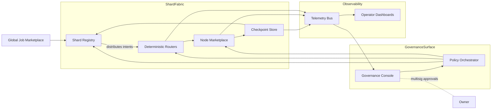
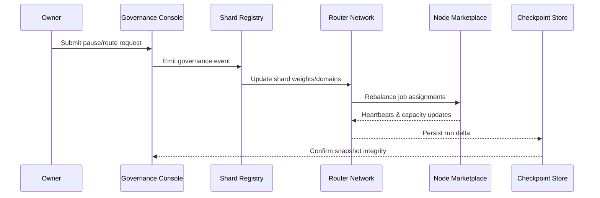

# AGI Jobs v0 Orchestration Assessment

## 1. Reusable Component Inventory

### Python orchestrator (`orchestrator/`)
| Module | Purpose | Key Interfaces & Notes |
| --- | --- | --- |
| `analytics.py` | Metrics and reporting engine (CMS, SPG, weekly analytics) with cache/scheduler utilities for long-running telemetry jobs. | Provides `AnalyticsEngine` with pluggable data sources and caching helpers for downstream dashboards. 【F:orchestrator/analytics.py†L30-L505】 |
| `events.py` | Event catalogue and reconciliation pipeline. | `EventCatalogue` tracks orchestration events; `EventReconciler` deduplicates receipts and updates stateful stores. 【F:orchestrator/events.py†L16-L94】 |
| `models.py` | Typed orchestration payloads. | Pydantic models covering intents, steps, budgets, receipts, and run status; reused across planner, runner, and API surfaces. 【F:orchestrator/models.py†L15-L215】 |
| `planner.py` | Natural-language-to-plan translator. | Parses intents, infers budgets/deadlines, invokes simulator to sanity-check ICS payloads, and outputs structured `OrchestrationPlan`. 【F:orchestrator/planner.py†L1-L205】 |
| `runner.py` | Execution engine with watchdog and persistence. | Manages plan lifecycles, runs steps via `StepExecutor`, persists status in pluggable state stores, and reconciles receipts. 【F:orchestrator/runner.py†L1-L195】 |
| `state.py` | Run state persistence backends. | Abstract `RunStateStore` with file-, Redis-, and Postgres-backed implementations for resumable orchestrations. 【F:orchestrator/state.py†L19-L136】 |
| `moderation.py` | Safety gating and manual overrides. | Provides `ModerationConfig`, queueing for manual reviews, and reporting used before executing steps. 【F:orchestrator/moderation.py†L46-L193】 |
| `scoreboard.py` | Immutable performance ledger. | Tracks aggregate success/failure metrics consumed in receipts and monitoring loops. 【F:orchestrator/scoreboard.py†L19-L84】 |
| `tools/executors.py` | Step execution adapter and Node bridge. | Maps plan steps to ICS intents, shells out to TS router via Node bridge, enforces retries, and annotates steps with phase runtimes. 【F:orchestrator/tools/executors.py†L1-L210】 |
| `extensions/phase6.py` / `phase8.py` | Scenario-specific runtimes. | Inject domain controls (Phase 6) and dominion governance guardrails (Phase 8) for simulations and annotations. 【F:orchestrator/extensions/phase6.py†L31-L129】【F:orchestrator/extensions/phase8.py†L84-L193】 |

### TypeScript packages (`packages/`)
| Package | Highlights | Integration Points |
| --- | --- | --- |
| `packages/orchestrator` | Core ICS router, governance toolkit, chain providers, validation helpers. | `router.ts` routes intents to job/stake/validation/governance tools; consumed by Python bridge for live execution. 【F:packages/orchestrator/src/router.ts†L1-L62】 |
| `packages/onebox-orchestrator` | Onebox planner/router harness mirroring production flows. | Provides ICS planner, router, and scenario tooling for local simulations; pairs with Python planner for parity. 【F:packages/onebox-orchestrator/src/index.ts†L1-L120】 |
| `packages/onebox-sdk` | Lightweight client SDK exposing job + governance helpers. | Schema exports align with Python models for plan execution parity. 【F:packages/onebox-sdk/src/types.ts†L1-L120】 |
| `packages/storage` | Storage adapters (IPFS). | Re-exports production IPFS uploader for consistent artifact persistence from orchestrator steps. 【F:storage/ipfs/index.js†L1-L120】 |

### Services (`services/`)
| Service | Domain | Reusable Modules |
| --- | --- | --- |
| `arena` | Competition telemetry & ELO scoring. | `arena.service.ts` orchestrates match flow, `monitoring.ts` & `observability.ts` expose metrics hooks, `validators.ts` enforce job payload integrity. 【F:services/arena/src/arena.service.ts†L1-L220】【F:services/arena/src/observability.ts†L1-L160】 |
| `alpha-bridge` | gRPC bridge for Alpha layer integrations. | `src/server.js` exposes job attestation bridge with proto contracts. 【F:services/alpha-bridge/src/server.js†L1-L200】 |
| `culture-graph-indexer` | Cultural graph ingestion and indexing. | Prisma-based pipeline in `src/index.ts` for syncing cultural data to orchestrator-compatible APIs. 【F:services/culture-graph-indexer/src/index.ts†L1-L220】 |
| `meta_api` | FastAPI metadata facade. | `app/main.py` surfaces orchestrator run metadata for dashboards. 【F:services/meta_api/app/main.py†L1-L160】 |
| `notifications` | Event fan-out service. | `server.js` pushes orchestrator events to subscribed channels, enabling operator alerts. 【F:services/notifications/server.js†L1-L200】 |

## 2. Updated Architecture Diagrams

## 3. Non-Technical Operator Requirements Matrix

| User Story | Shard Registry | Routers | Node Marketplace | Checkpoint Store | Governance Controls |
| --- | --- | --- | --- | --- | --- |
| Pause all shards during incident | Accept `owner:pause-all` command and propagate halt flag. | Respect pause flag and stop routing. | Stop dispatch; emit heartbeat alerts. | Persist paused state for resumption. | Owner console surfaces pause script + audit logs. 【F:demo/Planetary-Orchestrator-Fabric-v0/docs/owner-control.md†L1-L54】 |
| Reroute backlog from Earth to Helios | Update shard spillover target. | Deterministically push overflow jobs to Helios router. | Enforce capacity guardrails on receiving nodes. | Record reroute decision in checkpoint. | CLI command patch + audit trail for reroute. 【F:demo/Planetary-Orchestrator-Fabric-v0/docs/owner-control.md†L55-L102】 |
| Adjust latency budgets without code changes | Store new latency config and broadcast to routers. | Enforce revised latency thresholds in matching loop. | Mark nodes breaching latency budget. | Snapshot updated budgets for rollbacks. | Declarative latency command ensures reproducibility. 【F:demo/Planetary-Orchestrator-Fabric-v0/docs/owner-control.md†L67-L92】 |
| Resume orchestration after crash | Restore shard/job state from last checkpoint. | Replay router queues and in-flight assignments. | Reconcile node health vs saved state. | Provide verified snapshot & hash check. | Owner runbook outlines checkpoint resume steps. 【F:demo/Planetary-Orchestrator-Fabric-v0/docs/owner-control.md†L103-L132】 |
| Audit governance change for compliance | Version changes in registry ledger. | Emit deterministic event logs for routing updates. | Annotate node policy impacts. | Store audit-ready `events.ndjson` and hashes. | Governance console displays commands & outputs. 【F:demo/Planetary-Orchestrator-Fabric-v0/docs/architecture.md†L48-L96】 |

## 4. Assumption Validation & Gaps

| Assumption | Evidence | Status | Required Follow-up |
| --- | --- | --- | --- |
| Python runner can execute ICS steps via TypeScript router bridge. | `StepExecutor` shells out to `packages/orchestrator/dist/bridge.mjs`, mapping plan steps to ICS intents. 【F:orchestrator/tools/executors.py†L64-L147】 | **Partial** – bridge path is configurable but no compiled artifact is present in repo. | Add build pipeline that outputs `dist/bridge.mjs` (or ship prebuilt bundle) and document runtime requirement. |
| Shard governance exposes deterministic owner controls. | Owner manual enumerates pause, reroute, latency commands with audit artifacts. 【F:demo/Planetary-Orchestrator-Fabric-v0/docs/owner-control.md†L1-L132】 | **Valid** – docs aligned with architecture; tests rely on scripted commands. | Implement production wrappers (e.g., multisig transactions) and map to real contract calls. |
| Checkpoint store enables crash-safe resume. | Architecture dossier specifies `storage/checkpoint.json` snapshots and resume workflow; CI doc references deterministic simulations. 【F:demo/Planetary-Orchestrator-Fabric-v0/docs/architecture.md†L66-L106】【F:demo/Planetary-Orchestrator-Fabric-v0/docs/ci.md†L13-L52】 | **Valid in demos** – checkpoint implemented in demo, not yet wired into Python runner persistence. | Integrate `RunStateStore` (Redis/Postgres) with planetary checkpoint format and add verification tests. |
| Node marketplace policies enforce capacity/latency. | Architecture dossier details node registration, concurrency, heartbeat enforcement. 【F:demo/Planetary-Orchestrator-Fabric-v0/docs/architecture.md†L26-L74】 | **Assumed** – production services lack shared marketplace module. | Extract reusable marketplace service (likely from demo) into `services/` and add integration tests with routers. |
| Operator dashboards receive telemetry without code changes. | Architecture dossier + owner manual describe `events.ndjson`, `summary.json`, telemetry bus feeding dashboards. 【F:demo/Planetary-Orchestrator-Fabric-v0/docs/architecture.md†L78-L122】【F:demo/Planetary-Orchestrator-Fabric-v0/docs/owner-control.md†L118-L132】 | **Valid in demo artifacts** – but no shared ingestion between Python orchestrator and dashboards. | Define standardized telemetry schema in `services/meta_api` and ensure runner publishes matching events. |
