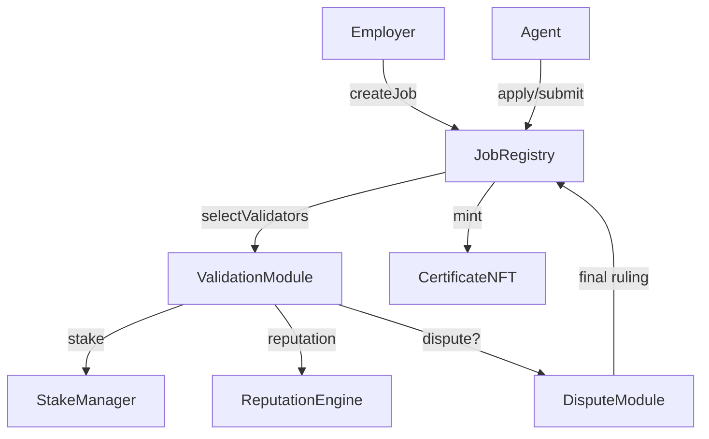

# AGIJobs Overview

## Architecture



### Module Summaries
| Module | Responsibility |
| --- | --- |
| JobRegistry | Posts jobs, escrows payouts, tracks lifecycle. |
| ValidationModule | Selects validators and runs commit‑reveal voting. |
| DisputeModule | Coordinates appeals and final rulings. |
| StakeManager | Custodies collateral, releases rewards, executes slashing. |
| ReputationEngine | Updates reputation, enforces blacklists. |
| CertificateNFT | Mints ERC‑721 certificates for completed jobs. |

## Universal Incentive System
The v2 contracts share a unified incentive model:

- **Staking** – Agents, validators, and platform operators stake through `StakeManager` under their respective roles. Stakes secure honest behaviour and unlock job participation.
- **Routing** – `JobRegistry` locks each job's reward and protocol fee, then routes the fee portion to `FeePool` on finalisation.
- **Revenue share** – `FeePool` streams accumulated fees to platform operators pro‑rata to their staked amount.
- **Zero‑stake main deployer** – The primary deployment address holds no stake and receives no rewards; all revenue accrues to platform stakers.
- The deployer may still register its platform but gains no routing priority or revenue share without staking.
  - **Worked example**
    1. The owner skips `depositStake` (amount = `0`) and calls `PlatformRegistry.register()`.
    2. `PlatformRegistry.getScore(owner)` returns `0`, so the platform has no routing weight.
    3. Calling `FeePool.claimRewards()` emits `RewardsClaimed(owner, 0)`, confirming no payout.

## Etherscan Interactions
1. Open the relevant contract address on Etherscan.
2. In **Write Contract**, connect your wallet.
3. Call the desired function and submit the transaction.
4. Verify emitted events and new state in **Read Contract** or on a second explorer.

For a step-by-step deployment walkthrough with owner-only setters, see [deployment-agialpha.md](deployment-agialpha.md).

### Owner Controls and Defaults
| Module | Owner-only setters (default) | Purpose |
| --- | --- | --- |
| JobRegistry | `setModules` (none set), `setJobParameters` (`reward=0`, `stake=0`), `setFeePool` (0 address), `setFeePct` (`0`), `setTaxPolicy` (0 address) | Wire modules, set template stake/reward, and configure fees/tax policy. |
| ValidationModule | `setValidatorPool` (empty), `setReputationEngine` (0 address), `setCommitRevealWindows` (`0`, `0`), `setValidatorBounds` (`0`, `0`), `setVRF` (0 address) | Choose validators and tune commit/reveal timing and committee sizes. |
| DisputeModule | `setModerator` (owner), `setAppealJury` (owner), `setAppealFee` (`0`), `setJobRegistry` (constructor address) | Configure appeal bond and arbiters. |
| StakeManager | `setToken` (constructor token), `setMinStake` (`0`), `setSlashingPercentages` (`0`, `0`), `setTreasury` (constructor treasury), `setJobRegistry` (0 address), `setDisputeModule` (0 address), `setSlashPercentSumEnforcement` (`false`), `setMaxStakePerAddress` (`0`) | Adjust staking token, minimums, slashing rules, and authorised modules. |
| ReputationEngine | `setCaller` (`false`), `setStakeManager` (0 address), `setScoringWeights` (`1e18`, `1e18`), `setThreshold` (`0`), `blacklist` (`false`) | Manage scoring weights, authorised callers, and blacklist threshold. |
| CertificateNFT | `setJobRegistry` (0 address), `setBaseURI` (empty) | Authorise minting registry and metadata base URI. |

## Incentive Mechanics
Honest participation minimises a system-wide free energy similar to the thermodynamic relation `G = H - T S`.
Slashing raises the enthalpy `H` of dishonest paths, while commit–reveal randomness injects entropy `S`.
Governance tunes the effective temperature `T` via parameters such as stake ratios and reward percentages.
When calibrated so that honest behaviour yields the lowest `G`, deviations carry higher expected energy cost than cooperation.

## Deployment Addresses
| Contract | Network | Address |
| --- | --- | --- |
| AGIJobManager v0 | Ethereum mainnet | [0x0178b6bad606aaf908f72135b8ec32fc1d5ba477](https://etherscan.io/address/0x0178b6bad606aaf908f72135b8ec32fc1d5ba477) |
| $AGI Token | Ethereum mainnet | [0xf0780F43b86c13B3d0681B1Cf6DaeB1499e7f14D](https://etherscan.io/address/0xf0780F43b86c13B3d0681B1Cf6DaeB1499e7f14D) |

## Quick Start
1. Clone the repository and install dependencies:
   ```bash
   git clone https://github.com/MontrealAI/AGIJobsv0.git
   cd AGIJobsv0
   npm install
   ```
2. Compile contracts and run the tests:
   ```bash
   npm run compile
   npm test
   ```
3. Interact with deployed contracts through a wallet or block explorer.

