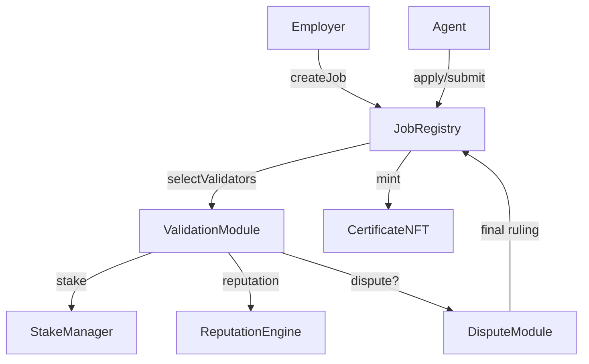

# AGIJobs Overview

## Architecture



### Module Summaries
| Module | Responsibility |
| --- | --- |
| JobRegistry | Posts jobs, escrows payouts, tracks lifecycle. |
| ValidationModule | Selects validators and runs commit‑reveal voting. |
| DisputeModule | Coordinates appeals and final rulings. |
| StakeManager | Custodies collateral, releases rewards, executes slashing. |
| ReputationEngine | Updates reputation, enforces blacklists. |
| CertificateNFT | Mints ERC‑721 certificates for completed jobs. |

## Etherscan Interactions
1. Open the relevant contract address on Etherscan.
2. In **Write Contract**, connect your wallet.
3. Call the desired function and submit the transaction.
4. Verify emitted events and new state in **Read Contract** or on a second explorer.

### Governance Table
| Module | Owner Functions | Purpose |
| --- | --- | --- |
| JobRegistry | `setModules`, `setJobParameters` | Wire module addresses and set job rewards/stake. |
| ValidationModule | `setParameters` | Tune validator counts, stake ratios, rewards and slashing. |
| DisputeModule | `setAppealParameters` | Configure appeal fees and moderator/jury settings. |
| StakeManager | `setStakeParameters`, `setToken` | Adjust stakes, slashing and staking token. |
| ReputationEngine | `setCaller`, `setThresholds`, `setBlacklist` | Authorise callers, set reputation floors, manage blacklist. |
| CertificateNFT | `setJobRegistry` | Authorise the registry allowed to mint. |

## Incentive Mechanics
Honest participation minimises a system-wide free energy similar to the thermodynamic relation `G = H - T S`.
Slashing raises the enthalpy `H` of dishonest paths, while commit–reveal randomness injects entropy `S`.
Governance tunes the effective temperature `T` via parameters such as stake ratios and reward percentages.
When calibrated so that honest behaviour yields the lowest `G`, deviations carry higher expected energy cost than cooperation.

## Deployment Addresses
| Contract | Network | Address |
| --- | --- | --- |
| AGIJobManager v0 | Ethereum mainnet | [0x0178b6bad606aaf908f72135b8ec32fc1d5ba477](https://etherscan.io/address/0x0178b6bad606aaf908f72135b8ec32fc1d5ba477) |
| $AGI Token | Ethereum mainnet | [0xf0780F43b86c13B3d0681B1Cf6DaeB1499e7f14D](https://etherscan.io/address/0xf0780F43b86c13B3d0681B1Cf6DaeB1499e7f14D) |

## Quick Start
1. Clone the repository and install dependencies:
   ```bash
   git clone https://github.com/MontrealAI/AGIJobsv0.git
   cd AGIJobsv0
   npm install
   ```
2. Compile contracts and run the tests:
   ```bash
   npm run compile
   npm test
   ```
3. Interact with deployed contracts through a wallet or block explorer.

