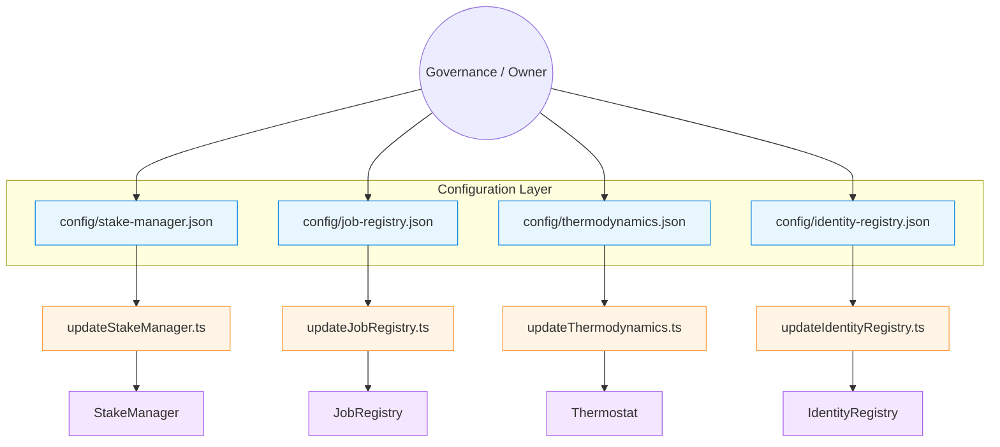

# Owner Control Atlas

The Owner Control Atlas stitches every configurable surface of the AGIJobs v2
protocol into a single, illustrated field manual that non-technical stewards can
run before any governance window. The companion CLI synthesises live JSON
manifests, highlights unsafe defaults and emits Mermaid diagrams that visualise
the closed loop from configuration edits to on-chain execution.

> **When to run it** – Before every production change, when onboarding new
> operators, and whenever compliance asks for a one-page snapshot of governance
> authority.

## Generate the Atlas

```bash
npm run owner:atlas -- --network <network>
```

Key options:

- `--out reports/<network>-owner-atlas.md` – persist Markdown for change tickets
  or board review packages.
- `--format human` – print a condensed terminal digest.
- `--format json` – feed structured data into dashboards or automated auditors.
- `--no-mermaid` – omit diagrams when exporting to systems that strip fenced
  code blocks.

The CLI automatically resolves the correct JSON manifests for the selected
network, injects the token symbol/decimals, and annotates any missing owner or
signer data so the contract owner retains full situational awareness without
opening Solidity.

## Atlas anatomy



Each Atlas run contains:

1. **Owner envelope audit** – validates governance/owner defaults, highlights
   zero-address controllers, and enumerates every module governed by the owner.
2. **Module directory** – status table showing config locations, update/verify
   commands, and the live value of critical parameters such as stake minimums,
   role-share percentages, PID coefficients, and authorised signer counts.
3. **Detailed narratives** – per-module bullet lists that explain how to tune
   the knobs, which documentation to read, and the exact commands to dry-run,
   execute, and verify changes without touching Solidity.
4. **Mermaid topology** – a flow diagram illustrating how owner inputs travel
   from JSON manifests through Hardhat helpers into deployed contracts.

## Operational workflow

1. **Snapshot** – Run `npm run owner:atlas -- --network <network>` and archive
the Markdown artefact alongside the owner-control surface report.
2. **Plan** – Open the Atlas table to identify modules needing attention (⚠️
status). Follow the linked documentation for deep dives.
3. **Execute** – Use the update commands embedded in the Atlas to dry-run and
apply parameter changes. All commands are copy/paste ready for non-technical
operators.
4. **Verify** – Run `npm run owner:verify-control` with the suggested module
filters to confirm on-chain ownership and governance matches the committed
configuration.
5. **File** – Attach the Atlas export, verification report, and signed
transactions to your change-control ticket for a tamper-evident audit trail.

## Integrating with mission control

- Combine the Atlas with `npm run owner:mission-control` to produce a
  multi-document operations pack that spans readiness checks, update execution
  and post-change verification.
- Feed the JSON output into SOC dashboards to monitor for zero treasuries,
  missing signers, or unbalanced thermodynamic role weights.
- Schedule nightly Atlas runs inside CI to alert governance teams if committed
  configuration drifts from production expectations.

By codifying the entire owner control surface into a single automated artefact,
the Atlas keeps the contract owner firmly in control of every parameter while
meeting the rigor demanded by high-stakes, production-critical environments.
