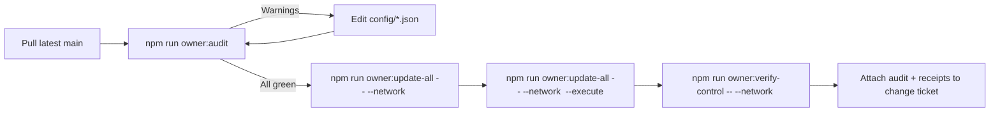

# Owner Control Audit

> **Audience.** Non-technical contract owners, governance coordinators, and auditors who need a
> single command to confirm every configurable subsystem is wired, documented, and ready for a
> production change.
>
> **Goal.** Deliver a printable, mermaid-illustrated checklist that proves each JSON manifest loads
> cleanly, every governance/owner target is defined, and all update & verification commands are
> copy/paste-ready before executing transactions.

## Why run the audit?

- **Proves readiness.** The CLI loads every owner-facing configuration helper and flags missing
  JSON, zero-address placeholders, or misclassified module types before you run `--execute`.
- **Creates artefacts.** Hashes of `config/agialpha*.json`, `config/owner-control*.json`, and every
  module manifest produce tamper-evident evidence for compliance or regulators.
- **Bridges documentation.** Each subsystem links directly to the relevant Mermaid playbook,
  handbook, or operations guide so reviewers always have context.
- **Empowers owners.** Outputs include both the generic `owner:update-all` invocations and the
  specialised Hardhat helpers, guaranteeing the contract owner can retune parameters without
  touching Solidity.

## Quick start

```bash
npm run owner:audit -- --network mainnet --out reports/mainnet-owner-audit.md
```

- `--network <name>` injects per-network overrides from `config/*.<network>.json`.
- `--format human` prints a chat-friendly briefing instead of Markdown.
- `--format json` emits structured data for dashboards or automation bots.
- `--no-mermaid` skips diagrams when rendering in tools that cannot display them.



## Reading the report

The Markdown report contains three layers:

1. **Header metadata** — timestamp, network, and SHA-256 hashes for the token and owner-control
   manifests. Include this block in your change request to prove provenance.
2. **Module overview table** — every subsystem lists the owner/governance/token status, config file
   hashes, and actionable notes. Emoji encode the state:
   - ✅ = ready for production (non-zero address & validation succeeded).
   - ⚠️ = zero address placeholder or optional field left blank.
   - ❌ = required address missing/invalid or the loader could not parse the configuration.
3. **Detailed guidance** — per-module sections summarise responsibilities, config paths, update &
   verification commands, reference docs, and action items.

> **Tip.** The audit reuses the same loaders as the execution helpers. If the audit passes, the
> change scripts (`update*.ts`, `owner:update-all`) will accept the configuration without surprises.

## Sample excerpt

```markdown
| Module | Owner | Governance | Token mapping | Config hashes | Notes |
| --- | --- | --- | --- | --- | --- |
| Stake Manager | ✅ 0x1234… | ⚠️ zero address placeholder | ⚠️ token address not set | `a1b2c3d4…` | Populate config/agialpha*.json → modules.stakeManager |
```

Follow the per-module subsection below the table for exact commands, for example:

```bash
# Dry-run only the stake manager changes
npm run owner:update-all -- --network mainnet --only=stakeManager

# Execute the dedicated helper when approved
npx hardhat run scripts/v2/updateStakeManager.ts --network mainnet --execute
```

## Operational checklist

1. **Snapshot** – run `npm run owner:surface -- --network <net> --format markdown` to capture the
   existing wiring.
2. **Audit** – execute `npm run owner:audit -- --network <net>` and review the module table.
3. **Remediate** – edit the flagged `config/*.json` files or update `config/agialpha*.json` with the
   deployed addresses.
4. **Dry run** – use either `owner:update-all -- --only=<module>` or the individual `update*.ts`
   helper printed in the report.
5. **Execute** – append `--execute` once the diff is approved.
6. **Verify** – close the loop with `npm run owner:verify-control` and `npm run owner:dashboard`.
7. **Archive** – attach the audit artefact, execution receipts, and verification output to your
   governance ticket.

## Guard rails & safety nets

- The audit stops and marks ❌ if any config loader throws (invalid JSON, malformed address, missing
  ENS alias). Fix the highlighted file, rerun the audit, then proceed.
- Zero-address placeholders produce ⚠️ entries with copy/paste remediation notes, ensuring the owner
  cannot forget to record deployed module addresses in `config/agialpha.json`.
- Config hashes expose unauthorised drift. If the hash changes unexpectedly between approval and
  execution, rerun the audit to regenerate fresh artefacts.
- Every command in the report is safe to copy, including dedicated Hardhat scripts for advanced
  scenarios and `owner:update-all` for guided multi-module updates.

## Troubleshooting

| Symptom | Root cause | Fix |
| --- | --- | --- |
| `Loader failed: ...` | Malformed JSON or schema violation in the referenced config file. | Open the file, correct the syntax/address, rerun the audit. |
| ❌ governance target missing | `config/owner-control.json` lacks a default or module override. | Add `governance` in the defaults or `modules.<name>.governance`, commit, rerun. |
| Token mapping ⚠️ | The module address in `config/agialpha*.json` is still zero. | Update the address, rerun `npm run compile`, and repeat the audit. |
| No Mermaid rendering | Viewer does not support Mermaid. | Rerun with `--no-mermaid` or copy the human/plain-text format. |

With the audit in place, the contract owner has a single command that validates every control surface,
anchors documentation, and outputs actionable next steps—closing the loop from configuration to
execution in a production-safe, regulator-friendly manner.
