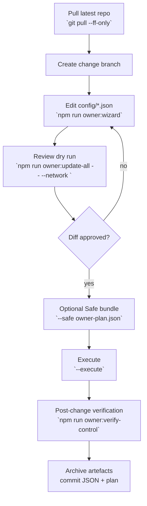
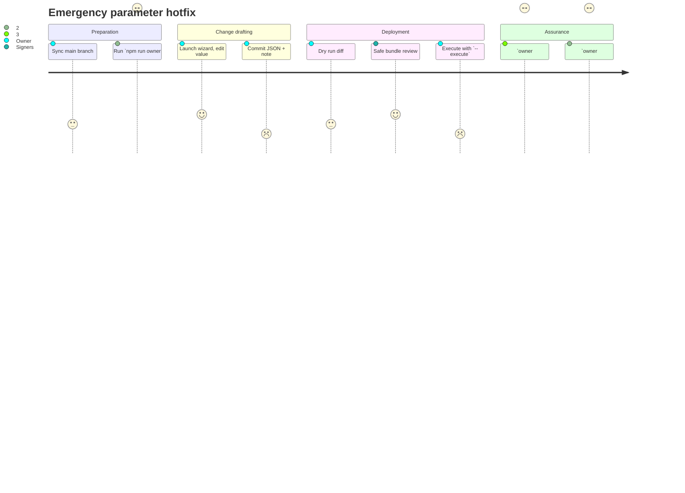
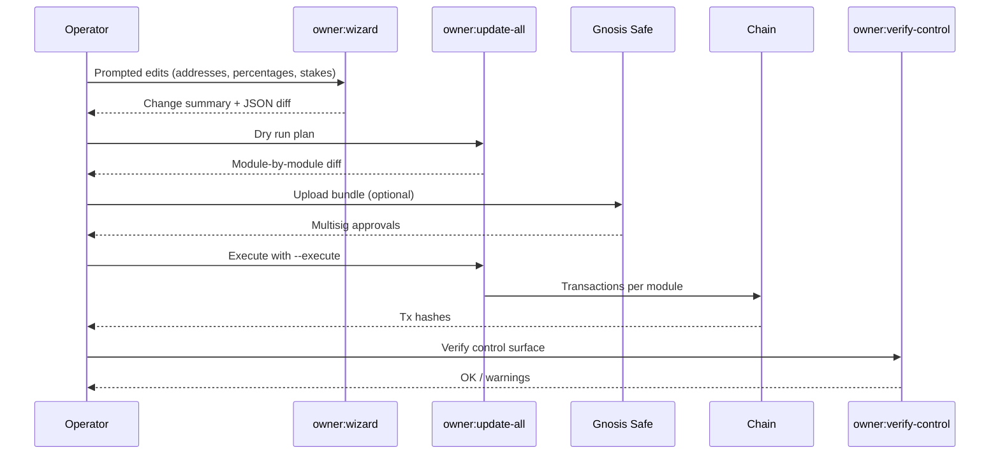

# Owner Control Blueprint

> **Goal.** Give the contract owner (multisig, timelock, or trusted operator) a single, illustrated operations blueprint for safely editing every tunable parameter in `contracts/v2` and getting the change into production without touching Solidity. The focus is on high assurance, reversible workflows that a non-technical coordinator can follow during live incidents or planned upgrades.

> **Command shortcut:** Generate a fresh, data-backed blueprint from the committed configuration with:
>
> ```bash
> npm run owner:blueprint -- --network <network> \
>   --out reports/<network>-blueprint.md
> ```
>
> Append `--format human` for a chat-friendly briefing or `--format json` for automation workflows. The CLI pulls live values from `config/*.json`, stamps the generation time, and embeds Mermaid diagrams unless `--no-diagrams` is supplied—perfect for non-technical owners who need verifiable, auditable artefacts in seconds.

### CLI generator options

| Flag | Purpose |
| --- | --- |
| `--network <name>` | Injects the network into update/verify commands and picks network-specific overrides when present. |
| `--format markdown|human|json` | Switch between the richly formatted Markdown report, a chat-ready text briefing, or structured JSON for automation. |
| `--out <path>` | Persist the blueprint to disk (directories are created automatically). |
| `--no-diagrams` | Suppress Mermaid diagrams for environments that cannot render them. |

## Audience & Operating Posture

- **Primary reader:** Protocol owner or change manager who approves configuration changes but does not ship Solidity.
- **Environment:** Hardened workstation with Node.js 20.19.0, Git, and RPC credentials for the target network (`mainnet`, `sepolia`, or fork).
- **Safety stance:** Defence-in-depth. Every edit must be:
  1. Drafted in version-controlled JSON.
  2. Reviewed via dry-run diffs and Safe bundles.
  3. Executed with automated invariants.
  4. Verified against on-chain state.

## Control Surface Atlas

| Domain | Configuration file | Primary edit helper | Execution command | Verification layer | Notes |
| --- | --- | --- | --- | --- | --- |
| Token constants | [`config/agialpha.json`](../config/agialpha.json) | Manual edit or `npm run owner:wizard` (token section) | `npm run compile` to regenerate `contracts/v2/Constants.sol` | `npm run verify:agialpha -- --rpc <url>` | Guard rails reject malformed addresses, zero decimals, or empty symbol/name. |
| Job policy | [`config/job-registry.json`](../config/job-registry.json) | `npm run owner:wizard` | `npm run owner:update-all -- --network <net>` | `npm run owner:verify-control -- --network <net>` | Covers job stake, treasury, fee split, validation hook wiring. |
| Stake economics | [`config/stake-manager.json`](../config/stake-manager.json) | `npm run owner:wizard` | `npm run owner:update-all -- --network <net>` | `npm run owner:dashboard -- --network <net>` | Includes slash ratios, auto-stake PID knobs, treasury allowlist. |
| Protocol fees | [`config/fee-pool.json`](../config/fee-pool.json) | `npm run owner:wizard` | `npm run owner:update-all -- --network <net>` | `npm run owner:surface -- --network <net>` | Prevents owner treasury, enforces burn percentage bounds. |
| Energy & thermodynamics | [`config/thermodynamics.json`](../config/thermodynamics.json)`, [`config/reward-engine.json`](../config/reward-engine.json)`, [`config/energy-oracle.json`](../config/energy-oracle.json)` | Manual edit + `npm run owner:guide -- --format human` for review | `npx hardhat run scripts/v2/updateThermodynamics.ts --network <net> --execute` | `npm run owner:dashboard -- --network <net>` | Edit JSON first, then drive dedicated module scripts for PID and oracle updates. |
| Identity & attestations | [`config/identity-registry.<net>.json`](../config/identity-registry.json)`, [`config/owner-control.json`](../config/owner-control.json)` | `npm run owner:wizard` (identity) or manual edit | `npx hardhat run scripts/v2/updateIdentityRegistry.ts --network <net> --execute` | `npm run owner:verify-control -- --network <net> --strict` | Wizard mirrors ENS aliasing rules; helper refuses to drop currently authorised signers unless instructed. |
| Ownership map | [`config/owner-control.json`](../config/owner-control.json) | Manual edit with `npm run owner:guide` preview | `npm run owner:rotate -- --network <net> [--safe ...]` or included in `owner:update-all` | `npm run owner:verify-control -- --network <net>` | Single source of truth for default owners/governance per module. |



## Rapid Response Checklist (Non-Technical Operator)



1. **Snapshot current state.**
   ```bash
   npm run owner:surface -- --network <network> --format markdown > owner-surface-pre.md
   ```
2. **Edit interactively.**
   ```bash
   npm run owner:wizard -- --network <network>
   ```
   - Wizard stores precise before/after values and rejects invalid inputs.
   - Type `skip` to keep existing values, `clear` to unset optional addresses.
3. **Stage the change.**
   ```bash
   git status
   git add config/
   git commit -m "chore(config): adjust job registry treasury"
   ```
4. **Render the execution plan.**
   ```bash
   npm run owner:update-all -- --network <network>
   ```
   - Inspect each module diff; ensure pauser, treasury, and reward splits match expectations.
5. **Generate a Safe bundle (optional but recommended for mainnet).**
   ```bash
   npm run owner:update-all -- --network <network> \
     --safe owner-plan.json \
     --safe-name "AGIJobs Owner Rotation"
   ```
6. **Execute when ready.** Append `--execute` to the approved command. The helper re-validates diff and refuses to submit if anything drifted.
7. **Verify immediately.**
   ```bash
   npm run owner:verify-control -- --network <network>
   npm run owner:dashboard -- --network <network>
   ```
8. **Archive artefacts.** Commit the generated plan, pre/post surface snapshots, and verification output into your change-ticket.

## Parameter Matrix

| Parameter | JSON key(s) | Wizard prompt | Execution tool | Guard rails |
| --- | --- | --- | --- | --- |
| Minimum agent job stake | `jobStakeTokens` (`config/job-registry.json`) | "Target job stake (tokens or raw:base)" | `owner:update-all` | Rejects negative values; enforces AGIALPHA decimals. |
| Treasury address | `treasury` (Job Registry, Stake Manager, Fee Pool) | "Treasury destination address" | `owner:update-all` | Prevents using owner/governance address; checksum validation. |
| Validator reward % | `validatorRewardPct` (Job Registry & Stake Manager) | "Validator reward percentage" | `owner:update-all` | 0-100 clamp; warns when totals > 100%. |
| Burn percentage | `burnPct` (`config/fee-pool.json`, `config/stake-manager.json`) | "Burn percentage" | `owner:update-all` | Combined burn + treasury share cannot exceed 100%; zero address burn enforced. |
| Auto-stake PID knobs | `autoStake.*` (`config/stake-manager.json`) | Enabled, threshold, increase/decrease, weights | `owner:update-all` | Validates ranges, ensures ceiling ≥ floor. |
| ENS aliases | `aliases` (`config/identity-registry.<net>.json`) | Wizard identity section | `updateIdentityRegistry.ts` | Resolves ENS to namehash, forbids duplicate nodes. |
| Reward temperature | `temperature` (`config/thermostat.json` or `thermodynamics.json`) | Manual edit | `updateThermostat.ts` | Script rejects instability (e.g., zero derivative gain with positive integral). |
| AGIALPHA metadata | `symbol`, `name`, `decimals` (`config/agialpha.json`) | Wizard token section | `npm run compile` | Build halts on invalid metadata. |

## Verification Ladder

1. **Config diff:** `git diff --stat` must show only intended JSON/doc updates.
2. **Static validation:** `npm run owner:update-all -- --network <net>` (without `--execute`) must finish with `No changes applied` once config matches on-chain state.
3. **On-chain parity:** `npm run owner:verify-control -- --network <net> --strict` returns exit code 0.
4. **Operational telemetry:** `npm run owner:dashboard -- --network <net>` prints `OK` for every module; escalate any `WARN/ERROR`.
5. **Token invariants:** If `config/agialpha.json` changed, `npm run verify:agialpha -- --rpc <url>` must succeed before merging.



## Operational Guard Rails

- All scripts normalise addresses via `ethers.getAddress`, so paste errors fail fast.
- Every helper aborts when RPC credentials are missing (`RPC_URL`, `HARDHAT_NETWORK_URL`, or network-specific env vars).
- Transaction batches are idempotent: re-running `owner:update-all --execute` after an interruption safely resumes.
- `owner:wizard` writes backups (`*.bak`) before saving; restore by renaming if you need to undo a prompt mistake.
- When introducing new modules, add them to `config/owner-control.json` first so rotation, dashboard, and verification tools understand expected owners.

## Change Governance Template

| Phase | Deliverable | Owner |
| --- | --- | --- |
| Proposal | Link to PR + rendered plan (`owner-plan.json`) | Change manager |
| Pre-flight | `owner-surface-pre.md`, `owner:update-all` dry-run log | Operator |
| Execution | Signed Safe bundle or direct transaction receipts | Signers |
| Post-flight | `owner:verify-control` output, `owner:dashboard` snapshot, git tag | Auditor |

Keep these artefacts in your ticketing system to prove end-to-end control and enable rapid rollback via git revert + re-execute.

## Next Steps

1. Automate periodic `owner:surface` runs via CI and post reports to the governance channel.
2. Mirror production configuration (`config/*.json`) into an encrypted secrets manager for disaster recovery.
3. Train secondary operators using the `npm run owner:guide -- --format human --no-mermaid` output as a printable quick reference.
4. Schedule quarterly fire drills that follow this blueprint end-to-end with a forked network to keep the team sharp.
