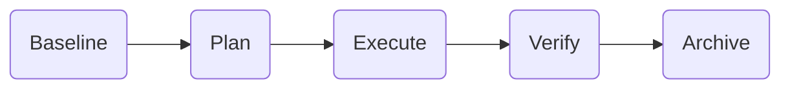
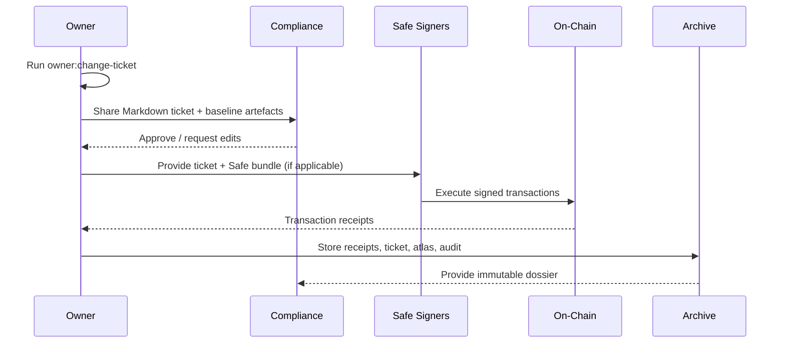

# Owner Control Change Ticket

> **Audience:** Contract owners, compliance leads and governance operators who
> must ship parameter updates with provable change-control artefacts.
>
> **Outcome:** A single command produces a fully documented change ticket with
> checklists, hashed configuration manifests, Mermaid flows and module-specific
> remediation links so non-technical stakeholders can approve, execute and audit
> the rollout.

---

## 1. Generate the ticket

```bash
# Human-readable console digest with Mermaid flow
npm run owner:change-ticket -- --network <network>

# Markdown artefact for approval workflows
npm run owner:change-ticket -- --network <network> --format markdown \
  --out reports/<network>/owner-change-ticket.md

# JSON payload for bots / CI guards
npm run owner:change-ticket -- --network <network> --format json \
  --out reports/<network>/owner-change-ticket.json
```

Each ticket bundles:

- **Control envelope** – Owner/governance addresses, canonical config paths,
  SHA-256 hashes for `config/owner-control*.json` and `config/agialpha*.json`,
  and the active Hardhat context (if available).
- **Stage plan** – Five phases (Baseline → Plan → Execute → Verify → Archive)
  with copy/paste commands that mirror the production runbook.
- **Module surface** – Per-module summaries, key parameter snapshots, update
  and verification commands plus the illustrated manuals to consult before
  editing JSON.
- **Checklists** – Environment preflight, Safe/multisig sign-off notes and the
  attachment matrix for compliance archives.



> **Tip:** The Mermaid block is automatically embedded in Markdown output and
> can be pasted into the compliance ticket, GRC system or governance forum
> discussion without manual edits.

---

## 2. Prepare the environment

1. `export RPC_URL=https://...` for read/write access.
2. `export OWNER_PRIVATE_KEY=0x...` and `export GOVERNANCE_PRIVATE_KEY=0x...`
   inside a secure shell (never commit secrets).
3. `mkdir -p reports/<network>/` to store generated artefacts. The directory is
   already git-ignored.
4. Run `npm run owner:surface -- --network <network> --format markdown \
--out reports/<network>/owner-surface.md` to capture the baseline referenced
   by the ticket.

The generator validates the configuration loaders used by the production
automation pipeline. If a JSON manifest is malformed, missing or unreadable, the
ticket highlights it under **Blocking Issues** with a ❌ marker instead of
crashing, delivering an immediate remediation pointer before any state changes.

---

## 3. Execute the stage plan

The ticket includes the canonical commands; follow them verbatim or adapt them
for automation systems.

1. **Baseline** – Run `npm run owner:doctor -- --network <network>` to surface
   missing addresses or miswired modules. Fix issues before continuing.
2. **Plan** – Use `npm run owner:wizard -- --network <network>` to edit JSON
   interactively, then `npm run owner:plan -- --network <network> --out ...` to
   preview batched transactions.
3. **Execute** – Generate Safe payloads via `npm run owner:plan:safe` or execute
   directly with `npm run owner:update-all -- --network <network> --execute`.
4. **Verify** – Run `npm run owner:verify-control` and `npm run verify:agialpha`
   to ensure on-chain state matches the ticketed configuration.
5. **Archive** – Capture artefacts with `npm run owner:audit` and
   `npm run owner:atlas`, then attach them alongside transaction receipts to the
   change record.

The change ticket surfaces module-level docs such as the
[Owner Control Blueprint](owner-control-blueprint.md),
[Owner Control Handbook](owner-control-handbook.md) and
[Thermodynamics Operations Guide](thermodynamics-operations.md) so operators
always have targeted remediation steps.

---

## 4. Non-technical approval workflow



- **Owner** controls parameters entirely through JSON manifests and copy/paste
  commands—no Solidity knowledge required.
- **Compliance** validates hashes, checklists and attached reports to green-light
  the change.
- **Safe signers** can trust the provided bundle because it references the same
  hashed configs captured in the ticket.
- **Archive** ensures a verifiable trail exists for future audits or rollbacks.

---

## 5. Troubleshooting

| Symptom                                                    | Resolution                                                                                                                                                 |
| ---------------------------------------------------------- | ---------------------------------------------------------------------------------------------------------------------------------------------------------- |
| `owner:change-ticket failed: Cannot find module 'hardhat'` | Hardhat is optional; set `DEBUG_OWNER_TICKET=1` to confirm the warning is benign or run from a shell where `hardhat` is installed (e.g. inside `npm run`). |
| Missing Mermaid block in Markdown                          | Remove `--no-mermaid` or rerun without the flag; Mermaid is included by default.                                                                           |
| Config hash reads `sha256: undefined`                      | The referenced JSON file does not exist; regenerate from the template via `npm run owner:template -- --force`.                                             |
| Attachment checklist contains unfamiliar files             | Consult the linked docs; every item corresponds to a recommended artefact for the compliance dossier.                                                      |

---

## 6. Next steps

- Automate ticket generation in CI to compare proposed PR changes against the
  latest committed configs.
- Use the JSON output to gate deployments (e.g. ensure owners are not zero,
  treasuries are configured and reward weights sum to 100%).
- Combine with [owner:mission-control](../scripts/v2/ownerMissionControl.ts) for a
  real-time dashboard before executing production changes.

By anchoring every owner action to the ticket, the contract owner retains full
control over parameters while providing auditors with immediate, verifiable
proof of intent, execution and verification.
