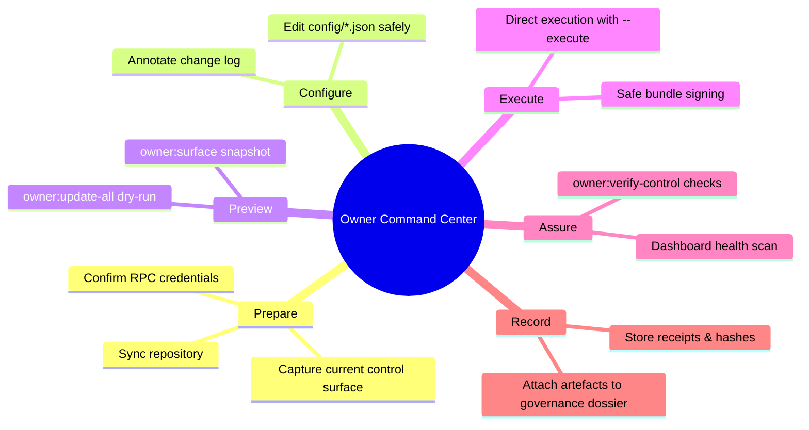
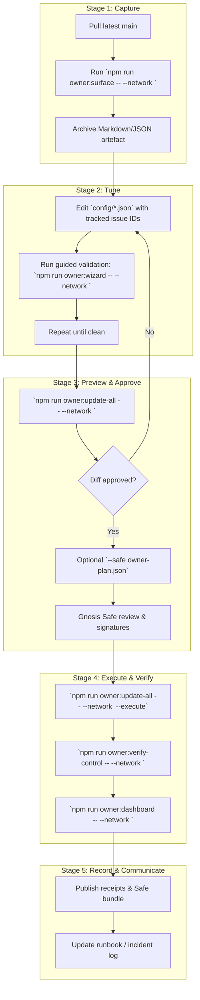
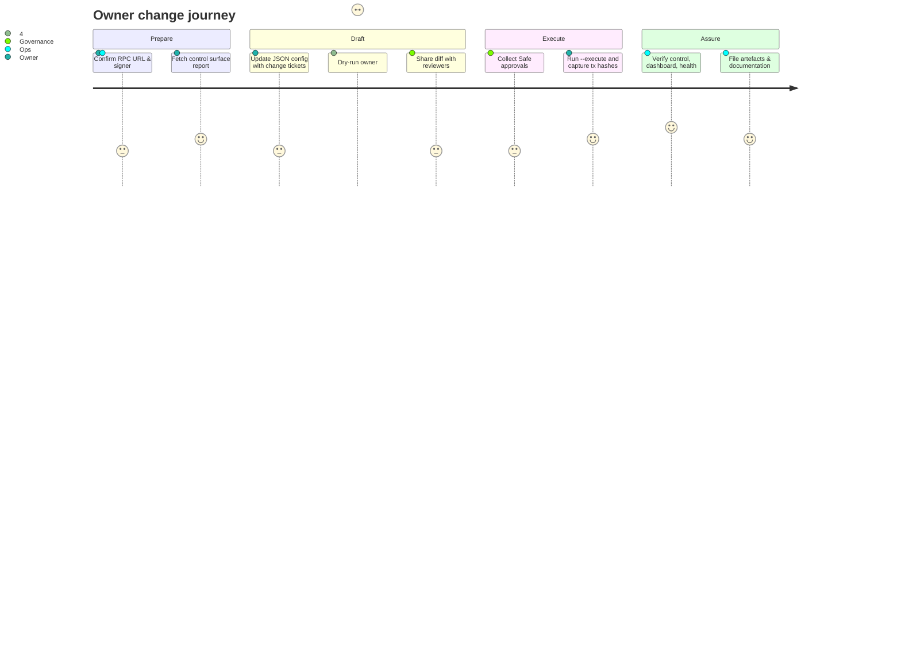

# Owner Command Center

> **Audience.** Contract owners, governance leads, and non-technical operators who must adjust AGIJobs production parameters without touching Solidity or deployment scripts manually.
>
> **Goal.** Deliver a single, visual command center that explains **what** can be tuned, **where** the configuration lives, **how** to preview the impact, and **which** verification hooks guarantee a safe rollout.

## Mission Map



Use the map as the default operating procedure for any parameter change. Each stage links to concrete commands below, so teams can assign duties without cross-training on Solidity internals.

## Command-Line Quickstart

Generate a live briefing—including Markdown tables, human-readable summaries, and an optional Mermaid governance flow—directly from the committed configuration:

```bash
# Human-readable digest
npm run owner:command-center -- --network <network>

# Markdown export with diagrams for your change ticket
npm run owner:command-center -- --network <network> --format markdown --out runtime/<network>-command-center.md

# Skip diagrams when pasting into plain-text systems
npm run owner:command-center -- --network <network> --no-mermaid
```

The CLI hydrates `config/owner-control.json`, `config/*` module manifests, and the `$AGIALPHA` token constants in one pass. Each module summary highlights:

- **Config path** – where the contract owner edits parameters.
- **Preview command** – the dry-run helper to validate edits before execution.
- **Execute command** – the exact transaction bundle trigger.
- **Verify command** – the post-change sanity check.
- **Key knobs** – burn ratios, treasuries, PID gains, signer allowlists, policy URIs, and other production levers.

Point `--output` at a shared folder to produce artefacts for audits, or run without arguments for an on-demand terminal dashboard.

## Parameter Surfaces at a Glance

| Layer | Key Decisions | Configuration Files | Preview Command | Execution Command | Verification |
| --- | --- | --- | --- | --- | --- |
| Identity & ENS | Registries, allowlists, ENS aliases | [`config/identity-registry.*.json`](../config) | `npm run identity:update -- --network <net>` | Same with `--execute` | `npm run owner:verify-control -- --network <net>` |
| Economic knobs | Fees, burn ratios, treasury, stake sizes | [`config/fee-pool.json`](../config/fee-pool.json), [`config/stake-manager.json`](../config/stake-manager.json), [`config/job-registry.json`](../config/job-registry.json) | `npm run owner:update-all -- --network <net> --only=feePool,stakeManager,jobRegistry` | Add `--execute` | `npm run owner:dashboard -- --network <net>` |
| Thermodynamics | PID gains, epoch share, free-energy ceilings | [`config/thermodynamics.json`](../config/thermodynamics.json), [`config/reward-engine.json`](../config/reward-engine.json) | `npx hardhat run scripts/v2/updateThermodynamics.ts --network <net>` | Same with `--execute` | `npm run owner:health -- --network <net>` |
| Measurement | Energy oracle signer set, Hamiltonian windows | [`config/energy-oracle.json`](../config/energy-oracle.json), [`config/hamiltonian-monitor.json`](../config/hamiltonian-monitor.json) | `npx hardhat run scripts/v2/updateEnergyOracle.ts --network <net>` | Add `--execute` | `npm run owner:surface -- --network <net>` |
| Governance wiring | Owner, pauser, governance targets | [`config/owner-control.json`](../config/owner-control.json) + per-module overrides | `npm run owner:surface -- --network <net>` | `npm run owner:update-all -- --network <net> --execute` | `npm run owner:verify-control -- --network <net>` |

> **Change-control tip.** Record SHA-256 hashes of edited JSON files (automatically printed by `owner:surface`) before and after execution. Attach both to your ticket for tamper-evident provenance.

## 360° Control Surface Flow



The flow makes explicit checkpoints for linting, Safe review, execution, and verification. Non-technical stewards can delegate each stage to different teammates while preserving an auditable chain of custody.

## One-Page Operator Journey



Scores help allocate staffing: higher numbers indicate greater effort/attention required from that role during the step.

## Scenario Playbooks

### 1. Update Treasury Destination

1. Edit `config/fee-pool.json` and `config/job-registry.json`, supplying the new treasury address under `treasury`.
2. Run:
   ```bash
   npm run owner:update-all -- --network <network> --only=feePool,jobRegistry
   ```
3. Verify the diff includes both modules and that the helper automatically rejects the owner address.
4. Once approved, rerun with `--execute` and finish with `npm run owner:verify-control -- --network <network>`.

### 2. Rotate Governance Owner to a New Multisig

1. Update `governance` and `owner` defaults in `config/owner-control.json`.
2. Execute a full dry-run:
   ```bash
   npm run owner:surface -- --network <network>
   npm run owner:update-all -- --network <network>
   ```
3. Generate a Safe bundle for review:
   ```bash
   npm run owner:update-all -- --network <network> \
     --safe owner-governance-rotation.json \
     --safe-name "AGIJobs Governance Rotation"
   ```
4. After signatures, execute the bundle or run with `--execute` from an authorised signer.
5. Confirm with `npm run owner:verify-control -- --network <network> --strict`.

### 3. Refresh Energy Oracle Signers

1. Edit `config/energy-oracle.json`, adjusting `signers` and optionally setting `retainUnknown: false`.
2. Preview and execute using the helper:
   ```bash
   npx hardhat run scripts/v2/updateEnergyOracle.ts --network <network>
   npx hardhat run scripts/v2/updateEnergyOracle.ts --network <network> --execute
   ```
3. Run `npm run owner:dashboard -- --network <network>` to ensure the signer set matches expectations.

### 4. Thermodynamic PID Retuning

1. Update `config/thermodynamics.json` and `config/reward-engine.json` with the new gains.
2. Execute the preview:
   ```bash
   npx hardhat run scripts/v2/updateThermodynamics.ts --network <network>
   ```
3. Validate stability (no warnings). If safe, append `--execute`.
4. Finish with `npm run owner:health -- --network <network>` to re-run integration checks.

## Safety Nets & Validation Matrix

| Validation Layer | Command | Failure Signal | Recovery Action |
| --- | --- | --- | --- |
| Static schema | `npm run owner:surface -- --network <net>` | Script throws on malformed JSON or missing fields | Fix configuration; rerun before proceeding. |
| Dry-run diffs | `npm run owner:update-all -- --network <net>` | Highlighted `ERROR` or `WARN` rows | Resolve before adding `--execute`. |
| Runtime guards | Helper transactions | Reverts like `InvalidTreasury()` | Adjust configuration; rerun preview. |
| On-chain audit | `npm run owner:verify-control -- --network <net>` | Non-zero exit / mismatch list | Execute missing `acceptOwnership` or rerun helper. |
| Health overlay | `npm run owner:dashboard -- --network <net>` | WARN/ERROR statuses | Follow suggested remediation (pauser wiring, treasury drift, etc.). |

Always run **at least three** layers before signing off. The combo of lint → dry-run → verify prevents accidental production drift.

## Artefact Checklist

- [ ] Configuration JSON committed with descriptive message.
- [ ] `owner:surface` Markdown/JSON stored with change ticket.
- [ ] Dry-run diff exported (`--json` or CLI log captured).
- [ ] Safe bundle (if used) archived alongside signatures.
- [ ] Execution receipts (tx hashes) recorded.
- [ ] `owner:verify-control` output saved.
- [ ] Dashboard snapshot attached to incident/change record.

## Frequently Referenced Commands

```bash
# Full-stack dry run and execution
npm run owner:update-all -- --network <network>
npm run owner:update-all -- --network <network> --execute

# Ownership surface artefact
npm run owner:surface -- --network <network> --format markdown > runtime/<network>-surface.md

# Governance dashboard
npm run owner:dashboard -- --network <network>

# Thermodynamics helper (preview)
npx hardhat run scripts/v2/updateThermodynamics.ts --network <network>

# Interactive validator for config edits
npm run owner:wizard -- --network <network>
```

## Embedding Into Operational Culture

1. **Runbooks** – Link this command center inside your operational wiki. Encourage teams to treat it as the canonical reference before touching production.
2. **Change windows** – Schedule regular control-surface refreshes (e.g., weekly) so drift is caught during low-pressure periods.
3. **Training** – Walk new multisig signers through the Mermaid journey and scenario playbooks during onboarding.
4. **Incident response** – Pre-fill Safe bundles for emergency pausing or treasury reroutes and store them in an encrypted vault.
5. **Audits** – Share your artefact checklist and archived reports with auditors to evidence strong governance practices.

By consolidating diagrams, commands, and checklists, the Owner Command Center ensures the contract owner retains **complete, confident control** over every tunable parameter while meeting high-stakes, production-grade expectations.
