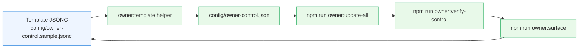
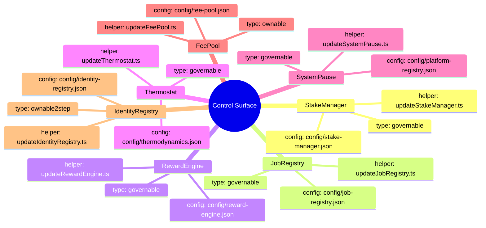
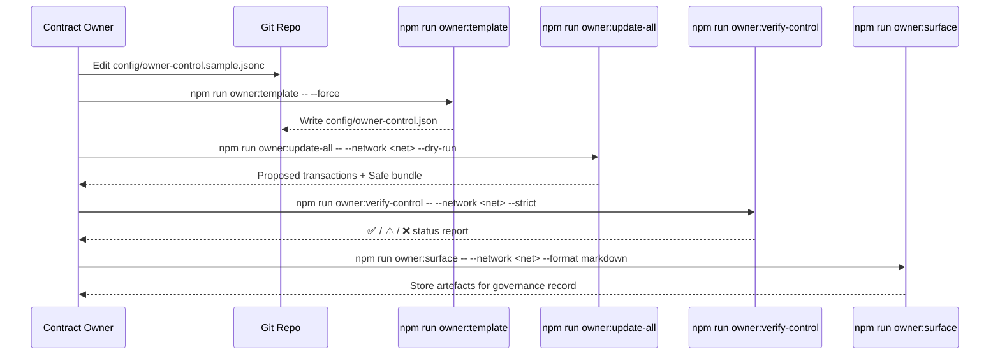

# Owner Control Configuration Template

> **Audience:** Contract owners and operations stewards who need a safe, fully
auditable way to edit `config/owner-control.json` without reverse-engineering the
existing tooling. The companion CLI helper and template make it trivial to stage,
review, execute and verify governance rotations from a single source of truth.

## Why this exists



- **Annotated JSONC** keeps every requirement inline with the fields you must
  edit. Comments describe where each address and override originates so you can
  cross-check against deployment manifests.
- **The `owner:template` helper** strips comments and produces a standards-compliant
  JSON file that all existing owner-control tooling consumes.
- **Guardrail scripts** (`owner:update-all`, `owner:verify-control`, `owner:surface`)
  stay untouched—this workflow simply makes it effortless to prepare the JSON they
  expect.

## Quickstart: render a clean JSON file

1. Inspect the annotated template:
   ```bash
   cat config/owner-control.sample.jsonc
   ```
2. Generate a production-ready JSON file (non-destructive by default):
   ```bash
   npm run owner:template
   ```
3. Overwrite an existing file intentionally:
   ```bash
   npm run owner:template -- --force
   ```
4. Capture the generated JSON for review in change-control tickets without
   touching disk:
   ```bash
   npm run owner:template -- --stdout > /tmp/owner-control.json
   ```
5. Commit the updated `config/owner-control.json` and run the standard owner-control
   pipeline before execution:
   ```bash
   npm run owner:update-all -- --network <network> --dry-run
   npm run owner:verify-control -- --network <network> --strict
   npm run owner:surface -- --network <network> --format markdown --out reports/<network>-surface.md
   ```

> **Safety check:** The helper refuses to overwrite an existing file unless you
> pass `--force`. This prevents accidental loss of hand-edited parameters during
> rehearsals or staged migrations.

## Field reference

| Field | Location | Purpose | Notes |
| ----- | -------- | ------- | ----- |
| `governance` | Root | Default multisig/timelock that controls modules marked `governable`. | Replace with the production governance Safe or timelock. Appears in reports and Safe bundles. |
| `owner` | Root | Default operational owner for `ownable` modules. | Often a hot wallet or operations Safe responsible for day-to-day maintenance. |
| `modules.*.type` | Module entry | Declares how the automation scripts interact with the module. | Supported values: `governable`, `ownable`, `ownable2step`. Custom strings are preserved for documentation but skipped during automation. |
| `modules.*.address` | Module entry | On-chain contract address. | Copy from `docs/deployment-addresses.json`, Hardhat artifacts or subgraph outputs. |
| `modules.*.governance` | Module entry | Optional override for the module governance address. | Falls back to the root `governance` if omitted. Use when a module is governed by a distinct Safe/timelock. |
| `modules.*.owner` | Module entry | Optional override for the module owner address. | Falls back to the root `owner`. Useful for pausers or when a module remains operator-controlled. |
| `modules.*.skip` | Module entry | Flag to exclude a module from automated updates while keeping it documented. | Reports still display the module with a "Skipped" banner so auditors know it is managed manually. |
| `modules.*.notes[]` | Module entry | Free-form annotations surfaced in every owner-control report. | Record why the module exists, the change cadence, or operational caveats. |

### Module cheat sheet



Use the cheat sheet to cross-reference the JSON template with the dedicated
update helpers. The names in the template map directly to the module keys used by
`owner:update-all --only=<module>` and the verification scripts.

## Step-by-step change playbook



## Frequently asked questions

- **Can I add new modules?** Yes. Add a new key under `modules` in the template,
  fill in the required fields and rerun `npm run owner:template -- --force`. All
  owner-control scripts automatically pick up the additional module and include it
  in reports.
- **How do I document multi-signature requirements?** Use the `notes` array to
  reference Safe names, signer thresholds or escalation contacts. The notes appear
  verbatim in command outputs and Markdown artefacts.
- **What if a module is intentionally manual?** Set `"skip": true`. The automation
  helpers will omit transactions but still surface the module in reports, reminding
  reviewers that manual interventions are expected.

## Change-control checklist

```mermaid
gantt
    title Owner Control Update Window
    dateFormat  HH:mm
    axisFormat  %H:%M
    section Preparation
    Draft template (git branch)       :done,    prep1, 00:30, 00:30
    Run owner:template --stdout       :done,    prep2, after prep1, 00:05
    section Dry Run
    owner:update-all --dry-run        :active,  dryrun, after prep2, 00:10
    Review Safe bundle                :         review, after dryrun, 00:15
    section Execution
    owner:update-all --execute        :         exec1, after review, 00:10
    section Verification
    owner:verify-control --strict     :         verify1, after exec1, 00:05
    owner:surface (archive)           :         archive1, after verify1, 00:05
```

Attach the completed checklist to your governance ticket to prove every control
lever was handled methodically.
