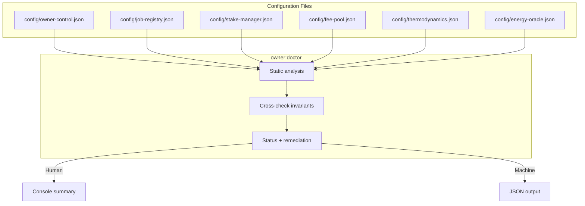

# Owner Control Doctor

> **Audience:** Contract owners, compliance teams and operations leads who need an
> objective, automation-friendly readiness score before touching production.
>
> **Goal:** Continuously validate that every owner-editable parameter is wired,
> non-zero and internally consistent before executing the update playbooks.

---

## Quick Start

```bash
# Human-friendly audit with severity ordering
npm run owner:doctor -- --network <network>

# Strict mode fails on warnings to gate CI pipelines
npm run owner:doctor -- --network <network> --strict

# Machine-readable JSON for dashboards or bots
npm run owner:doctor -- --network <network> --json
```

> **Tip:** The `--network` flag resolves per-network overrides exactly like the
> other owner helpers. Omit it when running against the default environment in
> `.env`/Hardhat.

---

## What It Checks

| Area                     | Validation Highlights                                                  | Why It Matters |
| ------------------------ | ---------------------------------------------------------------------- | -------------- |
| Owner control manifest   | Ensures every module exposes type, owner/governance targets & address. | Prevents tooling from skipping a contract due to missing metadata. |
| Reward engine + thermostat | Verifies share splits sum to 100, contract wiring is non-zero, and PID bounds are sane. | Stops mispriced rewards and temperature drift pre-deployment. |
| Energy oracle            | Confirms signer quorum is non-empty.                                   | Guards against stalled attestations. |
| Job registry             | Validates dependency addresses, fee percentages and tax/treasury routing. | Avoids jobs executing against incomplete wiring. |
| Stake manager            | Checks job registry linkage, pauser/thermostat wiring and staking thresholds. | Prevents slash routing issues and guarantees emergency controls. |
| Fee pool                 | Confirms stake manager link, burn percentages and treasury/gov wiring. | Stops reward accrual from disappearing into the zero address. |

> **Escalation policy:** Critical misconfigurations (missing addresses, broken
> share totals) surface as **✖ failures**. Optional-but-important fields (like
> treasury addresses) are **⚠ warnings**.

---

## Visual Overview



---

## Reading the Output

- **Summary header** – Shows pass/warn/fail counts and resolved networks.
- **Per-config blocks** – Sorted with failures first. Each bullet explains the
  issue and lists the exact field to edit.
- **Suggested actions** – Copy/paste guidance for non-technical operators; feed
  into tickets or runbooks.
- **Exit codes** – `0` on success/warnings (unless `--strict`) and `1` when
  failures are detected.

### Sample (abbreviated)

```
AGIJobs owner control doctor (network: mainnet)
Summary: 1 pass · 3 warn · 2 fail

✖ Thermodynamics & reward engine configuration (config/thermodynamics.json)
    - RewardEngine address is unset or zero.
    - Thermostat contract address is unset.
    Suggested actions:
      • Set rewardEngine.address in config/thermodynamics.json to the deployed RewardEngine contract.
      • Set thermostat.address to the deployed Thermostat contract.

⚠ FeePool configuration (config/fee-pool.json)
    - treasury defaults to zero; residual fees will burn.
    Suggested actions:
      • Assign fee-pool.treasury to the treasury wallet if dust should be captured.
```

Use the failed entries as a punch list: edit the referenced JSON file, rerun the
doctor until only passes remain, then execute `npm run owner:update-all`.

---

## Embedding in Automation

1. **Pre-commit hook** – Add `npm run owner:doctor -- --strict` to prevent
   accidental commits with zero addresses.
2. **Continuous delivery** – Run inside CI before broadcasting multisig bundles
   so production pipelines halt on configuration drift.
3. **Alerting** – Schedule the JSON mode hourly; diff the resulting payload to
   alert operations whenever someone edits a config without broadcasting updates.

---

## Next Steps

Once the doctor reports green across the board:

1. Generate the latest control surface: `npm run owner:surface -- --network <network>`.
2. Dry-run updates: `npm run owner:update-all -- --network <network>`.
3. Execute with `--execute` once the plan matches expectations.
4. Archive the doctor report alongside receipts for auditors.
