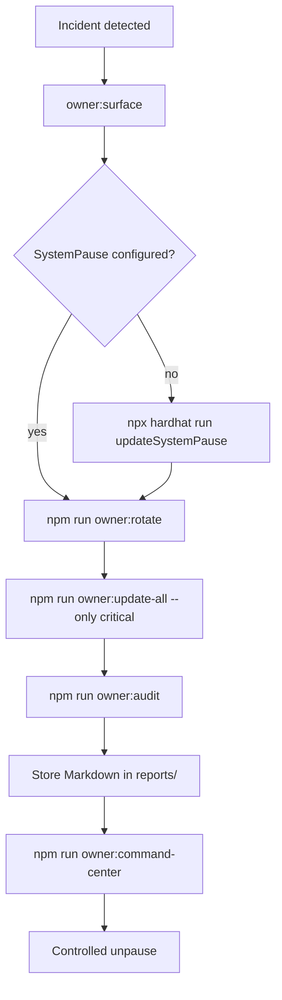
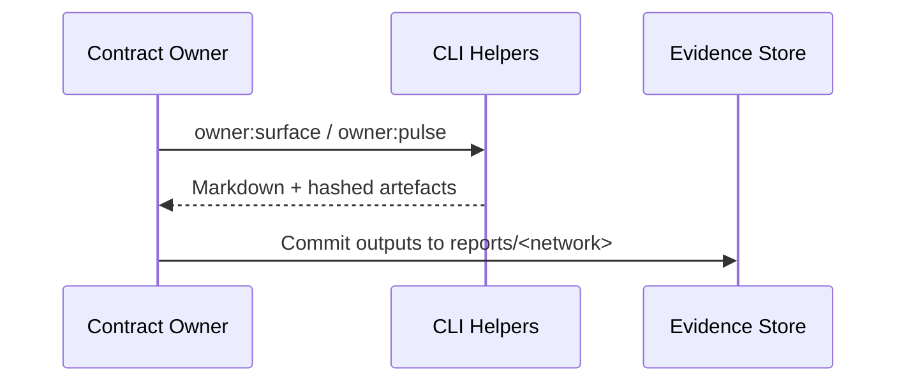

# Owner Control Emergency Runbook

> **Purpose.** Arm the contract owner with a pre-approved, non-technical playbook
> for freezing AGIJobs, rotating governance, and documenting every mitigation step
> under incident-response timelines. Every command below ships in this repository
> and can be executed by an operator following copy/paste instructions.

---

## 1. Generate a tailored emergency pack

Run the new helper to assemble a network-aware action plan, Markdown checklists and
Mermaid diagrams you can attach to incident tickets.

```bash
npm run owner:emergency -- --network <network> \
  --format markdown \
  --out reports/<network>/emergency-runbook.md
```

- **Outputs.** A Markdown binder in `reports/<network>/` with the exact commands,
  validations and audit artefacts required for the next 24 hours.
- **Include diagrams.** Pass `--no-mermaid` to skip diagrams when exporting to
  systems that do not render Mermaid. By default the helper embeds both flowchart
  and sequence diagrams (see below).
- **JSON automation.** Switch to `--format json` when piping the runbook into an
  orchestration platform or ticketing bot.



---

## 2. Capture the live control surface

Before executing any change, freeze the current ownership and governance state.

```bash
npm run owner:surface -- --network <network> --format markdown \
  --out reports/<network>/surface-pre-emergency.md
npm run owner:pulse -- --network <network> --format markdown \
  --out reports/<network>/pulse-pre-emergency.md
npm run owner:verify-control -- --network <network> --strict
```

- **Why.** These artefacts become immutable evidence for regulators, auditors and
  insurance partners. The emergency helper automatically references the same
  output paths so every incident bundle is consistent.
- **Escalate failures.** If `owner:verify-control` reports a mismatch, escalate to
  the governance Safe immediately—ownership drift must be resolved before further
  automation.



---

## 3. Engage the System Pause switch

```bash
npx hardhat run --no-compile scripts/v2/updateSystemPause.ts \
  --network <network>
npx hardhat run --no-compile scripts/v2/updateSystemPause.ts \
  --network <network> --execute
```

- **Dry-run first.** The initial invocation prints the intended wiring and flags
  any modules that still need to transfer ownership to `SystemPause`.
- **Execute with the emergency signer.** Use the governance Safe or timelock key
  designated for incidents when rerunning with `--execute`.
- **Document overrides.** If a module is marked `"skip": true` inside
  `config/owner-control.json`, record the manual pause procedure in the incident
  ticket.

---

## 4. Rotate ownership and governance to emergency controllers

```bash
npm run owner:rotate -- --network <network>
npm run owner:rotate -- --network <network> \
  --safe reports/<network>/emergency-rotation-safe.json \
  --safe-name "AGIJobs Emergency Rotation"
npm run owner:rotate -- --network <network> --execute
```

- **Safe bundle ready.** The helper exports a Gnosis Safe JSON you can upload to
  the transaction builder for signature collection.
- **Two-step owners.** After executing, call `acceptOwnership()` from the new owner
  on any `Ownable2Step` modules (TaxPolicy, IdentityRegistry) listed in the CLI
  output.
- **Console transcripts.** Copy the full `owner:rotate --execute` console log into
  the incident ticket, including timestamps and transaction hashes.

---

## 5. Reapply emergency parameter overrides

```bash
npm run owner:update-all -- --network <network> \
  --only=feePool,stakeManager,jobRegistry,platformRegistry,platformIncentives
npm run owner:update-all -- --network <network> \
  --only=feePool,stakeManager,jobRegistry,platformRegistry,platformIncentives \
  --execute
```

- **Treasury hardening.** Redirect all protocol flows (treasuries, burns, rewards)
  to hardened wallets defined in `config/fee-pool.json` and
  `config/stake-manager.json`.
- **Signer triage.** Use `config/energy-oracle.json` to disable compromised energy
  oracle signers and re-run the helper with `--only=energyOracle` if required.
- **Diff visibility.** Pair the run with `--json` output piped to the incident
  ticket for machine-verifiable logging.

---

## 6. Archive post-change evidence

```bash
npm run owner:audit -- --network <network> --format markdown \
  --out reports/<network>/emergency-audit.md
npm run owner:dashboard -- --network <network> --format markdown \
  --out reports/<network>/dashboard-post-emergency.md
npm run owner:mission-control -- --network <network> --format markdown \
  --out reports/<network>/mission-control-post-emergency.md
```

- **Audit trail.** Confirms ownership, governance, pauser wiring and outstanding
  acceptOwnership actions.
- **Telemetry snapshot.** Captures runtime parameters (thermodynamics, reward
  shares, signer sets) under emergency settings.
- **Immutable storage.** Upload these Markdown artefacts to a write-once storage
  provider (e.g. IPFS, cloud bucket with object lock).

---

## 7. Plan controlled recovery

```bash
npm run owner:command-center -- --network <network> --format markdown \
  --out reports/<network>/recovery-brief.md
npm run owner:change-ticket -- --network <network> --format markdown \
  --out reports/<network>/recovery-change-ticket.md
npm run owner:verify-control -- --network <network> --strict
```

- **Recovery brief.** Summarises outstanding tasks, owners, dependencies and
  gating approvals required to exit emergency mode safely.
- **Change ticket.** Provides a ready-to-sign document for governance to approve
  resuming normal operations.
- **Continuous verification.** Keep ownership checks running even while paused to
  detect unauthorised changes.

---

## 8. Incident binder checklist

Track progress using the following Gantt view (rendered by the helper as well).

```mermaid
gantt
    title Emergency Response Window
    dateFormat  HH:mm
    axisFormat  %H:%M
    section Detect & Snapshot
    owner:surface + owner:pulse    :done,   snap, 00:10, 00:10
    owner:verify-control           :active, verify, after snap, 00:05
    section Stabilise
    updateSystemPause --execute    :        pause, after verify, 00:05
    owner:rotate --safe            :        rotate, after pause, 00:10
    owner:rotate --execute         :        rotateExec, after rotate, 00:05
    section Harden
    owner:update-all --only crit   :        harden, after rotateExec, 00:10
    section Audit
    owner:audit + owner:dashboard  :        audit, after harden, 00:10
    section Recovery Planning
    owner:command-center           :        recover, after audit, 00:10
```

Mark each step as complete inside the generated Markdown to create an auditable
timeline of actions taken during the incident.

---

## 9. Who does what?

| Role | Responsibilities | Key Commands |
| --- | --- | --- |
| **Contract Owner** | Initiates the helper, signs emergency transactions, liaises with governance. | `owner:emergency`, `owner:rotate --execute`, `owner:update-all --execute` |
| **Governance Safe Signers** | Approve Safe bundle, monitor for replay attacks. | Review `reports/<network>/emergency-rotation-safe.json` |
| **Compliance / Legal** | Archive Markdown outputs, confirm regulatory notifications. | `owner:audit`, `owner:dashboard`, `owner:mission-control` |
| **Site Reliability (SRE)** | Monitor telemetry, reconfigure alerting thresholds, coordinate infrastructure fixes. | `owner:pulse`, `owner:command-center` |

---

## 10. Recovering from the incident

Once incident responders and governance approve returning to normal operations:

1. Reverse any temporary treasury overrides inside `config/fee-pool.json` and
   `config/stake-manager.json`.
2. Restore baseline signer sets in `config/energy-oracle.json` and rerun
   `owner:update-all --only=energyOracle --execute`.
3. Update the change ticket with the planned unpause time and approvals.
4. Re-run `npm run owner:emergency` to generate a **recovery** runbook and file the
   output alongside the incident binder.

> **Remember:** never unpause the system until `owner:verify-control --strict`
> returns clean, the governance Safe has signed the recovery plan and the
> compliance team confirms all artefacts are archived.

