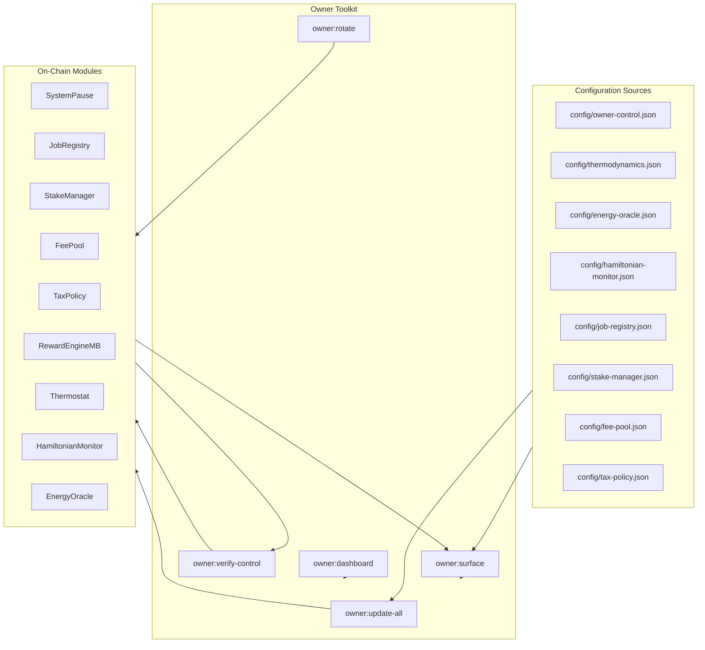
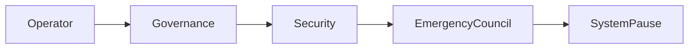

# Owner Control Handbook

> **Audience:** Non-technical protocol owners and operations teams who need a single
> source of truth for the AGIJob platform's governance and configuration levers.
>
> **Goal:** Provide a production-ready, copy/paste friendly guide for inspecting,
> updating and validating every owner-editable parameter without writing code.

> **Bundle Exports:** Need tamper-evident artefacts for auditors? Pair the commands
> below with the bundle workflow in
> [`docs/owner-mission-bundle.md`](./owner-mission-bundle.md).

---

## Command Quick Reference

```bash
# Generate a fresh control-surface report (human readable)
npm run owner:surface -- --network <network>

# Export the report to Markdown for distribution or runbook attachment
npm run owner:surface -- --network <network> --format markdown --out reports/<network>-owner-surface.md

# Apply every config change described under config/*.json (dry run)
npm run owner:update-all -- --network <network>

# Execute the validated update batch once the dry run looks correct
npm run owner:update-all -- --network <network> --execute

# Verify that every contract is controlled by the intended owner / governance signer
npm run owner:verify-control -- --network <network>
```

> **Tip:** `--network` accepts any Hardhat network defined in
> [`hardhat.config.js`](../hardhat.config.js). Use environment variables like
> `RPC_URL` or `OWNER_PRIVATE_KEY` to provide credentials without committing
> secrets.

---

## Visual Control Surface



The mermaid diagram illustrates the closed loop between configuration files,
command-line helpers and the deployed contracts. **Every setter exposed by the
protocol flows through these scripts**, giving the contract owner end-to-end
control without direct Solidity interaction.

---

## Step-by-Step Owner Workflow

1. **Inspect the current state**

   - Run `npm run owner:surface -- --network <network>`.
   - Review highlighted warnings (yellow) and errors (red). Hovering text in the
     terminal shows missing configuration files or mismatched addresses.
   - For audit trails, rerun with `--format markdown --out reports/<network>-owner-surface.md`.

2. **Plan configuration edits**

   - Edit the relevant JSON file under `config/` (for example,
     `config/thermodynamics.json`). Every key is documented inline within the
     files and mirrors the Solidity setter signature.
   - Use version control to capture the change set. Commit messages should
     reference the network and expected on-chain impact.

3. **Validate against live contracts**

   - Execute `npm run owner:update-all -- --network <network>`.
   - The script loads every config module, compares against on-chain state and
     prints a transaction plan without sending transactions.
   - If discrepancies appear unexpected, rerun with `DEBUG=owner:update` to view
     RPC traces before proceeding.

4. **Execute the plan**

   - Once the dry run is correct, append `--execute` to broadcast the batched
     transactions from the configured signer.
   - Hardware wallets and multisigs are supported: specify
     `--safe <file>` and `--safe-name <label>` to emit a
     [Gnosis Safe](https://safe.global) transaction bundle for air-gapped review.

5. **Post-change verification**
   - Run `npm run owner:verify-control -- --network <network>` to ensure every
     governed contract now reports the expected owner or governance address.
   - Archive the Markdown surface report together with execution receipts to
     maintain a production compliance trail.

---

## Parameter Inventory

| Module               | Key Controls                                      | Setter Commands                                                      |
| -------------------- | ------------------------------------------------- | -------------------------------------------------------------------- |
| `JobRegistry`        | Job fee rates, treasury address, per-role caps    | `npm run owner:update-all` (reads `config/job-registry.json`)        |
| `StakeManager`       | Minimum/maximum stake, cooldown windows, treasury | `npm run owner:update-all` (reads `config/stake-manager.json`)       |
| `FeePool`            | Burn percentage, treasury allowlist               | `npm run owner:update-all` (reads `config/fee-pool.json`)            |
| `RewardEngineMB`     | Free-energy budget split, chemical potentials     | `npm run owner:update-all` (reads `config/thermodynamics.json`)      |
| `Thermostat`         | PID gains, target entropy, max adjustments        | `npm run owner:update-all` (reads `config/thermostat.json`)          |
| `HamiltonianMonitor` | Observation window, reset flag                    | `npm run owner:update-all` (reads `config/hamiltonian-monitor.json`) |
| `EnergyOracle`       | Authorised signers, quorum requirements           | `npm run owner:update-all` (reads `config/energy-oracle.json`)       |
| `TaxPolicy`          | Tax brackets, exemptions, treasury routing        | `npm run owner:update-all` (reads `config/tax-policy.json`)          |
| `SystemPause`        | Module wiring, pause guardians                    | `npm run owner:update-all` (reads `config/system-pause.json`)        |

Every configuration file supports per-network overrides. Place a file named
`config/<module>.<network>.json` next to the default to specialise a deployment
without forking the repository.

---

## Operational Safety Checklist

- [ ] Store every owner and governance private key inside an HSM or hardware
      wallet. Never expose the key to the CI system.
- [ ] Require multisig approval (`owner:rotate -- --safe ...`) for irreversible
      governance transfers.
- [ ] Pin transaction receipts to the internal runbook immediately after
      execution. A completed checklist provides legal and compliance coverage.
- [ ] Schedule quarterly full-surface audits: rerun `owner:surface` for each
      supported network and file the Markdown outputs in the compliance vault.
- [ ] Monitor the `SystemPause` address with an on-chain alert (e.g. Tenderly or
      OpenZeppelin Defender) to detect unsolicited ownership changes.

---

## Troubleshooting Matrix

| Symptom                                   | Diagnosis Steps                                                        | Resolution                                                           |
| ----------------------------------------- | ---------------------------------------------------------------------- | -------------------------------------------------------------------- |
| `owner:surface` throws `Unknown argument` | Ensure extra flags are placed after `--` so `npm` passes them through. | `npm run owner:surface -- --network sepolia --format markdown`       |
| Update scripts fail with `CALL_EXCEPTION` | The executing signer lacks the required role (owner/governance).       | Re-run `owner:verify-control` and rotate ownership if necessary.     |
| Markdown export missing sections          | One or more config files are absent.                                   | Copy the template from `config/templates` and adjust values.         |
| Multisig bundle rejected                  | Safe transaction nonce mismatch.                                       | Pull the latest Safe state and increment `--safe-nonce` accordingly. |

---

## Appendices

### A. Compliance Runbook Template

```markdown
# <Network> Owner Control Session – <YYYY-MM-DD>

- Operator: <Name>
- Execution Wallet: <Address / Safe Name>
- Git Commit: <hash>
- Commands Executed:
  1. npm run owner:surface -- --network <network>
  2. npm run owner:update-all -- --network <network>
  3. npm run owner:update-all -- --network <network> --execute
  4. npm run owner:verify-control -- --network <network>
- Artifacts:
  - reports/<network>-owner-surface-<timestamp>.md
  - safe/<network>-batch.json
  - receipts/<network>-owner-update-<txhash>.json
- Sign-Off:
  - [ ] Governance Lead
  - [ ] Security Lead
  - [ ] Compliance Lead
```

### B. Escalation Ladder



Keep the escalation ladder posted in the operations war room. The `SystemPause`
contract remains the final authority for emergency response and requires joint
sign-off from the Emergency Council.

---

## Change Log

- **2025-01-12:** Initial publication of the Owner Control Handbook. Aligns with
  repository scripts `owner:surface`, `owner:update-all`, `owner:verify-control`,
  and `owner:rotate`.
