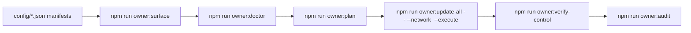

# Owner Control Index

> **Audience:** Contract owners, governance stewards, compliance reviewers.
>
> **Purpose:** Provide a single flight deck that catalogues every adjustable governance input, its source manifest, the automation helpers that mutate it, and the verification commands that prove the change landed correctly—without requiring Solidity expertise.

---

## Quick orientation

The index groups the AGI Jobs v2 control surface into domains that map to the JSON manifests under `config/`. Each entry lists:

1. **What you can tune** (e.g., thermodynamic weights, fee splits, signer rosters).
2. **Where the configuration lives** (path to the canonical manifest plus optional per-network overrides in `config/<network>/`).
3. **Which helper executes the change** (npm script or Hardhat task).
4. **How to validate post-change** (owner verification commands, CI expectations, or on-chain calls).

---

## Catalogue

| Domain | What you control | Source manifest(s) | Execute helper | Verification |
| --- | --- | --- | --- | --- |
| **Token & payouts** | Reward role shares, thermostat PID, treasury routing | `config/thermodynamics.json` (incl. `thermostat` block), `config/fee-pool.json` | `npm run owner:update-all -- --only rewardEngine,thermostat,feePool` | `npm run owner:verify-control -- --modules rewardEngine,thermostat,feePool` |
| **Job lifecycle** | Employer fee percentages, escrow stakes, identity registry wiring | `config/job-registry.json`, `config/identity-registry.json` | `npm run owner:update-all -- --only jobRegistry,identityRegistry` | `npm run owner:verify-control -- --modules jobRegistry,identityRegistry` |
| **Stake management** | Minimum stakes, fee/burn percentages, treasury allowlists | `config/stake-manager.json` | `npm run owner:update-all -- --only stakeManager` | `npm run owner:verify-control -- --modules stakeManager` |
| **Energy oracle** | Signer roster, quorum thresholds, reporting cadence, commit/reveal windows | `config/energy-oracle.json`, `config/randao-coordinator.json` | `npm run owner:update-all -- --only energyOracle,randao` | `npm run owner:pulse -- --network <network>` |
| **System pause & governance** | Pauser handoff, module wiring, guardian rotation | `config/agialpha.json` (`modules.systemPause`), `config/owner-control.json` | `npx hardhat run scripts/v2/updateSystemPause.ts --network <network> --execute` | `npm run owner:verify-control -- --modules systemPause` Dry run `npx hardhat run scripts/v2/updateSystemPause.ts --network <network>` |
| **Tax policy** | Custom tax slabs, exemptions, metadata strings | `config/tax-policy.json` | `npm run owner:update-all -- --only taxPolicy` | `npm run owner:verify-control -- --modules taxPolicy` |
| **Attestation** | ENS validator/agent overrides, emergency allowlists | `config/identity-registry.json` | `npm run owner:update-all -- --only identityRegistry` | `npm run owner:verify-control -- --modules identityRegistry` |

> **Per-network overrides:** When a directory like `config/mainnet/` exists, the owner tooling automatically merges it with the base manifest. Always edit the network-specific file for production deployments so your staging defaults remain untouched.

---

## Daily driver checklist

1. `npm run owner:surface -- --network <network>` to render the active parameter map and highlight mutable knobs.
2. `npm run owner:doctor -- --network <network>` for readiness; rerun until it reports only ✅ entries (or acceptable ⚠ warnings).
3. `npm run owner:plan -- --network <network>` to preview the Hardhat transactions with human-readable annotations.
4. Capture approvals and multisig sign-offs using the [Owner Control Change Ticket](owner-control-change-ticket.md) template.
5. Execute with `npm run owner:update-all -- --network <network> --only <modules> --execute` once approvals land.
6. `npm run owner:verify-control -- --network <network>` to confirm the chain matches your manifests.
7. Archive artefacts using `npm run owner:audit -- --network <network> --out reports/<network>-owner-audit.md`.

---

## Cross-links

- [Owner Control Surface Snapshot](owner-control-surface-snapshot.md) – quick visual map of every governance touchpoint.
- [Owner Control Blueprint](owner-control-blueprint.md) – step-by-step execution guide with sign-off milestones.
- [Owner Control Parameter Playbook](owner-control-parameter-playbook.md) – granular breakdown of each adjustable field.
- [Owner Control Verification Guide](owner-control-verification.md) – detailed post-change validation drills.
- [Owner Control Snapshot Kit](owner-control-snapshot-kit.md) – automation patterns for archiving parameter states.

Keep this index bookmarked inside the owner’s runbook so non-technical operators can jump directly to the relevant manuals.
