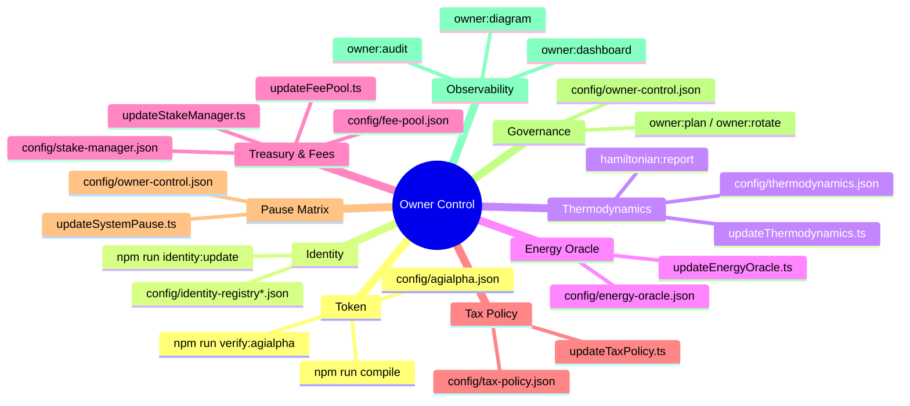

# Owner Control Index

This index distils every governance and configuration lever exposed by the AGIJobs v2 stack into a single, owner-friendly launchpad. It is designed for non-technical decision makers who must retune protocol parameters, rotate signers, or ship emergency fixes without touching Solidity or chasing scattered notes. Every entry below references an audited JSON manifest, a guided CLI helper, and a verification loop so the contract owner keeps full, provable authority over production systems.

> **Scope.** The index covers the supported v2 contracts (`contracts/v2`), all network-aware configuration files under `config/`, and the accompanying Hardhat/TypeScript orchestration scripts in `scripts/v2`. Legacy `contracts/legacy` artefacts remain unsupported.

## Mission control flight deck

The diagram below shows the canonical change pipeline. Each stage emits artefacts (Markdown, JSON, Safe bundles) that can be filed directly into compliance systems.

```mermaid
flowchart LR
    subgraph Config[Edit & Stage]
        C1[config/*.json
        Network overrides]
        C2[Draft change ticket
        (docs/owner-control-change-ticket.md)]
    end
    subgraph Analyse[Assess]
        A1[npm run owner:doctor
        Safety gate]
        A2[npm run owner:parameters
        Parameter matrix]
        A3[npm run owner:dashboard
        Live contract scan]
    end
    subgraph Plan[Plan & Approve]
        P1[npm run owner:plan
        diff preview]
        P2[npm run owner:command-center
        narrative brief]
        P3[npm run owner:blueprint
        compliance packet]
    end
    subgraph Execute[Execute]
        E1[npm run owner:rotate
        Ownership/governance]
        E2[npx hardhat run scripts/v2/update*.ts --network <net> --execute]
        E3[Safe bundle
        (owner:plan:safe)]
    end
    subgraph Verify[Verify & Archive]
        V1[npm run owner:verify-control]
        V2[npm run owner:audit]
        V3[npm run hamiltonian:report]
    end

    Config --> Analyse --> Plan --> Execute --> Verify
    Verify -->|post-change baseline| Analyse
```

## Zero-downtime change workflow

1. **Snapshot the current state.**
   - Run `npm run owner:surface -- --network <network>` to capture hashes of every config file and deployed address.
   - Export deployment records (`docs/deployment-addresses.json`) and ENS ownership with `npm run identity:update -- --network <network>`.
2. **Edit the relevant JSON manifest(s).**
   - Always stage edits in version control for auditability.
   - Use the `docs/owner-control-configuration-template.md` checklist to avoid missing mandatory fields.
3. **Run the automated doctors.**
   - `npm run owner:doctor -- --network <network>` halts the workflow if decimals, treasury targets, signer quorums or guardians are unsafe.
   - `npm run owner:parameters -- --network <network>` renders a red/amber/green table so stakeholders can approve the diff visually.
4. **Generate a change plan.**
   - `npm run owner:plan -- --network <network>` prints the exact transactions that will be broadcast.
   - Optional: `npm run owner:plan:safe -- --network <network>` exports a Gnosis Safe JSON ready for the multisig signers.
5. **Execute with explicit confirmation.**
   - Dry-run: remove `--execute` until every action preview is green.
   - Apply: rerun the same command with `--execute` from a governance-controlled signer.
6. **Verify and archive.**
   - `npm run owner:verify-control -- --network <network> --strict` enforces ownership invariants.
   - `npm run owner:audit -- --network <network>` generates Markdown/JSON artefacts for auditors.
   - Attach all artefacts (doctor report, plan, verification output) to the change ticket captured in step 1.

> **Non-technical mode.** Run `npm run owner:quickstart -- --network <network>` for a wizard that asks plain-language questions and emits a tailored checklist covering the workflow above.

## Parameter catalogue

| Domain | Config manifest(s) | Primary CLI entry point | On-chain targets | Verification & telemetry |
| --- | --- | --- | --- | --- |
| Token metadata, decimals, module wiring | `config/agialpha.json` (+ per-network overrides) | `npm run compile` → regenerates `contracts/v2/Constants.sol`; `npm run verify:agialpha -- --rpc <url>` | `Constants`, `RewardEngineMB`, dependent modules | `npm run owner:doctor`, `npm run owner:verify-control`, `npm run owner:diagram`
| Identity registry (agent/validator ENS roots, emergency allowlists) | `config/identity-registry*.json` | `npm run identity:update -- --network <network>` | `IdentityRegistry`, emergency bypass allowlists | `npm run owner:dashboard`, `npm run owner:mission-control`
| Thermodynamic reward weights & PID gains | `config/thermodynamics.json` | `npx hardhat run scripts/v2/updateThermodynamics.ts --network <network>` | `RewardEngineMB`, `Thermostat` | `npm run owner:parameters`, `npm run hamiltonian:update`, `npm run hamiltonian:report`
| Energy oracle signers & quorum policy | `config/energy-oracle.json` | `npx hardhat run scripts/v2/updateEnergyOracle.ts --network <network>` | `EnergyOracle` signer registry | `npm run owner:doctor`, `npm run owner:atlas`
| Hamiltonian monitor window & observations | `config/hamiltonian-monitor.json` | `npx hardhat run scripts/v2/updateHamiltonianMonitor.ts --network <network>` | `HamiltonianMonitor` | `npm run hamiltonian:report`, `npm run owner:command-center`
| Fee burning & treasury routing | `config/fee-pool.json`, `config/stake-manager.json`, `config/job-registry.json` | `npx hardhat run scripts/v2/updateFeePool.ts --network <network>` (plus `updateStakeManager.ts`, `updateJobRegistry.ts`) | `FeePool`, `StakeManager`, `JobRegistry` | `npm run owner:doctor`, `npm run owner:surface`
| Tax policy text & acknowledgers | `config/tax-policy.json` | `npx hardhat run scripts/v2/updateTaxPolicy.ts --network <network>` | `TaxPolicy` | `npm run owner:audit`, `npm run owner:command-center`
| Platform incentive multipliers | `config/platform-incentives.json` | `npx hardhat run scripts/v2/updatePlatformIncentives.ts --network <network>` | `PlatformIncentives` library targets | `npm run owner:parameters`, `npm run owner:blueprint`
| Randomness coordinator quorum & stake | `config/randao-coordinator.json` | `npx hardhat run scripts/v2/updateRandaoCoordinator.ts --network <network>` | `RandaoCoordinator` | `npm run owner:mission-control`, `npm run owner:atlas`
| System-wide pause wiring & guardians | `config/owner-control.json` (pause block) | `npx hardhat run scripts/v2/updateSystemPause.ts --network <network>` | `SystemPause` module map | `npm run owner:doctor`, `npm run owner:verify-control`
| Governance & ownership routing | `config/owner-control.json` | `npm run owner:plan -- --network <network>` / `npm run owner:rotate -- --execute` | All `Ownable`/`Governable` contracts | `npm run owner:verify-control`, `npm run owner:surface`, `npm run owner:mission-control`
| Agent & validator incentives catalogue | `config/platform-registry.json`, `config/platform-incentives.json` | `npx hardhat run scripts/v2/updatePlatformRegistry.ts --network <network>` | `PlatformRegistry` | `npm run owner:dashboard`, `npm run owner:atlas`

> **Need everything at once?** `npm run owner:update-all -- --network <network>` dry-runs the entire stack of update helpers using the manifests above. Add `--execute` only after every per-module preview is approved.

## Visual parameter map

The mind map highlights how each configuration manifest feeds scripts, change tickets, and monitoring outputs. Use it to brief executives in seconds.



## Hardening checklist

- ✅ **Backup before change.** Copy the relevant `config/*.json` files and `docs/deployment-addresses.json` to an immutable store before editing.
- ✅ **Enforce multi-party approval.** Require signatures on the Safe bundle generated by `npm run owner:plan:safe` before executing any `--execute` step.
- ✅ **Automate regression detection.** Integrate `npm run owner:doctor -- --network <network> --strict` into CI so pull requests that weaken invariants fail fast.
- ✅ **Record evidence.** Attach the rendered Markdown from `npm run owner:command-center` and `npm run owner:audit` to every change ticket.
- ✅ **Post-change monitoring.** Schedule `npm run owner:dashboard -- --network <network>` and `npm run hamiltonian:report` in cron/CI to detect drift.

## Further reading

| Goal | Reference |
| --- | --- |
| End-to-end story with diagrams & human checklists | [Owner Control Playbook](owner-control-playbook.md) |
| Single-page operating model | [Owner Control Blueprint](owner-control-blueprint.md) |
| Visual brief with runtime metrics | [Owner Control Command Center](owner-control-command-center.md) |
| Zero-downtime upgrade drills | [Owner Control Zero-Downtime Guide](owner-control-zero-downtime-guide.md) |
| Structured change-ticket template | [Owner Control Change Ticket](owner-control-change-ticket.md) |

Print any of the above as Markdown or JSON via the matching `npm run owner:*` command listed in `package.json`. Every helper supports `--network <name>`, optional `--out <file>` destinations, and JSON output modes for automation.
