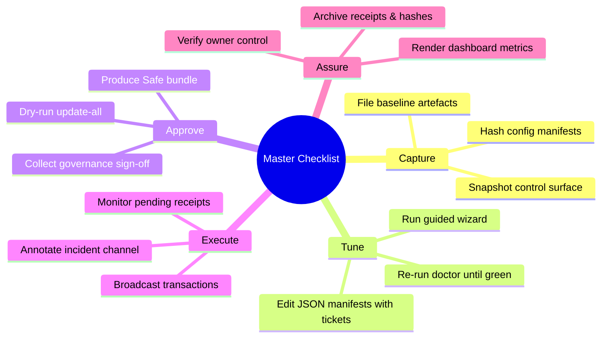
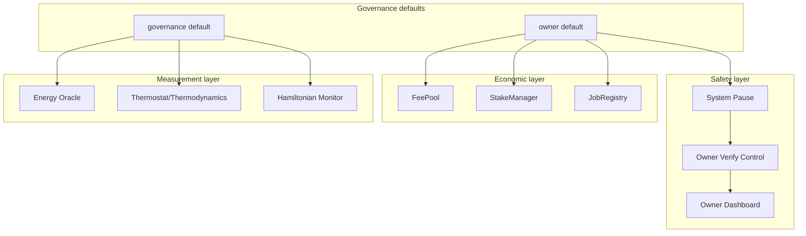
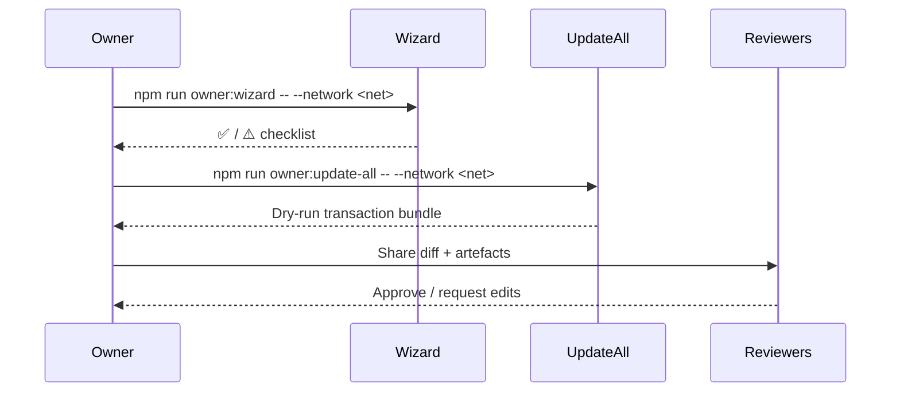

# Owner Control Master Checklist

> **Audience.** Contract owners, compliance leads, and non-technical operators who must retune AGIJobs production parameters without editing Solidity.
>
> **Goal.** Provide a single-page, copy/paste-ready checklist that links every governance lever to the exact command, artefact, and verification hook required for a flawless production change.

## Visual Orientation



Use the mind map to brief stakeholders before entering the change window. Each branch maps to an actionable block below with commands, success criteria, and remediation tips.

## Pre-Flight Checklist (copy/paste)

| ✅ / ⚠️ | Task | Command / Artefact | Owner | Notes |
| --- | --- | --- | --- | --- |
| ☐ | Pull latest repository state | `git pull --rebase origin main` | Ops | Ensure CI is green before proceeding. |
| ☐ | Load runtime secrets | `cp deployment-config/.env.example .env && vi .env` | Owner | Populate RPC URLs and signer keys. |
| ☐ | Baseline control surface | `npm run owner:surface -- --network <network> --format markdown --out runtime/<network>-surface.md` | Ops | Attach SHA-256 hashes to the change ticket. |
| ☐ | Baseline doctor report | `npm run owner:doctor -- --network <network> --json --out runtime/<network>-doctor.json` | Ops | Must be ⚠️ or ✅ only before continuing. |
| ☐ | Announce maintenance window | Follow your communications runbook (see [docs/owner-mission-control.md](owner-mission-control.md)) | Comms | Notify stakeholders, validators, and support desks. |

Update the checkboxes as you complete each prerequisite. A production change cannot proceed until every row is checked.

## Tunable Surfaces



Every contract listed above is configurable without touching Solidity. The JSON manifests in `config/` plus the scripts under `scripts/v2/` provide the edit → preview → execute → verify loop.

## Parameter Editing Workflow

1. **Identify the change ticket.** Record the issue or governance decision in your tracking system.
2. **Edit the manifest.** Update the relevant JSON file:
   - `config/fee-pool.json` for burn percentages, treasury addresses, and fee routing.
   - `config/stake-manager.json` for bonding/unbonding timers and reward weights.
   - `config/job-registry.json` for employer deposit buffers and dispute windows.
   - `config/thermodynamics.json` and `config/reward-engine.json` for temperature/PID gains.
   - `config/energy-oracle.json` for authorised signer allowlists.
   - `config/hamiltonian-monitor.json` for sliding window parameters.
3. **Run the wizard.** `npm run owner:wizard -- --network <network>` walks each manifest, validates schema/addresses, and shows remediation tips.
4. **Repeat until clean.** Continue editing and re-running the wizard until it reports ✅ across all modules.

> **Tip:** Save intermediate wizard artefacts (`--out runtime/<network>-wizard.md`) for compliance archives.

## Dry-Run and Approval Gate



- **Dry run** using `npm run owner:update-all -- --network <network> --json --out runtime/<network>-plan.json`.
- **Generate Safe bundle** when approvals are required: `npm run owner:update-all -- --network <network> --json --safe runtime/<network>-safe.json`.
- **Review** the Markdown diff produced by `owner:update-all` and attach the wizard, surface, doctor, and plan artefacts to the approval ticket.

Only proceed once reviewers sign off on the JSON diff and Safe bundle.

## Execution Window

1. **Set HARDHAT_NETWORK** (optional): `export HARDHAT_NETWORK=<network>`.
2. **Execute plan**: `npm run owner:update-all -- --network <network> --execute --receipt-log runtime/<network>-receipts.json`.
3. **Monitor mempool** using your block explorer or `npx hardhat tx:wait --hash <0x...>` if available.
4. **Capture transaction hashes** and drop them into the change log.

If any transaction fails, abort the window, restore the config from Git, and consult `docs/disaster-recovery.md`.

## Assurance & Post-Flight

| Step | Command | Success Criteria | Remediation |
| --- | --- | --- | --- |
| Verify ownership | `npm run owner:verify-control -- --network <network> --strict --json --out runtime/<network>-verify.json` | Exit code 0, no ❌ rows | Re-run ownership setters for mismatched modules. |
| Dashboard sweep | `npm run owner:dashboard -- --network <network> --format markdown --out runtime/<network>-dashboard.md` | All metrics green | Investigate metrics flagged in the report. |
| Mission control | `npm run owner:mission-control -- --network <network> --out runtime/<network>-mission.md` | Report status `success` | Review nested step logs if warnings appear. |
| Archive artefacts | `tar -czf runtime/<network>-change-bundle.tgz runtime/<network>-*.{md,json}` | Bundle stored in compliance vault | Retry tar command or regenerate missing artefacts. |

## Quick Reference Commands

```bash
# Everything in one go (surface -> plan -> verify -> dashboard)
npm run owner:mission-control -- --network <network> --out runtime/<network>-mission.md

# Render command center briefing for executive review
npm run owner:command-center -- --network <network> --format markdown --out runtime/<network>-command-center.md

# Generate parameter matrix for a governance packet
npm run owner:parameters -- --network <network> --out runtime/<network>-parameters.md
```

Store all generated artefacts under `runtime/` (already gitignored) and attach them to your ticketing system. This ensures the contract owner retains full control and auditable evidence of every change.

## Incident Response Hooks

If verification fails after execution:

1. **Pause affected modules** using `npx hardhat run scripts/v2/updateSystemPause.ts --network <network> --execute --only <module>`.
2. **Restore** the previous JSON manifests from Git (`git checkout -- config/<file>.json`).
3. **Re-run** `owner:update-all` to roll back the configuration.
4. **Document** the issue in `docs/sre-runbooks.md` for future reference.

## Final Sign-Off

```mermaid
gantt
    dateFormat  HH:mm
    axisFormat  %H:%M
    title Change Window Timeline (example)
    section Prepare
    Baseline reports           :done,    prep1, 00:00, 00:20
    Wizard clean run           :done,    prep2, 00:20, 00:30
    section Execute
    Dry-run & review           :active,  exec1, 00:30, 00:45
    Broadcast transactions     :         exec2, 00:45, 01:00
    section Assure
    Verify & dashboard         :         assure1,01:00, 01:15
    Archive artefacts          :         assure2,01:15, 01:25
```



Once all tasks are complete, upload the artefact bundle, close the change ticket, and note the transaction hashes in your ledger. The checklist ensures the contract owner maintains complete control over every tunable parameter with documented, repeatable procedures.
