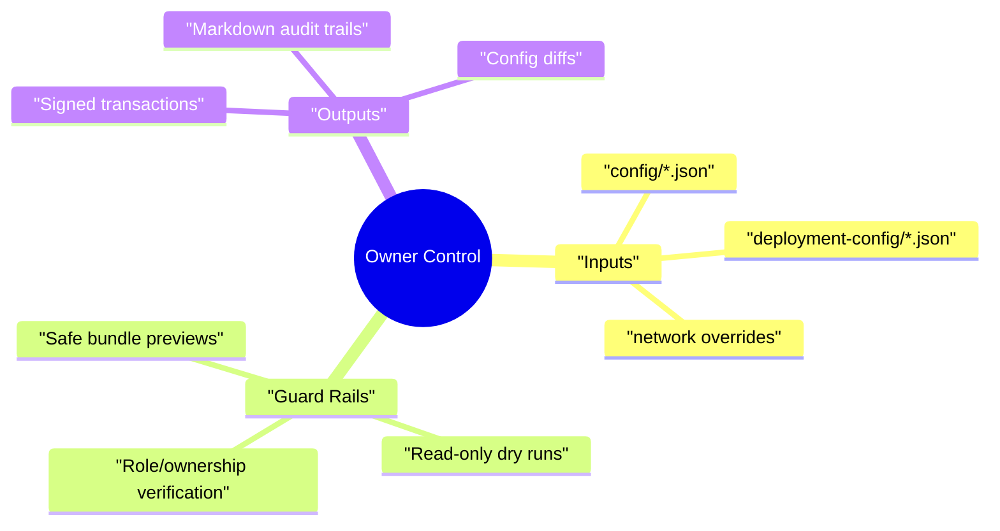
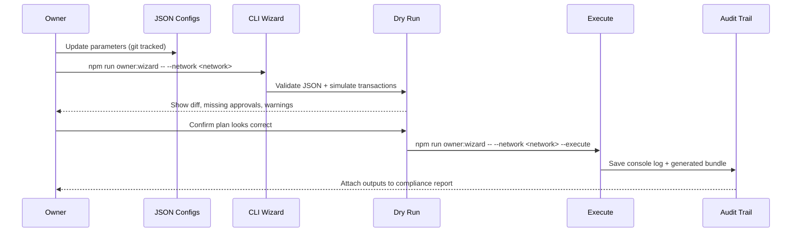

# Owner Control Non-Technical Guide

> **Audience:** Platform owners, operations managers and compliance leads who need to
> adjust AGIJobs parameters without Solidity, Hardhat or scripting expertise.
>
> **Goal:** Deliver a buttoned-down, copy/paste checklist that keeps the production
> deployment safe while giving the owner complete authority over every adjustable
> parameter.

---

## 1. Quick Orientation



- **Everything starts with configuration files.** `config/owner-control.json` mirrors
  ownership targets, while `config/*.json` (FeePool, StakeManager, Thermodynamics, …)
  contain the knobs you can turn. Never edit contracts directly—tune the JSON.
- **Automation scripts do the heavy lifting.** Each helper supports `--dry-run`
  (default) and `--execute` so you always preview the plan before signing.
- **Reports create audit trails.** Commands in this guide emit Markdown snapshots,
  JSON bundles and CLI transcripts ready to share with stakeholders.

---

## 2. Pre-Flight Checklist

1. **Select the network.** Every command accepts `--network <network>` and reads the
   matching entries in the config directory. Use `npx hardhat networks` to review
   available names if needed.
2. **Load credentials safely.** Export `OWNER_PRIVATE_KEY`, `GOVERNANCE_PRIVATE_KEY`
   or point to a JSON-RPC URL with `RPC_URL`. Never commit secrets—environment
   variables keep them local.
3. **Create an execution workspace.** We recommend storing generated artefacts inside
   `reports/<network>/` so each run is traceable.

```bash
mkdir -p reports/mainnet
export RPC_URL="https://mainnet.infura.io/v3/<project>"
export OWNER_PRIVATE_KEY="0x..."
```

> **Double-check:** If you are unsure the keys control the right signers, run
> `npm run owner:verify-control -- --network <network>` before making changes. The
> command fails fast if ownership is misconfigured.

---

## 3. Edit Parameters with Confidence

Follow this workflow whenever you need to change treasury addresses, adjust reward
weights or update signer allowlists.



### 3.1 Launch the guided wizard

```bash
npm run owner:wizard -- --network <network>
```

- Answers accept **plain English** (e.g. `none`, `keep`, `treasury.safe.eth`).
- Numeric fields understand both token units (e.g. `1250`) and raw base units via
  the `raw:` prefix.
- The wizard writes back to the relevant `config/*.json` files and prints a change
  summary ready for Git commit.

### 3.2 Regenerate Solidity constants when token settings change

```bash
npm run compile
```

- Required whenever `config/agialpha.json` is edited. The compiler refuses to overwrite
  constants if addresses are malformed or decimals fall outside `0-255`.

### 3.3 Re-run the wizard in execute mode

```bash
npm run owner:wizard -- --network <network> --execute \
  --receipt reports/<network>/owner-wizard-$(date +%Y%m%d%H%M).json
```

- Adds a tamper-evident receipt with every on-chain transaction hash and config file
  digest.
- Skips unchanged modules, guaranteeing idempotent runs.

---

## 4. Apply Batch Updates from Source Control

When multiple teammates propose edits through Git, consolidate the work with the
batch runner.

```bash
npm run owner:update-all -- --network <network> \
  --plan reports/<network>/update-plan.md
```

- Generates a Markdown playbook documenting the diff per module.
- Pair with `--execute` once stakeholders sign off.
- Supports `--safe owner-rotation.json` to automatically produce a Gnosis Safe bundle
  for non-custodial execution.

---

## 5. Validate End-to-End Control

```bash
npm run owner:surface -- --network <network> --format markdown \
  --out reports/<network>/control-surface.md
npm run owner:verify-control -- --network <network>
```

- **`owner:surface`** captures the live control surface, including pausable modules,
  owner addresses and outstanding acceptOwnership steps.
- **`owner:verify-control`** halts if any contract is misaligned with the intended
  owner or governance account.

> **Tip:** Commit generated Markdown to a `runbooks/` folder so auditors can diff the
> evolution of your control posture between releases.

---

## 6. Zero-Downtime Execution Pattern

For production changes, chain these safeguards:

1. `npm run owner:dashboard -- --network <network>` – Build the visual dashboard to
   spot anomalies.
2. `npm run owner:command-center -- --network <network>` – Receive a curated action
   list plus links back to this guide, the playbook and mission bundle docs.
3. `npm run owner:doctor -- --network <network>` – Run health diagnostics before the
   execution window.
4. Apply updates with `--execute` flags only after every dry run is green.

Cross-reference [`docs/owner-control-zero-downtime-guide.md`](./owner-control-zero-downtime-guide.md)
for full sequencing, Safe bundle handling and rollback playbooks.

---

## 7. Hand-Off Package for Non-Technical Stakeholders

After executing updates, gather artefacts in a single archive:

1. `reports/<network>/control-surface.md`
2. `reports/<network>/update-plan.md`
3. Any `owner-wizard-*.json` receipts
4. Git diff of `config/*.json`

Distribute the bundle via your compliance process. Each file is intentionally
human-readable and can be reviewed without blockchain tooling.

---

## Appendix A – Frequently Used Commands

```bash
# Inspect current parameter matrix (no transactions)
npm run owner:matrix -- --network <network>

# Print ENS signer and oracle status
npm run owner:command-center -- --network <network> --focus energy-oracle

# Prepare Safe transaction JSON for treasury updates
npm run owner:update-fee-pool -- --network <network> --safe reports/<network>/fee-pool-safe.json

# Render the owner mermaid diagram as SVG for presentations
npm run owner:mermaid -- --network <network> --out reports/<network>/owner-surface.svg
```

---

By following this guide, the contract owner retains full, documented authority over
all adjustable parameters with zero guesswork, audit-ready trails and production-safe
rollouts.
