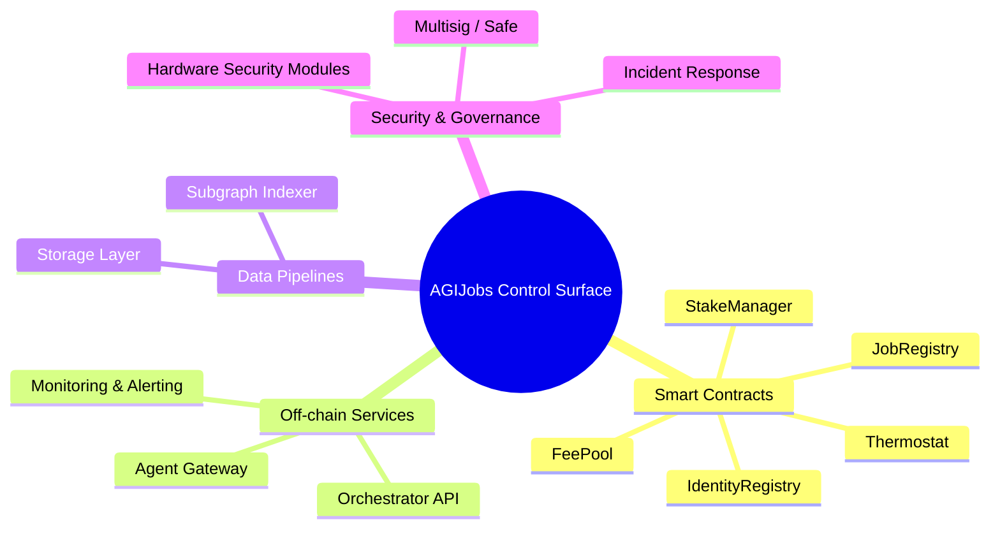
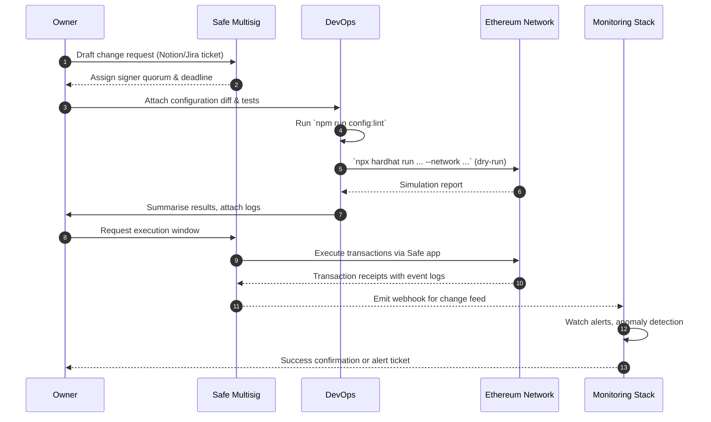

# Owner Control Operations Playbook

> **Audience:** Platform owner, delegated operators, and trusted multisig members who need a consolidated control surface across smart contracts, backend services, and monitoring stacks.
>
> **Goal:** Provide a production-ready, auditable runbook that can be executed by a non-technical owner with minimal blockchain familiarity while keeping every sensitive action reviewable, reversible where possible, and protected by best-in-class operational safeguards.

---

## 1. Platform Control Surface Overview



### Description
- **Smart Contracts** provide the trust-minimised logic for jobs, payments, staking, and governance. All mutable parameters are gated by contract owners (usually a multisig) and emit events for auditability.
- **Off-chain Services** orchestrate job lifecycle tasks, enforce rate limits, and surface human-readable dashboards. Each service exposes versioned configuration files tracked in Git and synchronised through CI/CD.
- **Data Pipelines** aggregate analytics and search views; they must be kept in sync with on-chain migrations and schema upgrades.
- **Security & Governance** ensures only authorised signers can mutate state and all emergency procedures are rehearsed.

---

## 2. Rapid Configuration Checklist

| Layer | Entry Point | Command | Verification | Notes |
| --- | --- | --- | --- | --- |
| Global config | `config/` JSON manifests | `npm run config:lint` | `npm run config:diff -- --network <network>` | Lints and network diff before applying. |
| Smart contracts | Hardhat scripts in `scripts/v2/` | `npx hardhat run <script> --network <network>` | `npx hardhat run <script> --network <network> --verify` | Always dry-run first. |
| Off-chain services | `.env` and YAML in `deploy/` | `npm run deploy:<service>` | Health endpoint (`/healthz`) | GitOps flow; include change ticket. |
| Monitoring | `monitoring/` | `npm run monitoring:plan` | `npm run monitoring:apply` | Plans diff using Terraform Cloud. |

> **Triple-check principle:** No change proceeds without (1) configuration lint, (2) dry-run output captured in the runbook, and (3) independent human review.

---

## 3. End-to-End Update Flow



### Verification steps
1. **Simulation capture** – Store dry-run outputs under `monitoring/runbooks/<date>-<change-id>.md`.
2. **Transaction receipts** – Archive JSON receipts in `storage/receipts/<network>/<tx-hash>.json`.
3. **Post-change health checks** – Run the service-specific smoke tests (`npm run smoke:<service>`) and attach logs.

---

## 4. Parameter Catalogue (Owner Editable)

| Domain | Parameter | Location | Update Method | Default Governance Guardrails |
| --- | --- | --- | --- | --- |
| Treasury | `treasury` addresses | `scripts/v2/updateTreasury.ts` | Safe transaction | Rejects owner address; requires allowlist. |
| Fees | `burnPct`, `protocolFee` | `config/fees.<network>.json` | `npm run fees:apply -- --network` | Enforces `0 <= burnPct <= 5000` basis points. |
| Identity | ENS roots, allowlists | `config/identity-registry.<network>.json` | `npm run identity:update -- --network` | Auto-adds alpha aliases; warns on revoked ENS. |
| Rewards | Role weights, PID gains | `config/thermodynamics.json` | `scripts/v2/updateThermodynamics.ts` | Bounds weights to `0-100` and sum=100. |
| Energy Oracle | Signer set | `config/energy-oracle.json` | `scripts/v2/updateEnergyOracle.ts` | Supports `retainUnknown` flag for pruning. |
| Hamiltonian Monitor | Window size, history | `config/hamiltonian-monitor.json` | `scripts/v2/updateHamiltonianMonitor.ts` | Blocks negative windows, dedupes observations. |
| Paymaster | Spend limits | `deploy/paymaster/<network>.json` | `npm run paymaster:deploy -- --network` | Requires Safe approval on mainnet. |

> **Owner override:** The repository intentionally keeps all parameters in declarative JSON. Owners can fork, edit, and push to a protected branch; CI enforces schema validation before any deploy job executes.

---

## 5. Security Hardening Checklist

- [ ] Multi-factor authentication on Safe signers and CI/CD accounts.
- [ ] Hardware wallets required for any transaction touching `Owner` roles on-chain.
- [ ] Continuous monitoring via `monitoring/` stack with PagerDuty/Webhook integrations.
- [ ] Quarterly incident response drills using `internal_docs/incident-response-playbook.md`.
- [ ] Immutable audit logs stored in `storage/audit/` with WORM semantics (cloud bucket + object lock).
- [ ] Annual third-party security audit covering Solidity, TypeScript services, and infrastructure code.
- [ ] Chaos exercises on staging (disable nodes, simulate oracle failure) documented in `simulation/chaos/`.

---

## 6. Non-Technical Execution Guide

1. **Review Change Brief:** Each update request includes a one-page executive summary in plain language (template: `docs/templates/change-brief.md`).
2. **Confirm Backups:** Ensure `storage/backups/<date>` contains the latest state dumps before executing any on-chain changes.
3. **Follow Checklist:** Use the dynamic checklist at `apps/owner-console` (run `npm run owner:console`) which mirrors this document and records sign-off.
4. **Record Evidence:** Export transaction receipts, screenshots of Safe confirmation, and monitoring dashboards post-change.
5. **Update Ledger:** Append actions to `storage/owner-ledger.json` to maintain a chronological change log.

> **Tip:** The `apps/owner-console` frontend guides non-technical operators through each required command with copy-paste snippets and links to documentation. No private keys are handled by this UI; it merely orchestrates human workflows.

---

## 7. Failure Recovery Matrix

```mermaid
flowchart TD
    subgraph Detection
        A[Alert Triggered] --> B{Severity?}
    end
    B -- Low --> L[Log & Monitor]
    B -- Medium --> M[Create Ticket]
    B -- High --> H[Invoke Incident Response]
    H --> I[Safe Emergency Runbook]
    I -->|Option A| R1[Pause Contracts]
    I -->|Option B| R2[Rotate Keys]
    I -->|Option C| R3[Rollback Config]
    R1 --> C1[Call pause() on JobRegistry via Safe]
    R2 --> C2[Update signer list]
    R3 --> C3[Reapply previous config snapshot]
    C1 --> E[Postmortem]
    C2 --> E
    C3 --> E
    L --> E
    M --> E
    E[Postmortem & Learnings]
```

### Emergency Contracts Toolbox

| Action | Command | Cooldown/Requirement |
| --- | --- | --- |
| Pause job intake | `npx hardhat run scripts/v2/pauseJobRegistry.ts --network <network>` | Requires `PAUSER_ROLE`. |
| Freeze payouts | `npx hardhat run scripts/v2/pauseFeePool.ts --network <network>` | Multisig quorum. |
| Slash validator | `npx hardhat run scripts/v2/slashValidator.ts --address <validator> --network <network>` | Provide incident ticket ID in `--memo`. |
| Rotate oracle signer | `npx hardhat run scripts/v2/updateEnergyOracle.ts --network <network> --execute --retainUnknown false` | None; executes Safe batch. |
| Restore config snapshot | `npm run config:restore -- --snapshot <id>` | Snapshot must exist; verify hash. |

---

## 8. Change Assurance & Evidence Collection

1. **Automated Diff Review:** `npm run owner:diff -- --network <network>` renders a colour-coded summary that highlights delta risk levels (green = cosmetic, amber = financial, red = security-critical).
2. **Independent Verification:** Require a second operator to run the diff command on a separate machine and compare SHA256 fingerprints of the output.
3. **Immutable Storage:** Upload zipped logs to the WORM bucket; include `SHA256SUMS` file and signature from Safe owners.
4. **Regulatory Compliance:** For SOX-like controls, cross-reference each change with approvals stored in `storage/approvals/` and ensure separation of duties.

---

## 9. Continuous Improvement Loop

- Capture metrics for every change: mean time to execute, incidents triggered, rollback rate.
- Review metrics monthly with governance council; adjust guardrails where friction is high but risk impact is low.
- Feed learnings into `docs/owner-control-operations.md` revisions and `apps/owner-console` UI hints.
- Maintain a backlog of automation opportunities to gradually reduce manual Safe interactions (e.g., scheduled config sync with human sign-off).

---

**Version:** 1.0.0 (generated 2025-09-30)

Update this document alongside any new configuration surface or incident drill. Submit a PR with before/after screenshots or receipts where relevant to maintain institutional memory.
