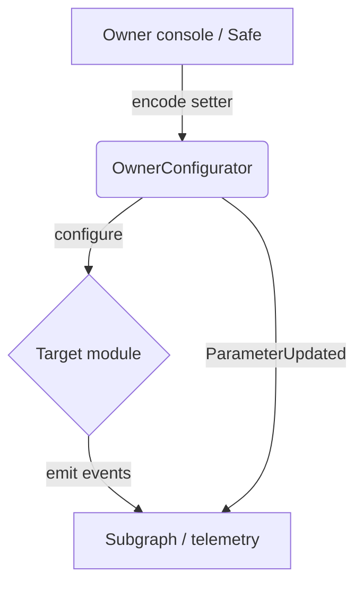

# Owner Control Parameter Playbook (V2)

This playbook gives the contract owner a single reference for adjusting AGI Jobs v2 parameters across the deployed module set. It complements the existing owner-control documentation and focuses on the `OwnerConfigurator` facade that batches privileged changes.



## Core tool: `OwnerConfigurator`

The [`OwnerConfigurator`](../contracts/v2/admin/OwnerConfigurator.sol) contract exposes four execution paths:

| Method | Purpose | When to use |
| --- | --- | --- |
| `configure` | Execute a single setter on a target module without forwarding ETH. | Quick one-off parameter update. |
| `configureWithValue` | Execute a single setter while forwarding an exact ETH amount to the target. | Payable setters (e.g., escrow float top-ups, prepaid gas buffers). |
| `configureBatch` | Execute multiple setters in sequence without forwarding ETH. | Release workflows or multi-module rollouts. |
| `configureBatchWithValue` | Execute multiple payable setters with per-call ETH accounting. | Coordinated maintenance where several modules require funding in the same change window. |

All methods require the caller to be the configured owner (Safe or EOA). Ownership can be rotated using the inherited `transferOwnership` flow, giving the platform operator full control.

When using the payable variants, make sure the Safe or EOA supplies the sum of all forwarded amounts as `msg.value`. The configurator enforces exact accounting via the `OwnerConfigurator__ValueMismatch` error, preventing stray ETH from remaining on the facade.

## Preparing a change

1. **Identify the module:** Use `docs/v2-module-interface-reference.md` to locate the contract exposing the setter you need (e.g., `JobRegistry`, `StakeManager`).
2. **Confirm governance state:** Verify that the new owner address is set in `Governable` contracts if a timelock coordinates the change. The [governance runbooks](owner-control-handbook.md) explain how to update timelock addresses.
3. **Capture current values:** Read the module's getter (via CLI or block explorer) and record the value in the change ticket.
4. **Encode calldata:** With `ethers` or `cast`, encode the setter call—for example:

   ```bash
   cast calldata "setCommitWindow(uint256)" 1800
   ```

5. **Populate metadata:** Choose descriptive `moduleKey` / `parameterKey` pairs (e.g., `keccak256("JOB_REGISTRY")`) to keep analytics dashboards consistent.

## Executing via Safe transaction

1. Open the Safe app connected to the deployment network.
2. Add a **Contract interaction** targeting the `OwnerConfigurator` address.
3. Paste the encoded calldata for `configure` or `configureBatch`.
4. Insert the `moduleKey`, `parameterKey`, `oldValue`, and `newValue` fields as hex strings. The console export tool can autofill these values.
5. Submit the transaction for signatures and execute once the threshold is met.

The emitted `ParameterUpdated` event includes all metadata, enabling real-time monitoring in the owner console and subgraph.

## Validation checklist

- [ ] The target contract supports the setter being called (cross-check `abi:diff` reports when upgrading).
- [ ] Required governance approvals (timelock delay, Safe signatures) are met.
- [ ] Monitoring alerts (Hamiltonian Monitor, Thermostat) stay green after the change.
- [ ] The change ticket references the relevant documentation and includes before/after values.

## Emergency rollback

If a parameter change behaves unexpectedly, submit a new `configure` call reverting to the previous value captured in the ticket. Because ownership remains with the platform operator, no external coordination is required.

## Integration with CI & audits

- CI enforces access-control coverage on contracts under `contracts/v2/admin` and `contracts/v2/governance`, ensuring mutator functions stay guarded by owner or governance modifiers.
- The audit trail from `ParameterUpdated` is ingested into `docs/owner-control-pulse.md`. Update that log whenever a production change is executed.

Following this playbook ensures the contract owner retains complete operational control of AGI Jobs v2 while keeping documentation, telemetry, and governance processes synchronized.
