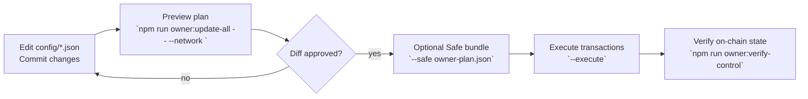
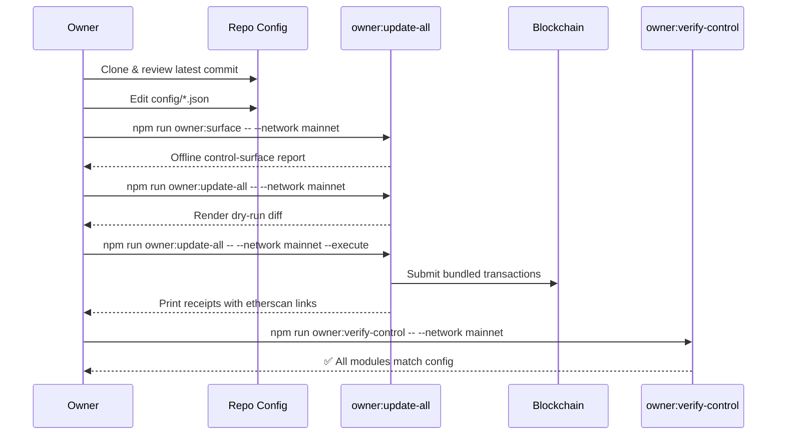

# Owner Control Playbook

> **Purpose.** This playbook distils the day-to-day controls that the contract owner (typically a multisig or timelock) needs to run the AGIJobs protocol safely. Every checklist is written so that a non-technical operator can execute the required commands without learning Solidity or Hardhat internals.
>
> **Scope.** The guidance applies to the production `contracts/v2` stack. Legacy artifacts remain unsupported and should not receive new configuration changes without an audit.

## Executive Summary

- All mutable parameters live in version-controlled JSON under [`config/`](../config). Owners edit these files, review the autogenerated plan, and ship a single transaction bundle.
- The `owner:update-all` script renders a multi-module diff, prompts for confirmation, and can emit a Gnosis Safe batch for air-gapped signers.
- Run `owner:surface` to generate an offline control-surface snapshot with ownership wiring, configuration hashes, and prioritised warnings before touching the chain. See [owner-control-surface.md](owner-control-surface.md).
- Safety rails (address validation, non-zero checks, ENS ownership proofs) run before any transaction is sent. The helper refuses to mutate state if configuration is inconsistent.
- A dashboard command gives a one-line health readout covering pauser wiring, treasury destinations, ENS registries, and reward engine settings.



## Parameter Surfaces

| Module | JSON configuration | Key knobs | Notes |
| --- | --- | --- | --- |
| `JobRegistry` | [`config/job-registry.json`](../config/job-registry.json) | treasury, stake requirements, validation module | Rejects treasury if it matches the owner address. |
| `StakeManager` | [`config/stake-manager.json`](../config/stake-manager.json) | treasury, agent/validator stakes, slash ratios | Enforces burn/treasury invariants at load time. |
| `FeePool` | [`config/fee-pool.json`](../config/fee-pool.json) | burn percentage, treasury, allowlist | Requires `StakeManager` address, auto-blocks owner treasury. |
| `PlatformRegistry` | [`config/platform-registry.json`](../config/platform-registry.json) | operator incentives, pauser | Validates operator stake schedule. |
| `RandaoCoordinator` | [`config/randao-coordinator.json`](../config/randao-coordinator.json) | commit window, reveal window, deposit token | Emits dedicated update transactions when values change. |
| `Thermostat / Reward Engine` | [`config/thermodynamics.json`](../config/thermodynamics.json), [`config/reward-engine.json`](../config/reward-engine.json) | PID parameters, epoch share | Can be tuned independently; helpers guard against unstable gains. |
| `Energy Oracle` | [`config/energy-oracle.json`](../config/energy-oracle.json) | authorised signers | Accepts JSON flag `retainUnknown` for pruning absent signers. |
| `Owner defaults` | [`config/owner-control.json`](../config/owner-control.json) | canonical owner / governance per module | Feeds `owner:update-all` and Safe bundles. |

> **Tip.** When introducing a new module, add it to `owner-control.json` first so the rotation and dashboard tools understand ownership expectations before deployment.

## Zero-to-Production Checklist



1. **Sync repository.** Pull the latest `main` branch so configuration JSON matches deployed contracts.
2. **Edit configuration.** Update the relevant files in `config/`. Use descriptive commit messages even if operating from a fork; they double as an audit trail.
3. **Dry run.** Execute:
   ```bash
   npm run owner:update-all -- --network <network>
   ```
   Replace `<network>` with `mainnet`, `sepolia`, or your configured fork. The script highlights planned changes, including before/after values, pauser mismatches, and any treasury invariants triggered.
4. **Export a Safe bundle (optional).** For multi-sig workflows, re-run with `--safe owner-plan.json --safe-name "AGIJobs Control"`. Inspect the generated JSON within Gnosis Safe to approve each step.
5. **Execute.** Once the diff looks correct, append `--execute`. The helper signs with the active Hardhat account (load via private key, mnemonic, or `.env`).
6. **Verify.** Finish with `npm run owner:verify-control -- --network <network>` to cross-check on-chain state with your configuration files.

## Health Monitoring

Use the dashboard to summarise ownership wiring, treasury destinations, ENS registries, and incentive parameters:

```bash
npm run owner:dashboard -- --network <network>
```

The command prints coloured status lines for each subsystem. Anything marked `WARN` or `ERROR` includes actionable remediation guidance.

When operating blind (no RPC access), fall back to the static analyser:

```bash
npm run owner:plan -- --network <network> --json > owner-plan.json
```

The resulting JSON contains the exact calldata needed for manual submission via Etherscan or similar tools.

## Error Handling & Rollback

| Situation | Detection | Resolution |
| --- | --- | --- |
| Mis-typed address | Dry-run diff flags `InvalidAddress` | Fix JSON entry. The script refuses to execute while invalid. |
| Attempted owner treasury | Execution halts with `InvalidTreasury()` | Provide a non-owner treasury or set to `null` / `0x000...`. |
| Module still owned by deployer | Dashboard reports `ownership mismatch` | Call the module's `transferOwnership` to the configured owner, then rerun `owner:update-all`. |
| Safe bundle rejected | Gnosis UI identifies failing transaction | Re-run dry-run to ensure calldata matches expected version. |

For complex rollbacks, restore the previous commit, re-run `owner:update-all --execute`, and verify. All helper transactions are idempotent—the script only submits calls when current on-chain values differ from desired configuration.

## Frequently Asked Questions

**Can I test changes locally before touching mainnet?**
: Yes. Run a Hardhat fork (`npx hardhat node --fork <rpc>`) and point the helpers to `localhost` via `--network localhost --fork <network>`. The dry-run + execute flow works identically.

**How do I rotate only a single module?**
: Use `--only=<module>` with `owner:update-all`. For example, `--only=stakeManager` touches nothing else.

**What if I need to pause modules fast?**
: Update `config/owner-control.json` to set the desired pauser, run `owner:update-all`, then trigger `SystemPause` actions with `npx hardhat run scripts/v2/updateSystemPause.ts --network <network> --execute`.

**Where do I document signed-off changes?**
: Commit the modified JSON and include the generated Safe bundle in your change management system. The helpers log transaction hashes—copy them into your ticketing workflow.

## Operational Safeguards

- The helpers require RPC URLs to be present via `HARDHAT_NETWORK_URL`, `RPC_URL`, or command-line flags. Missing URLs abort execution before calldata is constructed.
- Every script uses [Ethers.js `getAddress`](https://docs.ethers.org/v6/api/utils/function/getAddress/) to checksum addresses, ensuring UI copy/paste errors are caught immediately.
- Timeouts default to 15 s; override with `--timeout <ms>` for congested networks. Long-running operations retry idempotently.
- Use the `owner:wizard` CLI for guided prompts when editing JSON feels risky. The wizard writes back to the correct file path and prints a summary diff before saving.

## Next Steps

1. Store RPC credentials in an `.env` file (never commit secrets). Example:
   ```ini
   RPC_URL="https://ethereum.publicnode.com"
   OWNER_PRIVATE_KEY="0x..."
   ```
2. Grant the execution environment least-privilege access—ideally hardware wallets for signing the Safe bundle.
3. Schedule a monthly `owner:dashboard` report to detect drift proactively.
4. After each major upgrade, run `npm run owner:health` to ensure no module is missing from configuration.

With these practices the owner retains complete, auditable control over every tunable parameter while benefiting from defence-in-depth safeguards.
