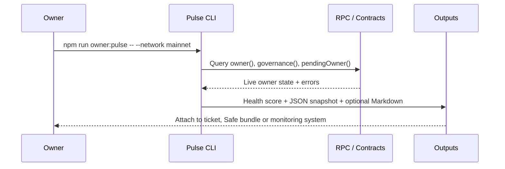
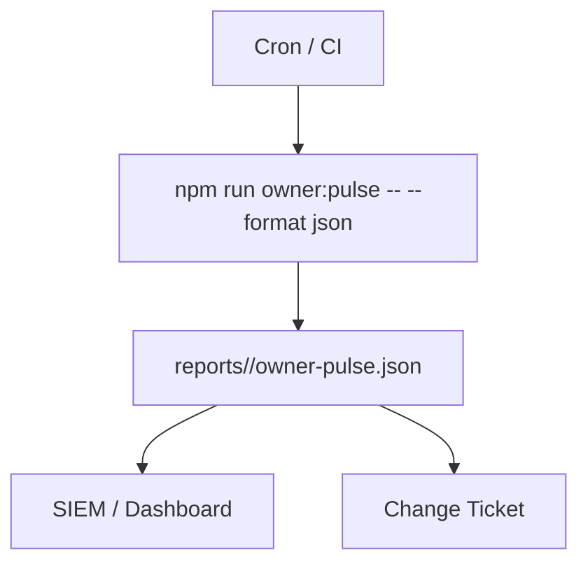

# Owner Control Pulse

> **Audience:** Contract owners, governance signers and operations leads who need an
> instant view of whether production ownership matches the intended configuration.
>
> **Outcome:** A colour-graded health score, actionable remediation list and
> machine-readable snapshot that can be dropped into change tickets, Safe bundles
> or monitoring dashboards without touching Solidity.

---

## 1. Why the pulse matters

```mermaid
mindmap
  root((Owner Pulse))
    "Inputs"
      "owner-control.json"
      "docs/deployment-addresses.json"
      "Environment overrides"
    "On-chain queries"
      "owner()"
      "governance()"
      "pendingOwner()"
    "Outputs"
      "Health score"
      "Module timeline"
      "JSON snapshot"
      "Markdown brief"
```

- **Align stakeholders fast.** The pulse condenses the full
  `verifyOwnerControl` dataset into a single grade that even non-technical
  approvers can understand at a glance.
- **Catch regressions before execution.** Run the command before authorising a
  Safe bundle or rotation to confirm ownership, treasury wiring and pauser roles
  still match configuration.
- **Archive immutable evidence.** Every run can export Markdown and JSON so you
  can prove compliance, trace sign-offs and feed observability pipelines.

---

## 2. Quick start workflow

```bash
# Human-readable output plus JSON footer for automation
npm run owner:pulse -- --network <network>

# Markdown artefact ready for change tickets or executive briefings
OWNER_PULSE_FORMAT=markdown OWNER_PULSE_OUT=reports/mainnet-owner-pulse.md \
  npm run owner:pulse -- --network mainnet

# Strict machine output (no human prose)
OWNER_PULSE_FORMAT=json OWNER_PULSE_OUT=reports/mainnet-owner-pulse.json \
  npm run owner:pulse -- --network mainnet
```



- **No environment variables required.** The helper reads
  `config/owner-control.json` and `docs/deployment-addresses.json` by default.
  Override per run with `--address <module=0x...>` if you are testing new
  deployments before updating the address book.
- **JSON footer always on.** When `--format` is `human` or `markdown`, the CLI
  prints a `JSON snapshot` section after the main report so automation can parse
  the same run without a second command.
- **Idempotent & read-only.** The helper never sends transactions; it only
  inspects deployed contracts.

---

## 3. Understanding the health score

```mermaid
flowchart LR
    Start[Start score 100] --> Mismatch{{Mismatch?}}
    Mismatch -- yes -->|−35 each| Score
    Start --> MissingAddr{{Missing address?}}
    MissingAddr -- yes -->|−30 each| Score
    Start --> MissingExpected{{Missing expected?}}
    MissingExpected -- yes -->|−20 each| Score
    Start --> Errors{{On-chain errors?}}
    Errors -- yes -->|−45 each| Score
    Start --> Skipped{{Skipped modules?}}
    Skipped -- yes -->|−10 each| Score
    Score --> Grade{Grade}
    Grade -->|≥85| Green[Green]
    Grade -->|60-84| Amber[Amber]
    Grade -->|<60| Red[Red]
```

- **Green (≥85).** Everything matches configuration; archive the result as part
  of your change ticket.
- **Amber (60–84).** Issues exist but are typically recoverable via
  configuration edits, address book updates or pending acceptOwnership calls.
- **Red (<60).** Stop and remediate before signing any transactions. The
  recommendations list will call out priority fixes.

> **Pending owners:** Even when the current owner matches configuration, the CLI
> highlights modules where `pendingOwner()` differs from `expectedOwner` so the
> right signer can call `acceptOwnership`.

---

## 4. Options reference

> **Tip:** When using the npm script (`npm run owner:pulse`) set script-specific
> options via the `OWNER_PULSE_*` environment variables below. To pass flags
> directly, invoke Hardhat manually (e.g. `npx hardhat run ... -- --format json`).

| Flag | Description |
| --- | --- |
| `--network <name>` | Overrides the network key used to resolve config and address book entries. |
| `--modules a,b` | Only include the listed modules in the pulse. |
| `--skip a,b` | Exclude listed modules from the report. |
| `--format <human\|markdown\|json>` | Chooses the output style. `--json` and `--markdown` are shortcuts. |
| `--out <path>` | Writes the chosen format to disk. Parent folders are created automatically. |
| `--address-book <path>` | Points to an alternative deployment address book file. |
| `--address <module=0x...>` | Overrides a module address for the current run only. |

Environment variables mirror the CLI flags for automation:

- `OWNER_PULSE_NETWORK`, `OWNER_PULSE_MODULES`, `OWNER_PULSE_SKIP`
- `OWNER_PULSE_FORMAT`, `OWNER_PULSE_JSON`
- `OWNER_PULSE_ADDRESS_BOOK`, `OWNER_PULSE_ADDRESS_OVERRIDES`

---

## 5. Automating the pulse



- **Continuous monitoring.** Schedule the pulse hourly against production RPC
  endpoints. Feed the JSON payload into your SIEM or alerting stack to catch
  unexpected ownership changes instantly.
- **Change management.** Attach the Markdown export to Safe proposals and change
  tickets. Auditors can see the health grade, module notes and action list in one
  page.
- **Disaster recovery drills.** Run the pulse immediately after executing
  `owner:update-all` or `owner:rotate` to verify the system returned to the
  expected state.

---

## 6. Troubleshooting

| Symptom | Likely cause | Resolution |
| --- | --- | --- |
| `❌ mismatch` rows | On-chain owner/governance differs from `owner-control.json`. | Queue a new `owner:rotate` plan or update the configuration to match intentional changes. |
| `⚠️ missing-address` rows | Module address unknown in config/address book. | Populate `modules.<key>.address` or update `docs/deployment-addresses.json`, then rerun. |
| `⚠️ missing-expected` rows | No expected owner configured. | Ensure `ownerControl.owner`/`governance` or module-level overrides are set. |
| `❌ error` rows | RPC connectivity issues or ABI mismatch. | Retry with a healthy RPC; confirm the module exposes `owner()`/`governance()` as expected. |
| Health score drops below threshold | Pending ownership acceptances or skipped modules. | Run `npm run owner:verify-control -- --strict` to pinpoint remaining issues and complete acceptances. |

---

## 7. Next steps

- Pair the pulse report with the [Owner Control Surface](docs/owner-control-surface.md)
  to archive a full governance snapshot.
- Use the [Owner Control Change Ticket](docs/owner-control-change-ticket.md)
  when proposing modifications—embed the pulse Markdown for instant context.
- Feed the JSON snapshot into the telemetry pipeline outlined in
  [owner-control-command-center.md](docs/owner-control-command-center.md) so the
  health grade becomes part of your operational dashboards.
