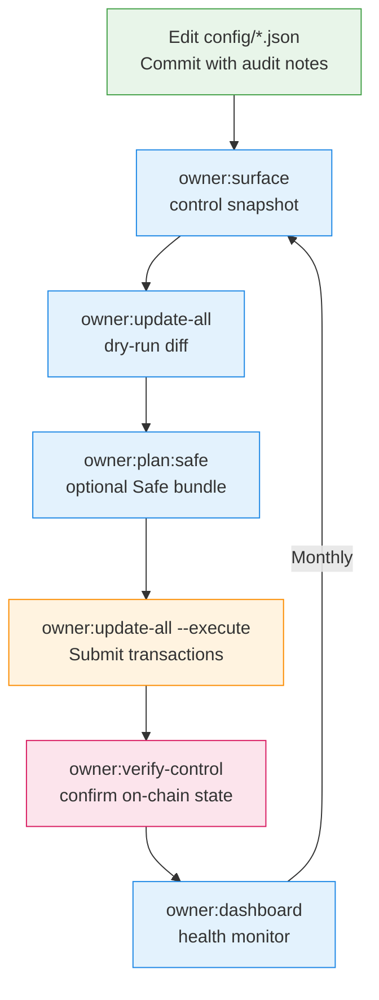
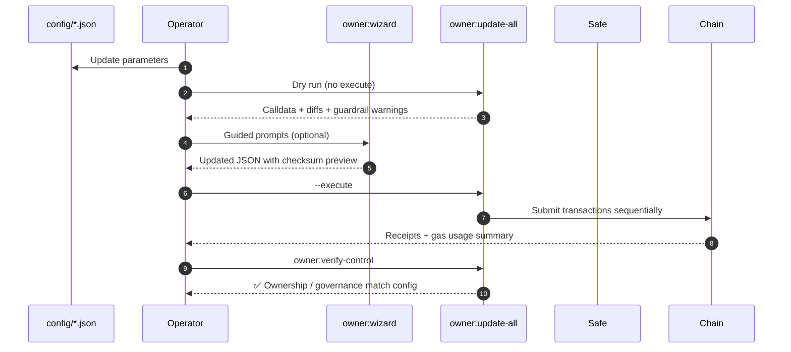

# Owner Control Quick Reference

> **Purpose.** Pair this document with the generated `ownerControlGuide` CLI so non-technical operators always have an illustrated, copy/paste-friendly blueprint for editing configuration, shipping Safe bundles, and verifying on-chain state.

## Run the Auto-Generated Guide

```bash
npm run owner:guide -- --network mainnet
npm run owner:guide -- --network sepolia --out docs/runtime/owner-guide-sepolia.md
```

- `--format human` – strip Markdown tables for plain-text change-control systems.
- `--no-mermaid` – disable diagram blocks when exporting to systems that do not support Mermaid.
- `--out <path>` – write the rendered instructions to disk for distribution or sign-off packages.

## Visual Overview



## Checklist Snapshot

| Phase | Action | Command |
| --- | --- | --- |
| Prepare | Update JSON under `config/` and run lint/tests | `npm run format:check && npm test` |
| Preview | Render dry run for the target chain | `npm run owner:update-all -- --network <network>` |
| Safeguard | Produce Safe bundle for sign-off | `npm run owner:plan:safe -- --network <network>` |
| Execute | Apply changes from a secure signer | `npm run owner:update-all -- --network <network> --execute` |
| Verify | Confirm ownership, treasury, pauser wiring | `npm run owner:verify-control -- --network <network>` |
| Archive | Store Safe bundle + transaction hashes | `npm run owner:guide -- --network <network> --out runtime/<network>-guide.md` |

## Sequence Diagram



## Operator Tips

- **Parameter ownership** – Run `npm run owner:guide -- --network <network>` before every change; the generated matrix highlights which controller (owner vs governance) signs each transaction.
- **Audit log** – Commit the generated Markdown output alongside config changes so reviewers can trace the exact workflow executed.
- **Network portability** – Use per-network overrides in `config/<name>.<network>.json`; the guide automatically resolves them.
- **Disaster recovery** – Keep the last generated Safe bundle; replaying it restores the prior configuration deterministically.
- **Non-technical handoff** – Provide the Mermaid diagrams plus the generated guide to coordinators; no Hardhat knowledge required.
