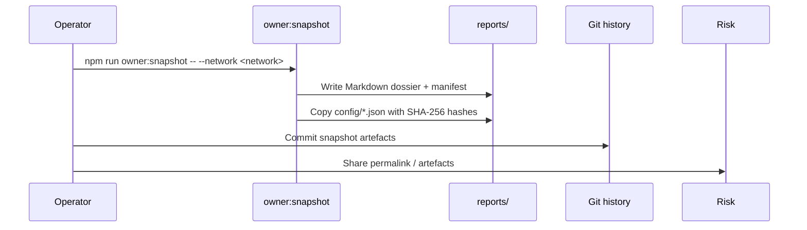

# Owner Control Snapshot Kit

> **Goal:** Capture, diff, and archive the full governance surface before and after every change window without manual copy/paste.
>
> **Audience:** Contract owners, ops leads, risk teams who need evidence packages for audits and incident response.

---

## Snapshot pipeline overview



The `owner:snapshot` helper fans out across every `config/*.json` manifest (plus per-network overrides) and records:

- **Effective parameter tables** – resolved values after merging overrides.
- **Contract wiring** – owner, pauser, and treasury addresses with ENS labels when available.
- **Change detection hashes** – SHA-256 of each manifest so auditors can prove no hidden edits occurred between approval and execution.
- **Regeneration commands** – copy/paste references to rerun `owner:verify-control` or targeted automation.

---

## Command reference

```bash
# Default console output + snapshot directory under reports/<network>/
npm run owner:snapshot -- --network <network>

# Persist to a custom directory
npm run owner:snapshot -- --network mainnet --out reports/mainnet/control-kit

# Skip Mermaid diagrams (for PDF exports)
npm run owner:snapshot -- --network mainnet --no-mermaid
```

Flags supported today:

| Flag | Description |
| --- | --- |
| `--network <name>` | Selects the Hardhat network configuration and merges `config/<name>/` overrides. |
| `--out <path>` / `--output <path>` | Saves the snapshot folder to a custom location. The helper creates the directory if it does not exist. |
| `--no-mermaid` | Omits Mermaid diagrams from the Markdown briefing for compatibility with restrictive PDF converters. |
| `--help` | Prints usage information and exits. |

Snapshot output includes:

- `README.md` – executive briefing with subsystem breakdowns and embedded checklists.
- `manifest.json` – machine-readable listing of each subsystem, source path, SHA-256 hash, regeneration commands, and verification hints.
- `configs/` – exact copies of every config file consumed while generating the kit, preserving per-network overrides.

---

## Embedding in approvals

1. Generate a **pre-change** snapshot and attach it to the [Owner Control Change Ticket](owner-control-change-ticket.md).
2. Secure approvals and signatures referencing the snapshot’s SHA-256 manifest hashes.
3. Execute the approved plan using `npm run owner:update-all -- --network <network> --only <modules> --execute`.
4. Generate a **post-change** snapshot; compare the `manifest.json` hashes with `jq '.files[] | {id, sha256}'` to confirm only expected domains changed.
5. Store both artefacts in your compliance drive and link them from the ticket or incident report.

---

## Integration ideas

- **CI gating:** Run the helper inside the `ci (v2)` workflow on release branches and upload the snapshot directory as an artefact so reviewers can inspect effective parameters before approving a deploy.
- **Monitoring:** Schedule hourly snapshots on production; trigger alerts if any subsystem hash drifts without a matching change ticket.
- **Incident response:** Use descriptive output paths (`--out reports/mainnet/outage-2024-09-14`) to preserve the exact configuration active during emergency freezes.

Cross-reference the [Owner Control Verification Guide](owner-control-verification.md) to confirm on-chain state matches the archived snapshots, and pair with the [Owner Control Doctor](owner-control-doctor.md) for pre-change readiness checks.
