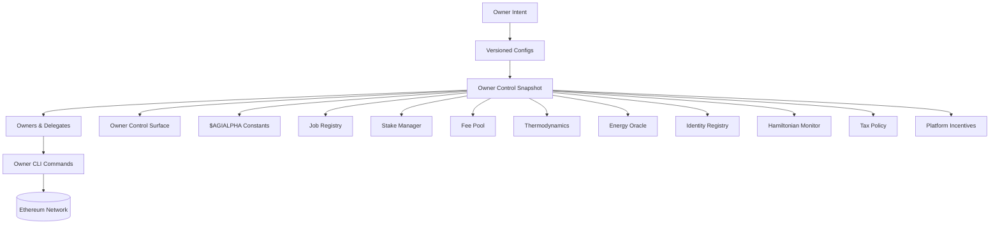
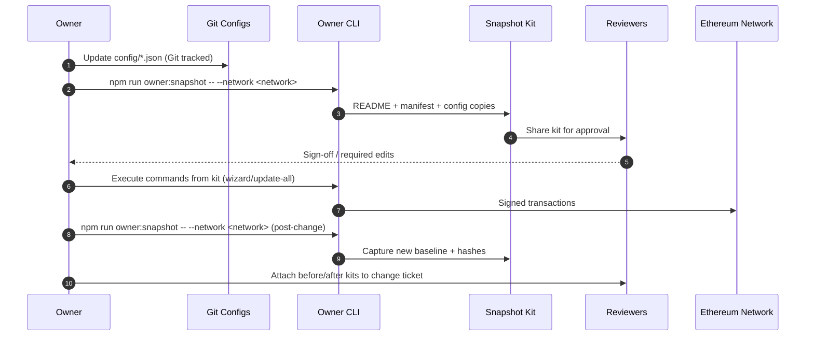

# Owner Control Snapshot Kit

> **Audience:** Contract owners, compliance officers, and operations partners who need
> an auditable, self-contained package describing every adjustable parameter in the
> AGIJobs platform.
>
> **Purpose:** Generate a portable "control dossier" that proves who can change what,
> how to exercise each control, and the exact configuration captured at a given point
> in time. The snapshot is safe to hand to non-technical stakeholders yet detailed
> enough for engineering review.

---

## 1. Quick start checklist

1. **Generate a fresh snapshot**
   ```bash
   npm run owner:snapshot -- --network <network>
   ```
   This writes `reports/<network>/owner-control-snapshot-<timestamp>/` with a
   Markdown briefing, machine-readable manifest, and copies of every relevant config
   file.
2. **Share the kit** – Zip the snapshot directory and attach it to change tickets,
   governance proposals, or investor reports. All files are human readable.
3. **Verify before executing** – Run the verification commands listed in the kit
   (`owner:verify-control`, `owner:parameters`, etc.) to confirm reality matches the
   captured state prior to signing transactions.

---

## 2. Control surface map



- **Intent** – Business decisions captured as JSON edits or CLI responses.
- **Configs** – Version-controlled files under `config/` and network overrides.
- **Snapshot kit** – Aggregated dossier produced by `owner:snapshot` with hashes for
  tamper evidence.
- **Owners & Delegates** – Humans approving or executing changes.
- **Owner CLI** – Commands included in the kit to rehearse and execute updates.
- **Chain** – On-chain contracts that enforce the captured parameters.

---

## 3. Kit contents

Each snapshot directory contains:

| File | Purpose |
| ---- | ------- |
| `README.md` | Executive-friendly overview with subsystem breakdowns and Mermaid diagrams. |
| `manifest.json` | Machine-readable listing of every subsystem, source config path, SHA-256 hash, and regeneration command. |
| `configs/**` | One-to-one copies of every configuration file used when generating the snapshot. |

The README includes a status row for each subsystem (`✅` captured, `⚠️ optional`,
`❌ error`). Optional modules (such as tax policy or platform incentives) are marked as
warnings if the configuration file is absent.

---

## 4. Operational workflow



---

## 5. Command palette (embedded in every snapshot)

| Scenario | Command |
| -------- | ------- |
| Regenerate the kit with custom path | `npm run owner:snapshot -- --network <network> --out reports/<network>/control-kit` |
| Skip Mermaid diagrams (for PDF exports) | `npm run owner:snapshot -- --network <network> --no-mermaid` |
| Validate live ownership | `npm run owner:verify-control -- --network <network>` |
| Export the live parameter matrix | `npm run owner:parameters -- --network <network> --out reports/<network>/matrix.md` |
| Produce Safe-ready batch plan | `npm run owner:update-all -- --network <network> --plan reports/<network>/plan.md` |

All commands automatically respect per-network overrides and read environment
variables (e.g., `AGJ_NETWORK`, `HARDHAT_NETWORK`).

---

## 6. Tamper evidence & compliance tips

- **SHA-256 hashes** – `manifest.json` records the hash of every captured config file
  and the README. Re-run the command to verify integrity after transmission.
- **Immutable manifests** – Keep signed manifests alongside Safe transaction bundles
  to prove exactly which parameters were approved.
- **Dual snapshots** – Capture kits both before and after production changes. Diffs of
  `manifest.json` highlight the precise configuration delta.
- **Non-technical distribution** – The README cross-links to human-readable guides
  (Owner Control handbook, blueprint, etc.) so business stakeholders can follow along
  without code editors.

---

## 7. Troubleshooting

| Symptom | Resolution |
| ------- | ---------- |
| `❌` status next to a subsystem | Open the error block in `README.md` to read the thrown error. Missing mandatory configs halt CI. |
| `⚠️ optional` on tax or incentive modules | Create the corresponding config file (e.g., `config/tax-policy.json`) or accept the warning if the module is intentionally disabled. |
| Missing directories when running on CI | Set `--out` to a writable path (`npm run owner:snapshot -- --out ./reports/ci-kit`). |
| Mermaid diagrams not rendering in Markdown viewers | Use the `--no-mermaid` flag or process the README through `npm run owner:diagram`. |

---

## 8. Next steps for owners

1. Integrate snapshot generation into your deployment pipeline (pre-change and
   post-change hooks).
2. Attach kits to Safe proposals, governance votes, and incident retrospectives.
3. Extend the manifest schema if you onboard new modules—`ownerControlSnapshot.ts`
   is intentionally modular and easy to augment.

The snapshot workflow gives the contract owner full operational visibility and a
single command to prove control over every AGIJobs parameter.
