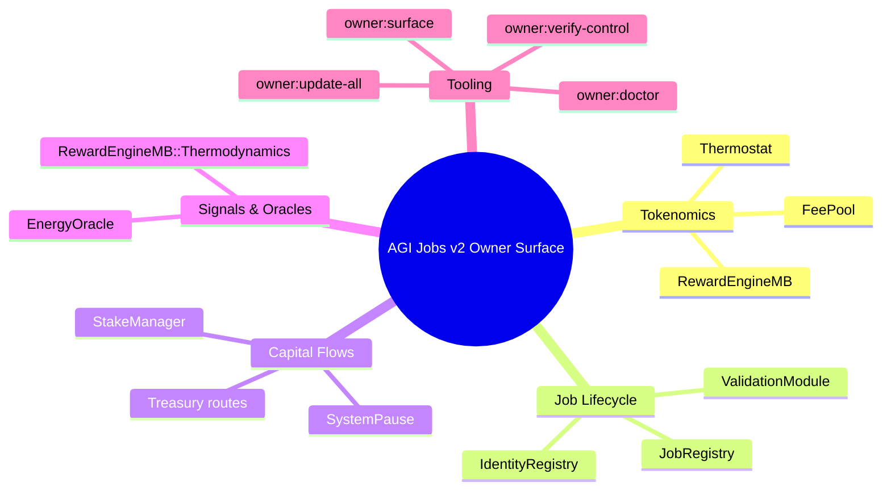

# Owner Control Surface Snapshot

> **Objective:** Give stakeholders a fast, visual understanding of every governance lever the contract owner can pull across AGI Jobs v2.
>
> **Use cases:** Executive briefings, onboarding decks, change window kick-offs, due diligence packets.

---

## At-a-glance map

---

## Surface checklist

| Layer | Primary knobs | Artefact | Change helper | Verification |
| --- | --- | --- | --- | --- |
| **Governance root** | `owner`, `guardian`, `pauser` addresses | `config/owner-control.json` | `npm run owner:rotate -- --network <network>` | `npm run owner:verify-control -- --network <network>` |
| **Safety net** | `SystemPause` wiring, module pause status | `config/system-pause.json` | `npx hardhat run scripts/v2/updateSystemPause.ts --network <network> --execute` | `npm run owner:verify-control -- --modules systemPause` `npx hardhat run scripts/v2/updateSystemPause.ts --network <network> --status` |
| **Economic parameters** | Thermodynamic shares, PID, burns, treasuries | `config/thermodynamics.json` (thermostat block), `config/fee-pool.json` | `npm run owner:update-all -- --only rewardEngine,thermostat,feePool` | `npm run owner:verify-control -- --modules rewardEngine,thermostat,feePool` |
| **Market access** | Job fees, escrow stake, identity roots, emergency allowlists | `config/job-registry.json`, `config/identity-registry.json` | `npm run owner:update-all -- --only jobRegistry,identityRegistry` | `npm run owner:verify-control -- --modules jobRegistry,identityRegistry` |
| **Capital risk** | Min stakes, fee splits, treasury allowlists | `config/stake-manager.json` | `npm run owner:update-all -- --only stakeManager` | `npm run owner:verify-control -- --modules stakeManager` |
| **Signal integrity** | Oracle signers, commit/reveal windows, quorum | `config/energy-oracle.json`, `config/randao-coordinator.json` | `npm run owner:update-all -- --only energyOracle,randao` | `npm run owner:pulse -- --network <network>` |
| **Taxation** | Policy metadata, brackets, exemptions | `config/tax-policy.json` | `npm run owner:update-all -- --only taxPolicy` | `npm run owner:verify-control -- --modules taxPolicy` |

> **Tip:** Run `npm run owner:surface -- --network <network>` before every change window; the command emits an updated version of this table with live addresses, ENS labels, and pending TODOs.

---

## Operating rhythm

1. **Visualise:** Start with `owner:surface` output or embed the Mermaid mind map above into meeting slides.
2. **Assess readiness:** Execute `owner:doctor` to highlight incomplete wiring or zeroed parameters.
3. **Plan:** Use `owner:plan` to simulate exact transaction payloads, copy the diff table into the [Owner Control Change Ticket](owner-control-change-ticket.md).
4. **Execute:** `owner:update-all` with scoped modules and `--execute` once approvals land.
5. **Verify:** `owner:verify-control` plus targeted scripts from the [Owner Control Verification Guide](owner-control-verification.md).
6. **Archive:** Snapshots via the [Owner Control Snapshot Kit](owner-control-snapshot-kit.md).

This snapshot is deliberately lightweight: print it, share it with exec sponsors, and use it as the first step in any governance change conversation.
