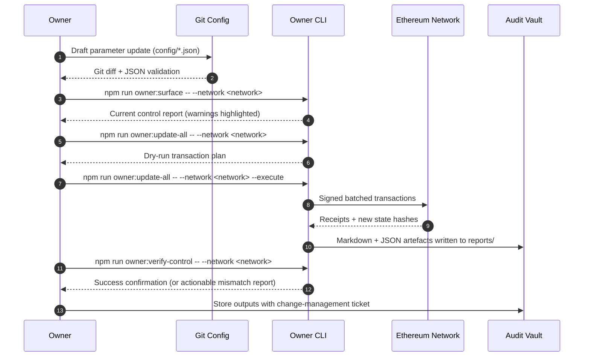
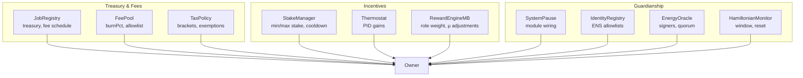

# Owner Control Systems Map

> **Audience:** Executive owners, program managers, and delegated operators who need a
> panoramic view of every governance lever before touching production.
>
> **Purpose:** Compress the entire owner control stack into a single orientation guide
> so you can move from intent → configuration → execution → verification without
> guesswork.

---

## 1. High-level control topology

```mermaid
flowchart LR
    subgraph Owners[Owner Personas]
        CEO[Contract Owner]
        GOV[Governance Multisig]
        OPS[Operations Engineer]
    end

    subgraph Inputs[Authoritative Inputs]
        OC[config/owner-control.json]
        MODS[config/*.json]
        DEP[deployment-config/<network>.json]
    end

    subgraph Tooling[Execution Toolchain]
        SURFACE[npm run owner:surface]
        PLAN[npm run owner:plan]
        WIZARD[npm run owner:wizard]
        UPDATE[npm run owner:update-all]
        ROTATE[npm run owner:rotate]
        VERIFY[npm run owner:verify-control]
    end

    subgraph OnChain[Deployed Contracts]
        JR[JobRegistry]
        SM[StakeManager]
        RE[RewardEngineMB]
        TH[Thermostat]
        FP[FeePool]
        TP[TaxPolicy]
        EO[EnergyOracle]
        SP[SystemPause]
    end

    Owners -->|set intent| Inputs
    Inputs -->|drive| Tooling
    Tooling -->|submit tx| OnChain
    OnChain -->|emit state| Tooling
    Tooling -->|produce reports| Owners
```



- **Owners** convert business requirements into explicit JSON changes.
- **Inputs** capture the single source of truth; never edit contracts directly.
- **Tooling** ensures every change is previewed, authenticated, and logged before
  touching production.
- **On-chain contracts** enforce the platform once the owner approves the plan.

---

## 2. Configuration staging lanes

| Lane | Purpose | Primary Files | Key Commands |
| ---- | ------- | ------------- | ------------ |
| **Ownership** | Decide who can pause, upgrade, or retune each subsystem. | `config/owner-control.json` | `npm run owner:surface`, `npm run owner:rotate`, `npm run owner:verify-control` |
| **Economic parameters** | Adjust fees, stakes, reward thermodynamics, and treasuries. | `config/job-registry.json`, `config/stake-manager.json`, `config/fee-pool.json`, `config/thermodynamics.json` | `npm run owner:wizard`, `npm run owner:update-all -- --only=<module>` |
| **Operational guardians** | Update allowlists, energy signers, pause wiring, or monitoring settings. | `config/identity-registry.json`, `config/energy-oracle.json`, `config/agialpha.json` (`modules.systemPause`), `config/hamiltonian-monitor.json` | `npm run owner:wizard`, `npx hardhat run scripts/v2/updateSystemPause.ts --network <network>`, `npm run owner:update-all -- --only=<module>` |
| **Network overrides** | Tailor the same deployment recipe to different chains. | `config/<name>.<network>.json`, `deployment-config/<network>.json` | Add `--network <network>` to every command |

Each lane moves independently yet feeds the same verification loop. Use Git branches
per lane to isolate review and merge when approved.

---

## 3. Owner mission lifecycle



### Execution checklist

1. **Snapshot the current state**
   ```bash
   npm run owner:surface -- --network <network> --format markdown \
     --out reports/<network>/surface-$(date +%Y%m%d).md
   ```
2. **Stage JSON edits** – Modify the relevant `config/*.json` file(s) and commit the
   diff for review.
3. **Dry-run updates**
   ```bash
   npm run owner:update-all -- --network <network>
   ```
4. **Request approvals** – Share the dry-run output and Git diff with reviewers.
5. **Execute once approved**
   ```bash
   npm run owner:update-all -- --network <network> --execute \
     --receipt reports/<network>/owner-update-$(date +%s).json
   ```
6. **Rotate governance if required** – Use `npm run owner:rotate -- --network <network>`
   to point modules at new multisigs or timelocks.
7. **Verify post-state**
   ```bash
   npm run owner:verify-control -- --network <network> --strict
   ```
8. **Archive artefacts** – Commit the generated reports to your internal change log.

---

## 4. Parameter deep-dive reference

Pull the exact knobs available to the owner without reading Solidity. Pair this
matrix with `npm run owner:parameters` to generate live values.



### Command palette

| Scenario | Command | Notes |
| -------- | ------- | ----- |
| Update treasury wallet for protocol fees | `npm run owner:wizard -- --network <network>` | Wizard prompts for treasury addresses across FeePool, StakeManager, JobRegistry. |
| Rotate governance multisig | `npm run owner:rotate -- --network <network> --safe rotation.json --safe-name "AGIJobs Governance"` | Produces a Safe bundle for air-gapped approval. |
| Verify ownership across all modules | `npm run owner:verify-control -- --network <network> --strict` | Fails fast if any module has drifted from the desired controller. |
| Export full parameter matrix | `npm run owner:parameters -- --network <network> --out reports/<network>/matrix.md` | Generates Markdown + Mermaid for audit sign-off. |
| Recover from partial execution | `npm run owner:update-all -- --network <network> --rollback` | (Optional flag supported by update script) Replays the previous state bundle. |

> **Tip:** Every helper accepts `--help` to display inline options. Combine with
> `DEBUG=owner:*` for verbose traces when troubleshooting RPC connectivity.

---

## 5. Governance guard rails

- **Two-person rule:** Require one signer to run the dry run and another to execute.
- **Safe bundles by default:** Pass `--safe` to produce JSON payloads for Safe UI review.
- **Time-boxed reports:** Export Markdown/JSON receipts during execution to prevent
  after-the-fact tampering.
- **Version locks:** Record the git commit hash alongside each change window so you can
  reproduce the exact config set.
- **Disaster recovery:** Keep a clean branch with last-known-good configs plus the
  reports generated in step 1 and step 7 of the lifecycle. Rolling back is as simple
  as reapplying those configs with `--execute`.

---

## 6. Non-technical quick start (10-minute drill)

1. **Clone the repository** and run `npm install` if you have not already.
2. **Identify the target network** (e.g., `mainnet`, `sepolia`, or custom Hardhat fork).
3. **Export RPC + signer credentials** in your shell.
4. **Generate the surface report**: `npm run owner:surface -- --network <network>`
5. **Answer the wizard prompts**: `npm run owner:wizard -- --network <network>`
6. **Review the diff** and share with stakeholders.
7. **Execute with approvals**: rerun the wizard with `--execute` and optionally `--safe`.
8. **Verify + archive**: `npm run owner:verify-control -- --network <network>` and store
   the Markdown receipts inside `reports/<network>/`.

You now own every adjustable switch without touching Solidity, EVM bytecode, or raw
JSON transactions. This systems map is the launch pad—dive into the specialised
runbooks under `docs/owner-control-*.md` for deeper playbooks.
