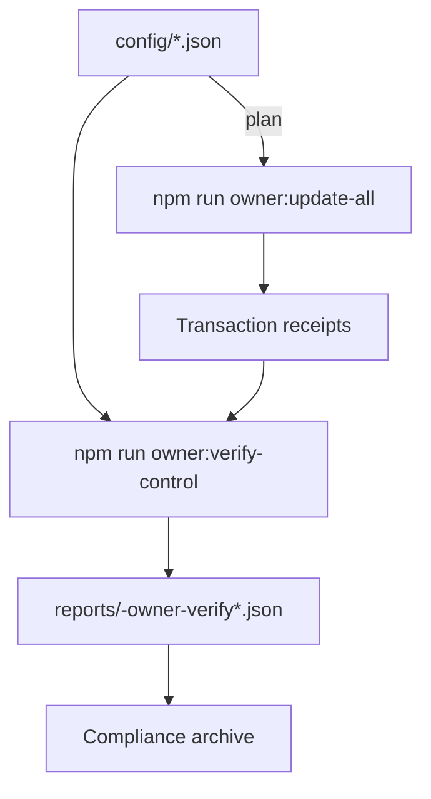

# Owner Control Verification Guide

> **Mission:** Prove that on-chain state matches the approved manifests immediately after an owner change—and keep those proofs organised for auditors.
>
> **Audience:** Contract owners, reviewers, internal audit, site reliability engineers.

---

## Verification strategy

1. **Config truth source** – the JSON manifests in `config/` (plus per-network overrides).
2. **Execution receipts** – transaction hashes produced by `owner:update-all` or targeted Hardhat scripts.
3. **On-chain checks** – read-only calls driven by `owner:verify-control` and supporting scripts.
4. **Evidence bundle** – Markdown/JSON exports stored under `reports/` and linked from the change ticket.



---

## Core command

```bash
# Console summary
npm run owner:verify-control -- --network <network>

# JSON output for diffing or CI bots
npm run owner:verify-control -- --network <network> --json > reports/<network>-verify.json

# Strict mode (non-zero exit code on mismatches)
npm run owner:verify-control -- --network <network> --strict
```

Available scopes and overrides:

| Flag | Description |
| --- | --- |
| `--modules rewardEngine,stakeManager,…` | Restrict checks to specific modules (comma separated). Use the exact keys from `config/owner-control.json` such as `rewardEngine`, `thermostat`, `feePool`, `jobRegistry`, `identityRegistry`, `stakeManager`, `systemPause`, `taxPolicy`, etc. |
| `--skip rewardEngine,…` | Exclude modules temporarily (use sparingly and document the reason in your ticket). |
| `--address-book <path>` | Point at an alternative deployment record (defaults to `docs/deployment-addresses.json`). |
| `--address module=0x…` | Override a single module address for the current run; supports multiple invocations. |
| `--config-network <name>` | Force the loader to merge `config/<name>/` overrides when Hardhat is connected to a different network. |
| Environment variables | `OWNER_VERIFY_MODULES`, `OWNER_VERIFY_SKIP`, `OWNER_VERIFY_STRICT`, `OWNER_VERIFY_ADDRESS_OVERRIDES`, etc. mirror the CLI flags for automation. |

The command prints a summary banner, per-module diff tables, and remediation hints (`npm run owner:update-all -- --only …`) so non-technical operators can resolve drift quickly.

---

## Companion tooling

| Goal | Command |
| --- | --- |
| Render the current control surface | `npm run owner:surface -- --network <network>` |
| Inspect staking/fee parameters | `npm run owner:parameters -- --network <network>` |
| Audit ENS and emergency allowlists | `npx hardhat run scripts/v2/auditIdentityRegistry.ts --network <network>` |
| Capture tamper-evident dossier | `npm run owner:snapshot -- --network <network>` |
| Generate change ticket template | `npm run owner:change-ticket -- --network <network>` |

Use these helpers alongside `owner:verify-control` to build an evidence package that survives legal, compliance, and security review.

---

## Evidence workflow

1. Run the verifier in both human and JSON modes:
   ```bash
   npm run owner:verify-control -- --network mainnet
   npm run owner:verify-control -- --network mainnet --json > reports/mainnet-verify-$(date +%Y%m%d).json
   ```
2. Append the JSON artefact and console transcript to the [Owner Control Change Ticket](owner-control-change-ticket.md).
3. Cross-reference the recorded transaction hashes from `owner:update-all` in the ticket body. Ensure they match the modules marked as updated.
4. Store the outputs next to the [Owner Control Snapshot Kit](owner-control-snapshot-kit.md) directory for the same change window.

---

## Troubleshooting

| Symptom | Likely cause | Resolution |
| --- | --- | --- |
| Module shows `expected 0x…` vs `actual 0x…` | Wrong address in deployment record | Update `docs/deployment-addresses.json` (or your alternate address book) and re-run; broadcast a fix if the on-chain owner is wrong. |
| `No address configured for module` warning | Missing entry in manifest | Add the module address to `config/owner-control.json` or supply `--address module=…`. |
| CLI exits 1 with `Ownership pending acceptance` | `Ownable2Step` transfer not finalised | Complete `acceptOwnership` on the target contract, then rerun verification. |
| JSON output empty | `--modules` filtered out all checks | Remove conflicting filters or provide a broader module list. |

Pair this guide with the [Owner Control Doctor](owner-control-doctor.md) for pre-change readiness and the [Owner Control Snapshot Kit](owner-control-snapshot-kit.md) for archival proofs to maintain an end-to-end assurance trail.
