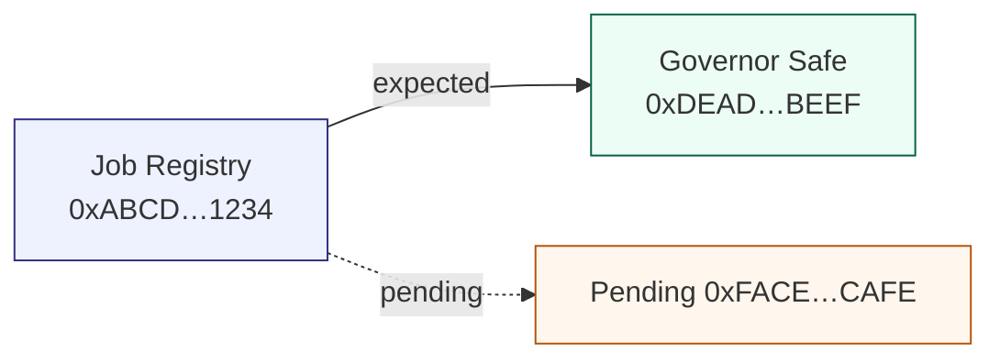

# Owner Control Visual Guide

This guide packages the **AGIJobs owner command surface** into a visual-first workflow
that non-technical operators can run in a few minutes. It pairs a richly annotated
Mermaid diagram with a tabular control matrix so the contract owner can instantly see
which addresses hold authority, what needs attention, and which follow-up scripts to run.

## Why this matters

- **Production assurance** – Governance, owner, and pending controllers are surfaced in
  a single place, making it obvious when a module is miswired or an ownership transfer is
  still pending.
- **Instant documentation** – Generate Markdown that drops directly into incident logs,
  quarterly reports, or Confluence pages with zero manual formatting.
- **Owner-first controls** – Address overrides, network selection, and pending owner
  highlights ensure the contract owner can retune the system without editing source code.

## Quick start (non-technical operator)

1. Ensure you have the repository checked out and Hardhat configured with the target RPC.
2. Run the diagram generator:

   ```bash
   npm run owner:diagram -- --network <network>
   ```

   Replace `<network>` with `mainnet`, `sepolia`, or any configured alias. The command
   prints a Markdown report containing a Mermaid diagram and an ownership matrix.

3. Paste the Markdown into any viewer that supports Mermaid (GitHub, Notion, VS Code,
   Obsidian, GitBook, etc.).
4. If any module shows a **Missing Address** or **Mismatch** status, follow the action
   checklist below to remediate.

> **Pro tip:** Store the rendered Markdown in `storage/owner-dashboards/` to create a
> dated audit trail. Use `OWNER_MERMAID_OUTPUT=storage/owner-dashboards/<date>.md`
> when invoking the script to automate this.

## Diagram anatomy



- **Blue modules** – On-chain contracts the owner steers.
- **Green controllers** – Addresses expected to own or govern modules.
- **Orange pending nodes** – `Ownable2Step` transfers that still require `acceptOwnership()`
  (or `acceptGovernance()` for governable contracts).
- **Red outlines** – Mismatches between the expected controller and the on-chain controller.
- **Grey nodes** – Missing configuration data; supply overrides to complete the picture.

## Owner response checklist

| Signal | What it means | Immediate action |
| --- | --- | --- |
| **Missing Address** | The system could not locate a deployed address for that module. | Supply an override via CLI/env, or update `docs/deployment-addresses.json`. |
| **Mismatch** | The expected controller does not match the on-chain owner/governance. | Use `npm run owner:verify-control` to inspect the discrepancy, then run the appropriate rotation script (e.g. `npm run owner:rotate`). |
| **Pending node present** | Ownership transfer initiated but not finalised. | Call `acceptOwnership()` / `acceptGovernance()` from the pending controller. |
| **Warnings about missing controllers** | The global config lacks `owner`/`governance`. | Update `config/owner-control.json` and re-run the generator. |

## Customising the output

| Goal | Command | Notes |
| --- | --- | --- |
| Export Markdown to a file | `OWNER_MERMAID_OUTPUT=storage/owner-dashboards/$(date +%F).md npm run owner:diagram -- --network <network>` | Directory is auto-created. |
| Generate Mermaid only | `OWNER_MERMAID_FORMAT=mermaid npm run owner:diagram -- --network <network>` | Ideal for embedding in dashboards. |
| Supply ad-hoc addresses | `OWNER_MERMAID_ADDRESS_OVERRIDES="stakeManager=0x123...,jobRegistry=0x456..." npm run owner:diagram` | Highest priority source. |
| Use environment overrides | `export AGJ_STAKE_MANAGER_ADDRESS=0x123...` | Takes precedence over config/address book. |
| Load alternate config network | `OWNER_MERMAID_CONFIG_NETWORK=sepolia npm run owner:diagram` | Useful for cross-network comparisons. |
| Suppress pending edges | `OWNER_MERMAID_INCLUDE_PENDING=0 npm run owner:diagram` | Focus on settled ownership only. |

All overrides accept comma-separated lists. You can also set
`OWNER_MERMAID_ADDRESS_OVERRIDES="stakeManager=0x...,jobRegistry=0x..."` for persistent
CI/CD runs.

## Action workflow for the contract owner

```mermaid
flowchart TD
  subgraph Discover
    A[Run owner diagram] --> B{Any warnings?}
  end
  B -- No --> H[Archive report]
  B -- Yes --> subgraph Triaging
    C[Identify affected modules]
    D[Cross-check with owner:verify-control]
    E[Decide fix: rotate / update config / accept pending]
  end
  E --> F[Execute remediation script]
  F --> G[Confirm on-chain state]
  G --> A
```

1. **Generate** – Run the diagram generator for the active network.
2. **Diagnose** – If a module is highlighted, inspect it with `npm run owner:verify-control`.
3. **Remediate** – Execute the targeted helper (`owner:rotate`, `owner:update-all`,
   or `owner:mission-control`) to restore the expected controller.
4. **Verify** – Re-run the diagram. Once all modules are green and pending edges vanish,
   commit the Markdown report.

## Embedding into governance reports

- Add the generated Markdown to `docs/production/` or your internal wiki for auditors.
- Store multiple snapshots per quarter to show governance continuity.
- Combine with `npm run owner:dashboard -- --json` to keep machine-readable artefacts
  alongside the visual summary.

## Related playbooks

- [Owner Control Handbook](owner-control-handbook.md) – Deep-dive operations for every module.
- [Owner Mission Control](owner-mission-control.md) – Multi-module execution plans.
- [Owner Control Surface](owner-control-surface.md) – Formal interface definitions.
- [Verify Owner Control script](../scripts/v2/verifyOwnerControl.ts) – Low-level verification helper.

By integrating the visual diagram into regular operations you ensure the platform owner
always has authoritative insight—and control—over every deployed module.
