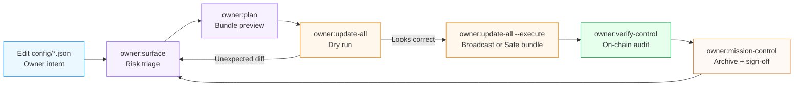
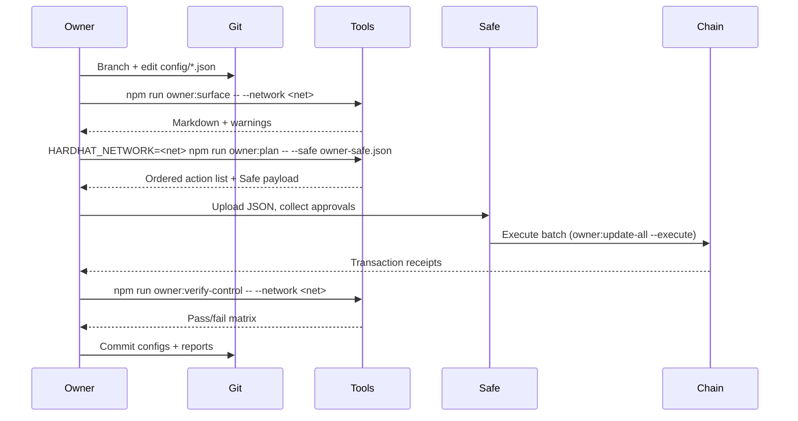

# Owner Control Zero-Downtime Guide

> **Audience:** Contract owners, governance operators, and compliance teams who must adjust
> AGIJob v2 parameters without interrupting production or writing Solidity.
>
> **Objective:** Deliver a bulletproof, human-friendly playbook that keeps governance, treasury,
> thermodynamics, and identity levers aligned while providing immediate rollback and verification paths.
>
> **When to use:** Before any material configuration change, including token treasury routing,
> reward splits, staking policy adjustments, or ENS roster updates.

---

## 1. System Overview



- **Single source of truth:** Every module derives its target state from `config/*.json`
  (with optional `<module>.<network>.json` overrides). Never edit Solidity or deployment
  scripts to change parameters.
- **Closed-loop verification:** The helper commands emit Markdown reports, JSON bundles,
  and Gnosis Safe payloads so non-technical signers can review, approve, and archive every
  change without ambiguity.

---

## 2. Pre-Flight Checklist (run before editing)

| Status | Step | Command / Artefact | Notes |
| ------ | ---- | ------------------ | ----- |
| [ ] | Sync repository | `git pull --rebase` | Ensures local configs match the audited baseline. |
| [ ] | Select Node version | `nvm use` | Loads the Node 20.19.0 toolchain defined in `.nvmrc`. |
| [ ] | Install dependencies | `npm ci` | Guarantees deterministic scripts. |
| [ ] | Export RPC + signer | `source .env && for var in RPC_URL OWNER_PRIVATE_KEY; do [ -n "${!var}" ] || echo "Missing $var"; done` | Confirms secrets are set without dumping values. |
| [ ] | Capture current surface | `npm run owner:surface -- --network <network> --format markdown --out reports/<network>-pre.md` | Establishes a tamper-evident baseline. |

---

## 3. Parameter Editing Matrix

| Module | Configuration File | Helper (Dry Run → Execute) | Post-change Verifier |
| ------ | ------------------ | ------------------------- | -------------------- |
| Stake policy | [`config/stake-manager.json`](../config/stake-manager.json) | `npm run owner:update-all -- --network <network> [--only stakeManager]` → append `--execute` when approved | `npm run owner:verify-control -- --network <network>` |
| Job economics | [`config/job-registry.json`](../config/job-registry.json) | Same as above with `--only jobRegistry` for targeted updates | Same verifier plus `npm run owner:surface` diff |
| Fee routing | [`config/fee-pool.json`](../config/fee-pool.json) + [`config/platform-incentives.json`](../config/platform-incentives.json) | `npm run owner:update-all` (module detection is automatic) | `npm run owner:dashboard -- --network <network>` |
| Reward thermodynamics | [`config/thermodynamics.json`](../config/thermodynamics.json) (includes `thermostat` section) + [`config/reward-engine.json`](../config/reward-engine.json) | `npm run owner:update-all -- --network <network>` or targeted `--only rewardEngine,thermostat` | `npm run owner:surface` (hash column) + `npx hardhat run scripts/v2/updateThermodynamics.ts --network <network>` (dry run) |
| Energy oracle signers | [`config/energy-oracle.json`](../config/energy-oracle.json) | `npm run owner:update-all` (optionally `--only energyOracle`) | `npm run owner:verify-control` + `npm run owner:surface -- --format markdown` |
| Identity roster | [`config/identity-registry.json`](../config/identity-registry.json) | `npm run identity:update -- --network <network>` for ENS sync, then `npm run owner:update-all` for overrides | `npm run owner:surface` + ENS lookup proof |
| Treasury & tax | [`config/tax-policy.json`](../config/tax-policy.json) | `npm run owner:update-all` | `npm run owner:mission-control -- --network <network> --format markdown --out reports/<network>-finance.md` |

> **Per-network overrides:** Drop a `.<network>` suffix (for example,
> `config/stake-manager.mainnet.json`) to specialise settings while keeping the default file as documentation.

---

## 4. Step-by-Step Zero-Downtime Workflow



1. **Draft changes**
   - Create a feature branch: `git checkout -b chore/<network>-owner-tuning`.
   - Update the relevant `config/*.json` files. Use comments within the files as reference; they mirror setter names.
   - Run `npm run owner:wizard -- --network <network>` for an interactive walkthrough if unsure which files to touch.

2. **Preview diff and risk**
   - `npm run owner:surface -- --network <network>` highlights missing owners, zero addresses, or schema issues.
   - Generate the action plan: `HARDHAT_NETWORK=<network> npm run owner:plan -- --json`.
   - Optional: `npm run owner:diagram -- --network <network> --format mermaid --out reports/<network>-governance.mmd` to visualise ownership wiring.

3. **Dry run execution**
   - `npm run owner:update-all -- --network <network> --json | tee reports/<network>-dry.json`.
   - Inspect the JSON for unexpected setter calls. Reject the plan if any module outside scope appears.

4. **Broadcast safely**
   - For direct execution, rerun with `--execute` and capture transaction hashes.
   - For multisig, provide the Safe bundle: `HARDHAT_NETWORK=<network> npm run owner:plan -- --safe owner-safe.json --safe-name "AGIJobs Owner Change"`.
   - Circulate the Markdown report and Safe payload for sign-off before release.

5. **Post-change validation**
   - `npm run owner:verify-control -- --network <network> --strict`.
   - `npm run owner:mission-control -- --network <network> --format markdown --out reports/<network>-post.md` to consolidate proofs, hashes, and signer acknowledgements.
   - Compare the new `owner:surface` output with the pre-change snapshot. File both under `reports/` and attach to the governance ticket.

---

## 5. Operational Guard Rails

- **Immutable audit trail:** Always commit configuration JSON changes _and_ generated reports (`reports/<network>-*.md/json`). This enables external auditors to reproduce the update.
- **Hash locking:** The surface report prints SHA-256 hashes of each config file. Verify these hashes in the governance call to prove the operator used the reviewed artefact.
- **Environment isolation:** Export `HARDHAT_NETWORK=<network>` and `NODE_OPTIONS="--max-old-space-size=4096"` inside an isolated shell to prevent background processes from hijacking RPC credentials.
- **Emergency abort:** If `owner:update-all` fails mid-flight, re-run the dry run to ensure partial state is visible, then use `npm run owner:rotate -- --network <network> --safe rollback.json` to restore canonical governance addresses.
- **Continuous monitoring:** Configure a Defender/ Tenderly alert on the `SystemPause` contract owner. The `owner:dashboard` command prints webhook-ready JSON describing the active guardian set.

---

## 6. Quick Reference Commands

```bash
# Interactive wizard for newcomers (walks every module)
npm run owner:wizard -- --network <network>

# Generate Gnosis Safe bundle without executing
HARDHAT_NETWORK=<network> npm run owner:plan -- --safe owner-safe.json --safe-name "AGIJobs Owner Update"

# Verify AGIALPHA token settings vs on-chain metadata
npm run verify:agialpha -- --rpc $RPC_URL

# Update only the thermostat module (dry run)
npm run owner:update-all -- --network <network> --only thermostat

# Render full governance diagram (Mermaid syntax)
npm run owner:diagram -- --network <network> --format mermaid --out reports/<network>-governance.mmd
```

---

## 7. Sign-Off Template

```
Change Ticket: <link>
Network: <network>
Config hashes:
  - config/owner-control.json: <sha256>
  - config/<module>.json: <sha256>
Execution:
  - Command: npm run owner:update-all -- --network <network> --execute
  - Tx hashes: <hashes>
Verification:
  - owner:verify-control ✔
  - owner:surface ✔
  - Reports archived at reports/<network>-post.md (commit <hash>)
Approvals:
  - Operations Lead: ________________________
  - Governance Multisig: ____________________
  - Compliance: ____________________________
```

Attach this signed template to the generated Markdown and Safe bundle for complete governance provenance.

---

## 8. Troubleshooting Matrix

| Symptom | Likely Cause | Resolution |
| ------- | ------------ | ---------- |
| `Missing owner, zero address` in `owner:surface` | `config/owner-control.json` lacks `owner`/`governance` defaults | Populate the file and rerun the surface check; commit the update. |
| `RPC error: unauthorized` during `owner:update-all` | RPC credentials missing or expired | Refresh `.env`, re-source the shell, and retry the dry run before execution. |
| Unexpected module in dry run plan | Stale config override on disk | Search for `config/<module>.<network>.json`, delete or fix, rerun `owner:surface`. |
| `Ownable2Step pending acceptance` warning | Governance transfer executed but not accepted | Use `npm run owner:rotate -- --network <network> --execute` with the accepting signer. |
| Safe bundle rejected | Using wrong Safe address or chain ID | Regenerate with `--safe-address` (see `owner:plan --help`) and confirm the Safe network matches `--network`. |

---

## 9. Continuous Improvement Loop

```mermaid
flowchart TD
    Audit[Quarterly audit\n(owner:surface for all networks)] --> Review[Retro meeting\nLessons + config debt]
    Review --> Backlog[Create GitHub issues\nfor config / script gaps]
    Backlog --> Sprint[Schedule owner-control sprint]
    Sprint --> Ship[Execute changes via this guide]
    Ship --> Audit
```

- Schedule recurring `owner:surface` sweeps per network. File the Markdown outputs in an immutable archive (e.g. IPFS CID recorded on-chain).
- Run `npm run owner:diagram` after each major change to refresh governance topology diagrams consumed by compliance dashboards.
- Encourage operators to submit pull requests that extend this guide whenever new modules or scripts land.

---

With these guard rails and workflows, the contract owner retains **complete, documented control** over every adjustable parameter while guaranteeing zero-downtime, auditable operations.
