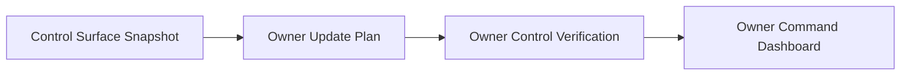
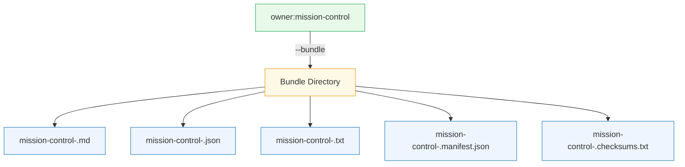
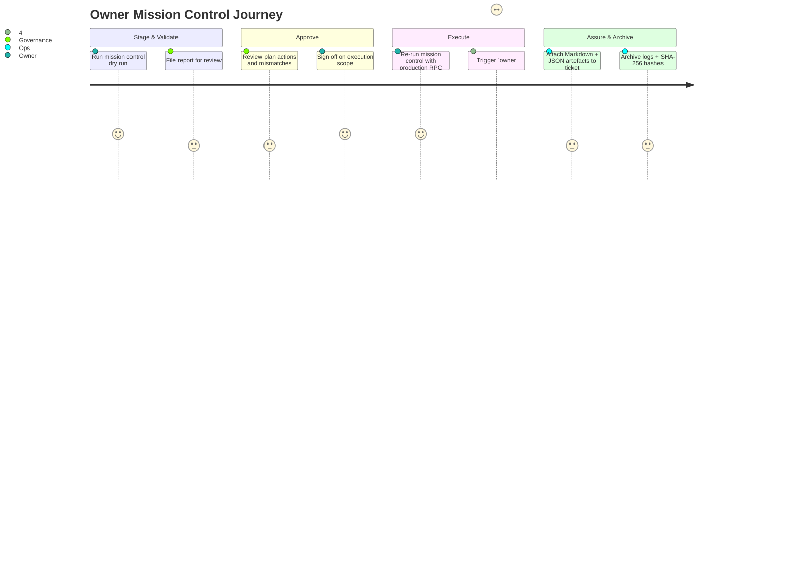

# Owner Mission Control

> **Audience.** Contract owners, operations engineers, and non-technical coordinators who need a single command to stage, approve, execute and validate AGIJobs governance updates.

## Mission Snapshot



Run one command to orchestrate the entire pipeline:

```bash
npm run owner:mission-control -- --network <network>
```

The helper executes four guardrail-heavy stages, merges JSON outputs, then renders a Markdown or JSON summary for change-control packages.

## Quick Start Checklist

1. `git pull` and `npm ci`
2. Configure RPC and secrets in `.env`
3. Dry-run mission control:
   ```bash
   npm run owner:mission-control -- \
     --network hardhat \
     --out runtime/mission-control.md
   ```
4. Export a full evidence bundle for ticketing systems:
   ```bash
   npm run owner:mission-control -- \
     --network hardhat \
     --bundle runtime/bundles \
     --bundle-name mission-control-dryrun
   ```
5. Open `runtime/mission-control.md` or the bundle artefacts for the aggregated status report.
6. Repeat with production RPC once the dry run is clean. Add `--strict` during
   sign-off windows to force a non-zero exit when warnings appear so CI/CD
   pipelines or manual operators cannot miss yellow flags.

## Step Reference Matrix

| Step                       | Purpose                                                                         | Underlying Command                                                                                                | Output Signals                                                  | Retry Command                                                         |
| -------------------------- | ------------------------------------------------------------------------------- | ----------------------------------------------------------------------------------------------------------------- | --------------------------------------------------------------- | --------------------------------------------------------------------- |
| Control Surface Snapshot   | Hashes configuration files, flags owner drift, and records parameter summaries. | `npx ts-node --compiler-options '{"module":"commonjs"}' scripts/v2/ownerControlSurface.ts --network <net> --json` | Warns on missing owners, absent configs, or invalid constants.  | `npm run owner:surface -- --network <net>`                            |
| Owner Update Plan          | Builds a multi-module execution plan and optional Safe bundle.                  | `node scripts/v2/run-owner-plan.js --json` (with `HARDHAT_NETWORK=<net>`)                                         | Counts pending actions; warns when no module addresses resolve. | `npm run owner:plan -- --network <net> --json`                        |
| Owner Control Verification | Confirms owners, governance, and pending acceptances on live contracts.         | `npx hardhat run --no-compile scripts/v2/verifyOwnerControl.ts --network <net>` (`OWNER_VERIFY_JSON=1`)           | Emits mismatch/missing-address counts and affected modules.     | `OWNER_VERIFY_JSON=1 npm run owner:verify-control -- --network <net>` |
| Owner Command Dashboard    | Pulls live module metrics (balances, cooldowns, PID coefficients).              | `npx hardhat run --no-compile scripts/v2/owner-dashboard.ts --network <net>` (`OWNER_DASHBOARD_JSON=1`)           | Highlights telemetry gaps or module RPC errors.                 | `OWNER_DASHBOARD_JSON=1 npm run owner:dashboard -- --network <net>`   |

## Output Modes

- `--format markdown` (default) – Mermaid journey, metrics, collapsible logs. Ready for governance packets.
- `--format json` – Machine-readable snapshot for pipelines or automated diffing.
- `--format human` – Console-friendly plaintext with emoji statuses.
- `--no-mermaid` – Disable diagrams when rendering for terminals without Mermaid support.

## Exit Codes & Strict Mode

- Mission control now returns exit code **1** whenever a step reports
  `❌ ERROR`, regardless of other settings.
- Pass `--strict` (or `--fail-on-warn`) to promote `⚠️ WARNING` outcomes to a
  non-zero exit status as well. This keeps automated deployments, Safe
  workflows, and CI pipelines from ignoring configuration drift or missing
  owners.
- Use `--allow-warnings` (or `--no-strict`) to restore the previous behaviour
  where warnings still exit successfully.

## Mission Bundle Export



- `--bundle <dir>` writes a complete evidence pack containing Markdown, JSON, and human-readable text alongside a manifest and SHA-256 checksum ledger.
- `--bundle-name <label>` controls the base filename (defaults to `mission-control-<network>`). The helper strips unsafe characters automatically.
- Each bundle file ends with a newline and is hash-signed so auditors can confirm provenance with `sha256sum mission-control-<net>.checksums.txt`.

### Verifying a Bundle

```bash
cd runtime/bundles
sha256sum --check mission-control-dryrun.checksums.txt
```

The checksum file validates every artefact, including the manifest. The manifest records step-by-step statuses, metrics, commands, and environment overrides so approvers can trace exactly how governance decisions were generated.

## Environment Variable Overrides

Mission control leans on new environment hooks so each sub-command stays automation-friendly:

| Variable                                                                                                                                               | Applies To             | Description                                                                                                                   |
| ------------------------------------------------------------------------------------------------------------------------------------------------------ | ---------------------- | ----------------------------------------------------------------------------------------------------------------------------- |
| `OWNER_UPDATE_ALL_JSON` / `OWNER_UPDATE_ALL_EXECUTE` / `OWNER_UPDATE_ALL_ONLY` / `OWNER_UPDATE_ALL_SKIP`                                               | `owner:update-all`     | Force JSON output, toggle execution, or select modules when Hardhat CLI flags are unavailable (e.g., Gnosis Safe automation). |
| `OWNER_VERIFY_JSON`, `OWNER_VERIFY_STRICT`, `OWNER_VERIFY_MODULES`, `OWNER_VERIFY_SKIP`, `OWNER_VERIFY_ADDRESS_BOOK`, `OWNER_VERIFY_ADDRESS_OVERRIDES` | `owner:verify-control` | Enable structured output, tighten failure modes, scope modules, or inject ad-hoc address maps without editing config files.   |
| `OWNER_DASHBOARD_JSON`, `OWNER_DASHBOARD_CONFIG_NETWORK`                                                                                               | `owner:dashboard`      | Emit JSON telemetry and override the configuration network key.                                                               |

All overrides accept truthy strings (`1`, `true`, `yes`, `on`) and falsy strings (`0`, `false`, `no`, `off`). List-style variables use comma-separated values.

## Non-Technical Operator Flow



## Best-Practice Workflow

1. **Dry run** on an isolated Hardhat node to surface configuration drift without touching live contracts.
2. **Resolve warnings** from the surface report (missing owners, invalid addresses) before escalating.
3. **Plan review** – if mission control reports pending actions, schedule an `owner:update-all` execution window.
4. **Execute changes** with `npm run owner:update-all -- --network <net> --execute` once governance approves.
5. **Verify** – re-run mission control to confirm verification and dashboard steps return to `✅`.
6. **Archive** – store the Markdown report, JSON payload (`--format json`), and any Safe bundles with SHA-256 hashes in the governance dossier.

## Troubleshooting Signals

| Symptom                                          | Likely Cause                                       | Resolution                                                                                                                              |
| ------------------------------------------------ | -------------------------------------------------- | --------------------------------------------------------------------------------------------------------------------------------------- |
| `Command exited with code 1` during verification | RPC misconfiguration or contract bytecode mismatch | Confirm RPC URL, ensure `HARDHAT_NETWORK`/`--network` points at the intended chain, re-run with `DEBUG_OWNER_GUIDE=1` for verbose logs. |
| Dashboard marks modules as missing               | `docs/deployment-addresses.json` lacks addresses   | Update the address book or pass `OWNER_VERIFY_ADDRESS_OVERRIDES`/`OWNER_DASHBOARD_CONFIG_NETWORK`.                                      |
| Plan reports “No module addresses resolved”      | Token or module configs missing `address` fields   | Populate `config/*` JSON files or set `HARDHAT_NETWORK` to a deployment with known addresses.                                           |

Mission control turns four governance guardrails into a one-click briefing. Pair the Markdown artefact with existing playbooks (`docs/owner-control-playbook.md`, `docs/owner-control-command-center.md`) to keep the contract owner in full, auditable control of every production parameter.
