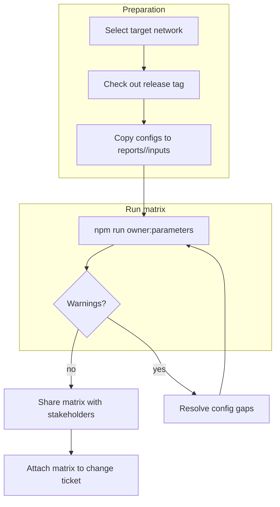
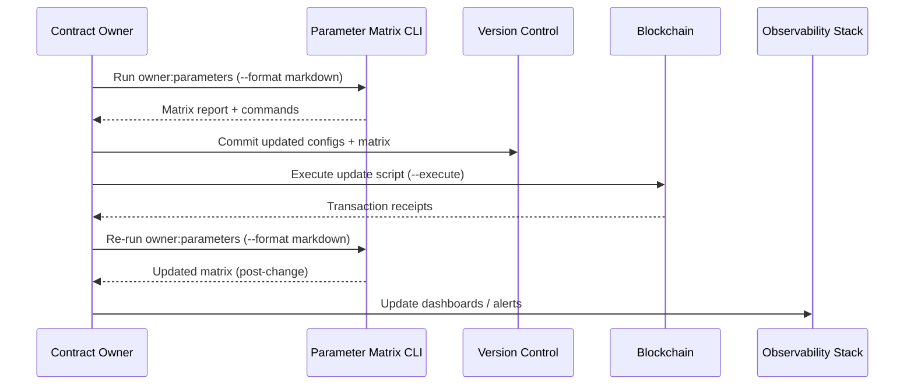
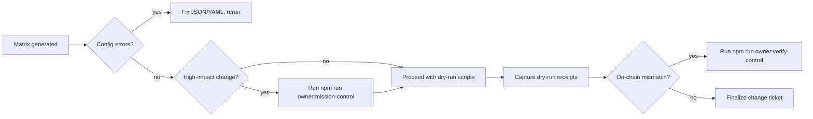

# Owner Parameter Matrix Guide

> **Audience:** Contract owners, governance stewards, and non-technical operators who
> need a single control surface for every configurable parameter in the AGIJobs v2
> deployment.
>
> **Outcome:** Produce a network-aware matrix that captures every mutable knob,
> the exact config file, the command to update it, the verification flow, and the
> owner-approved documentation so changes can ship safely—even under time pressure.
>
> **Primary tool:**
>
> ```bash
> npm run owner:parameters -- --network <network> \
>   --out reports/<network>/parameter-matrix.md
> ```
>
> The script expands JSON/YAML configuration into rich Markdown (or JSON/human
> formats) and injects Mermaid diagrams, helper commands, and documentation links.

---

## 1. Quick start — non-technical operator



1. **Pick your network** – Use `--network mainnet` or `--network sepolia`. The helper
   auto-detects Hardhat context if omitted.
2. **Stage configuration files** – Copy or symlink per-network overrides into
   `reports/<network>/inputs/` so diffs stay reviewable.
3. **Run the generator** – Execute the command above. Pass `--format human` for
   plain text or `--format json` for automation pipelines.
4. **Inspect the matrix** – Each section shows the configuration path, parameters,
   update script, verification script, and the official documentation bundle.
5. **Escalate gaps immediately** – Any `&lt;error&gt;` row signals a missing or malformed
   config. Fix the JSON and rerun before touching production.

---

## 2. Parameter families at a glance

| Module | Config file(s) | Update command | Verify command | Notes |
| --- | --- | --- | --- | --- |
| $AGIALPHA constants | `config/agialpha.json` (+ overrides) | `npm run compile` | `npm run verify:agialpha -- --rpc <url>` | Locks token metadata and scaling constants shared by Solidity/TypeScript.
| StakeManager | `config/stake-manager.json` | `npx hardhat run scripts/v2/updateStakeManager.ts --network <network>` | `npm run owner:verify-control -- --network <network> --modules=stakeManager` | Governs staking minima, unbonding, slashing, treasuries.
| JobRegistry | `config/job-registry.json` | `npx hardhat run scripts/v2/updateJobRegistry.ts --network <network>` | `npm run owner:verify-control -- --network <network> --modules=jobRegistry` | Controls job lifecycle bounds, routing, job creation policy.
| FeePool | `config/fee-pool.json` | `npx hardhat run scripts/v2/updateFeePool.ts --network <network>` | `npm run owner:verify-control -- --network <network> --modules=feePool` | Splits protocol fees, sets burns, routes treasuries.
| Thermodynamics & Thermostat | `config/thermodynamics.json` | `npx hardhat run scripts/v2/updateThermodynamics.ts --network <network>` and `npx hardhat run scripts/v2/updateThermostat.ts --network <network>` | `npm run owner:verify-control -- --network <network> --modules=rewardEngine,thermostat` | Tunes reward gradients, PID controls, energy budget.
| HamiltonianMonitor | `config/hamiltonian-monitor.json` | `npx hardhat run scripts/v2/updateHamiltonianMonitor.ts --network <network>` | `npm run owner:verify-control -- --network <network> --modules=rewardEngine` | Governs energy safety-rails and monitoring windows.
| EnergyOracle | `config/energy-oracle.json` | `npx hardhat run scripts/v2/updateEnergyOracle.ts --network <network>` | `npm run owner:verify-control -- --network <network> --modules=rewardEngine` and `npm run owner:surface -- --network <network> --only=rewardEngine` | Manages oracle signer sets, quorum, decay rules.
| TaxPolicy (optional) | `config/tax-policy.json` | `npx hardhat run scripts/v2/updateTaxPolicy.ts --network <network>` | `npm run owner:verify-control -- --network <network> --modules=taxPolicy` | Enables bracketed employer levies and exemptions.
| PlatformIncentives (optional) | `config/platform-incentives.json` | `npx hardhat run scripts/v2/updatePlatformIncentives.ts --network <network>` | `npm run owner:verify-control -- --network <network> --modules=platformIncentives` | Applies bonus multipliers for partner cohorts.
| IdentityRegistry | `config/identity-registry.json` (or `.network.json`) | `npx hardhat run scripts/v2/updateIdentityRegistry.ts --network <network>` | `npm run owner:verify-control -- --network <network> --modules=identityRegistry` | Maintains ENS roots, allowlists, emergency overrides.

---

## 3. Change workflow blueprint



- **Matrix first, transactions later** – Always generate, review, and commit the matrix
  before broadcasting state-changing transactions.
- **Dual snapshots** – Capture the matrix _before_ and _after_ execution to demonstrate
  intent vs. actual on-chain state.
- **Observability hook** – Feed the resulting Markdown/JSON into dashboards or the
  Owner Control Console so everyone shares a live source of truth.

---

## 4. Validation gates & risk checks



- **Syntax guard:** The matrix call fails fast on malformed JSON. Treat every failure
  as a stop-ship until corrected.
- **High-impact detection:** Large stake shifts, fee changes & identity rewires should
  route through `owner:mission-control` (multi-module planner) for extra validation.
- **Verification pairing:** After execution, rerun `owner:verify-control` and attach the
  output next to the matrix to prove the on-chain state matches the staged config.

---

## 5. Parameter-by-parameter playbook

Each matrix section mirrors the structure below. Use it to brief stakeholders or delegate
execution to ops engineers while keeping the owner firmly in control.

| Column | Meaning | Owner action |
| --- | --- | --- |
| **Parameter** | Dot/bracket path into the JSON config. | Review proposed values, adjust in JSON overrides, and rerun the matrix. |
| **Value** | The formatted value pulled from the staged config. | Confirm against business intent (e.g., stake levels, fee percentages). |
| **Update with** | Copy/paste script snippet (with network prefilled). | Run with `--dry-run` first; add `--execute` only after peer review. |
| **Verify with** | Follow-up command to confirm the on-chain state. | Execute post-transaction and archive output with the change ticket. |
| **Reference docs** | Deep dives, diagrams, and recovery guides. | Share with stakeholders or auditors needing more context. |

---

## 6. Owner safekeeping checklist

1. **Version lock:** Tag the Git commit used to generate the matrix so the config,
   scripts, and documentation remain in sync.
2. **Receipts:** Store `reports/<network>/parameter-matrix.md` (or JSON) alongside
   execution receipts under `reports/<network>/receipts/`.
3. **Alerting:** Wire a watcher (e.g., GitHub Actions, cron job) to regenerate the matrix
   daily. Diff the output to spot config drift or unauthorised edits.
4. **Emergency brake:** If any subsystem must be paused mid-change, pair the matrix with
   `npm run owner:emergency -- --network <network>` (see
   [owner-control-emergency-runbook](owner-control-emergency-runbook.md)).
5. **Custody review:** When rotating keys or treasuries, confirm the matrix lists the new
   addresses before executing `owner:rotate`.

---

## 7. Appendix — automation tips

- **CI enforcement:** Add a CI step that runs
  `npm run owner:parameters -- --network <network> --format json` and checks the output
  into an artefact. Fail the pipeline if the command errors or if critical parameters
  differ from expected thresholds.
- **Custom templates:** Pipe the Markdown output through Pandoc or md-to-pdf for
  executive-friendly reports. The CLI keeps all tables and Mermaid diagrams intact.
- **Environment overrides:** Use `OWNER_PARAMETER_OVERRIDES="module.path=value"` (see
  the script README) for ad-hoc experiments without editing disk configs.
- **Integrations:** Export JSON to the Owner Console or data warehouse to power dashboards
  tracking parameter history across networks.

By using the Owner Parameter Matrix as the canonical change surface, the contract owner
retains complete, auditable control over every configurable parameter while empowering
non-technical operators to execute updates with confidence.
