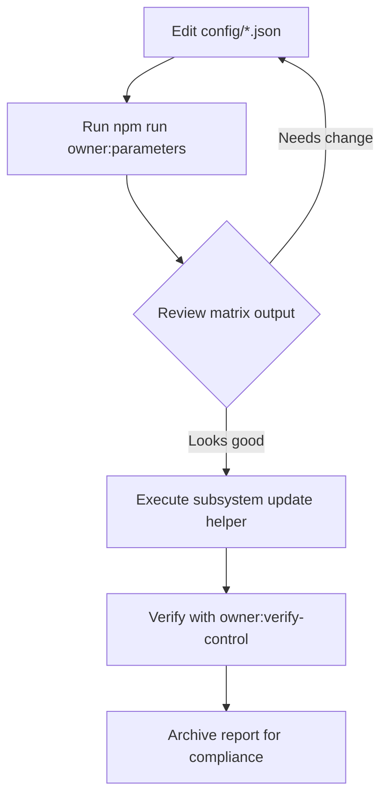
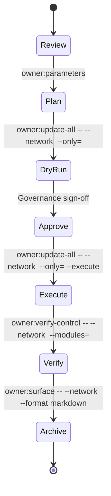

# Owner Parameter Matrix

The owner parameter matrix gives contract owners a single command that flattens every
production-facing configuration file into a navigable control sheet. The matrix combines
Mermaid visualisations, subsystem summaries and ready-to-run update & verification commands
so non-technical operators can tune the platform while preserving auditable guard rails.



## Quick start

1. Decide which network context you want to review (for example `mainnet` or `sepolia`).
2. Run the CLI helper:

   ```bash
   npm run owner:parameters -- --network sepolia --out runtime/sepolia-parameter-matrix.md
   ```

3. Inspect the generated Markdown report. Each subsystem block lists:
   - The configuration file location.
   - Copy/paste update commands with the selected network inserted automatically.
   - Verification steps that close the control loop.
   - A flattened table of every configurable field so nothing is hidden.
4. Hand the artefact to reviewers or attach it to the change-control ticket before executing
   the matching update helper (for example `npm run owner:update-all -- --network sepolia --only=stakeManager`).
5. After executing changes, rerun `npm run owner:parameters` and `npm run owner:verify-control`
   to confirm production matches the desired state.

> **Tip:** Omit `--out` to print the report directly to stdout, or add `--format human`
> for a plaintext briefing that fits easily in chat applications.

## Matrix anatomy

The generated Markdown report is structured as follows:

- **Global metadata** – Timestamp, optional network context and an embedded Mermaid
  workflow diagram that mirrors the governance control loop.
- **Subsystem sections** – Each configurable module appears under its own heading with
  a narrative summary, configuration path, update & verification commands and reference
  documentation.
- **Flattened parameter table** – Every primitive value in the underlying JSON is rendered
  as a `parameter → value` row so operators can review all tunables without digging through
  nested structures.

```markdown
## StakeManager parameters

Controls staking minimums, slashing weights, treasury routing, and validator incentives.

- **Config file:** `config/stake-manager.json`
- **Update with:**
  - `npx hardhat run scripts/v2/updateStakeManager.ts --network sepolia`
- **Verify with:**
  - `npm run owner:verify-control -- --network sepolia --modules=stakeManager`
- **Reference docs:**
  - [docs/owner-control-handbook.md](docs/owner-control-handbook.md)
  - [docs/owner-control-command-center.md](docs/owner-control-command-center.md)
  - [docs/thermodynamics-operations.md](docs/thermodynamics-operations.md)

| Parameter | Value |
| --- | --- |
| `minStakeTokens` | 10 |
| `employerSlashPct` | 50 |
| `treasury` | 0x0000000000000000000000000000000000000000 |
| `autoStake.enabled` | false |
| … | … |
```

## Decision companion

Pair the matrix with the existing owner-control helpers to drive safe changes:



## Options reference

| Flag | Description |
| ---- | ----------- |
| `--network <name>` | Applies per-network configuration overrides and injects the network name into commands. |
| `--format markdown|json|human` | Choose between Markdown (default), structured JSON or a plain-text briefing. |
| `--out <path>` | Write the matrix to disk (directories are created automatically). |
| `--no-mermaid` | Skip Mermaid diagrams for environments that cannot render them. |
| `--help` | Display inline documentation for the CLI tool. |

## Operational playbook

1. **Snapshot current state:** `npm run owner:surface -- --network <network> --format markdown --out reports/<network>-surface.md`
2. **Generate the matrix:** `npm run owner:parameters -- --network <network> --out reports/<network>-matrix.md`
3. **Dry-run updates:** `npm run owner:update-all -- --network <network> --only=<module>`
4. **Execute changes:** rerun the updater with `--execute` once reviewers approve the plan.
5. **Verify ownership:** `npm run owner:verify-control -- --network <network> --strict`
6. **Archive artefacts:** Store the surface snapshot, matrix and verification output alongside the governance decision log.

This workflow ensures the contract owner retains full, provable control over every parameter
without touching Solidity code, while surfacing the exact JSON paths and commands needed to
apply or roll back changes safely.
