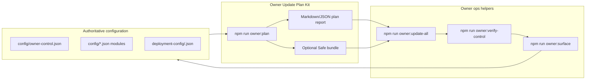
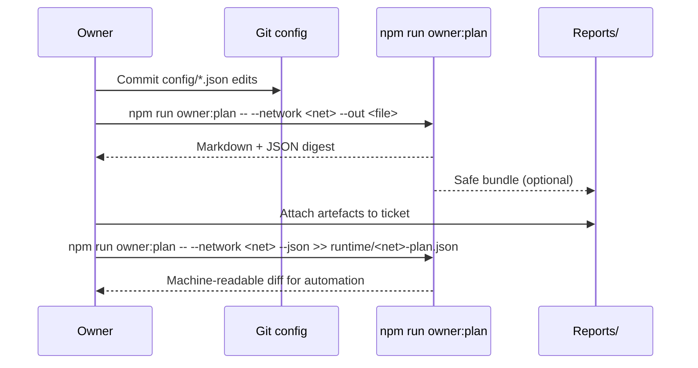

# Owner Update Plan Kit

> **Audience:** Non-technical contract owners, governance coordinators and
> operations stewards who must produce an auditable execution plan before
> running `npm run owner:update-all` in production.
>
> **Purpose:** Provide a drop-in, guided workflow that turns JSON configuration
> edits into a signed, traceable change package complete with Mermaid diagrams,
> Safe bundles, Markdown runbooks and verification checklists.

---

## 1. Orientation map



- **Configuration first.** Edit the JSON manifests in Git—never mutate contracts
  manually. The planner reads the same files that power the runtime scripts.
- **Plan before execute.** `npm run owner:plan` renders an actionable change
  dossier: tables, Mermaid flow, copy/paste commands and (optionally) a Gnosis
  Safe bundle.
- **Verify after execution.** Pair the plan with `owner:update-all` and
  `owner:verify-control` to close the control loop and archive receipts.

---

## 2. Quick start – three commands

```bash
# 1. Draft JSON changes under config/*.json, commit to a feature branch

# 2. Generate the plan (Markdown by default)
npm run owner:plan -- --network <network> --out \
  reports/<network>/owner-plan-$(date +%Y%m%d%H%M).md

# 3. Optionally emit a Safe bundle in the same pass
npm run owner:plan -- --network <network> \
  --safe reports/<network>/owner-plan-safe.json \
  --safe-name "AGIJobs Owner Plan" \
  --safe-desc "<ticket>: Parameter update batch"
```

The Markdown plan mirrors what `owner:update-all` will submit and contains:

- A timestamped header with network + chain ID.
- Mermaid flow diagrams that summarise the change pipeline.
- Per-module tables listing addresses, owner/governance targets, warnings and
  queued actions with natural-language descriptions.
- Suggested follow-up commands (`owner:update-all`, `owner:verify-control`,
  `owner:surface`) pre-filled with the selected network flag.

Attach the plan artefact to your change-control ticket before requesting
signatures or approvals.

---

## 3. Planner output anatomy



| Section | Contents | Why it matters |
| --- | --- | --- |
| **Mission header** | Network, chain ID, signer address, timestamp, change ticket placeholder. | Confirms the planner used the correct RPC context and signer. |
| **Mermaid topology** | Flowchart of plan ➝ execute ➝ verify loop. | Drop-in visual for tickets, chats and governance decks. |
| **Module roster** | Address, owner, pending actions, warnings, receipts path. | Single glance view of on-chain impact before execution. |
| **Action ledger** | Numbered list with method signature, current ➝ desired values, calldata hash. | Auditors can map every JSON tweak to an exact transaction. |
| **Verification checklist** | Copy/paste commands for `owner:update-all`, `owner:verify-control`, `owner:surface`. | Ensures operators rehearse and close the loop after execution. |

---

## 4. Flags & environment toggles

| Flag / Env | Description | Typical use |
| --- | --- | --- |
| `--network <name>` | Applies per-network overrides before building the plan. | `mainnet`, `sepolia`, staging forks. |
| `--out <file>` / `OWNER_PLAN_OUT` | Write Markdown output to disk (directories auto-created). | Persist plan for change tickets. |
| `--json` / `OWNER_PLAN_JSON=1` | Emit structured JSON instead of Markdown. | Feed CI bots or governance dashboards. |
| `--safe <file>` / `OWNER_PLAN_SAFE_OUT` | Produce a Gnosis Safe batch matching the planned actions. | Air-gapped signing ceremonies. |
| `--safe-name` / `OWNER_PLAN_SAFE_NAME` | Annotate the Safe bundle title. | Multi-change scheduling. |
| `--safe-desc` / `OWNER_PLAN_SAFE_DESCRIPTION` | Annotate the Safe bundle description. | Ticket/incident references. |
| `--execute` / `OWNER_PLAN_EXECUTE=1` | Preview the execution payload that would be submitted immediately. | Blue/green rehearsals and parity checks. |

> **Note:** `owner:plan` never broadcasts transactions. Even with `--execute`
> it only shows the exact payload that `owner:update-all --execute` will send,
> letting you compare and sign off before the real broadcast.

---

## 5. Integrating the plan with the execution stack

1. **Dry run with owner:update-all**
   ```bash
   npm run owner:update-all -- --network <network>
   ```
   Confirm that the CLI output matches the plan ledger.

2. **Request approvals**
   - Share the Markdown plan, JSON output (if generated) and any Safe bundle with
     the governance approvers.
   - Capture acknowledgements in your ticket or meeting notes.

3. **Execute once cleared**
   ```bash
   npm run owner:update-all -- --network <network> --execute \
     --receipt reports/<network>/owner-receipts-$(date +%s).json
   ```

4. **Verify and archive**
   ```bash
   npm run owner:verify-control -- --network <network> --strict
   npm run owner:surface -- --network <network> --format markdown \
     --out reports/<network>/surface-$(date +%Y%m%d).md
   ```
   Commit the plan, receipts and verification artefacts to your governance
   archive.

---

## 6. Troubleshooting checklist

| Symptom | Likely cause | Fix |
| --- | --- | --- |
| Planner exits with `Unknown owner:plan argument`. | Typo in CLI flag. | Run `npm run owner:plan -- --help` (prints usage) and re-run. |
| Plan shows `❌ Action required` for a module you did not touch. | Live state already diverged from committed JSON. | Re-run `owner:surface`, align JSON, rebuild the plan. |
| Safe bundle missing entries. | Plan found zero actionable changes. | Confirm JSON edits were saved/committed before re-running. |
| JSON plan file is empty. | Forgot `--json` or redirected stdout incorrectly. | Use `npm run owner:plan -- --json > runtime/<net>-plan.json`. |

---

## 7. Change ticket template snippet

```markdown
## AGIJobs owner update plan
- Network: <network>
- Ticket: <link>
- Plan artefact: reports/<network>/owner-plan-YYYYMMDDHHMM.md
- Safe bundle (if applicable): reports/<network>/owner-plan-safe.json
- Execution window: <date/time>
- Signers: <names or multisig threshold>
- Post-checks: owner:verify-control, owner:surface
```

Attach this snippet—with paths replaced—to every change request so reviewers can
trace JSON edits through planning, execution, and verification with no extra
context.

---

By following the Owner Update Plan Kit workflow you guarantee the contract
owner keeps full operational control with a human-readable, auditor-friendly
paper trail—without touching Solidity, scripting internals or RPC minutiae.
