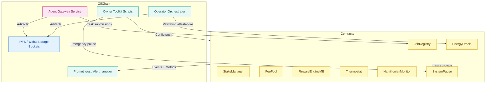
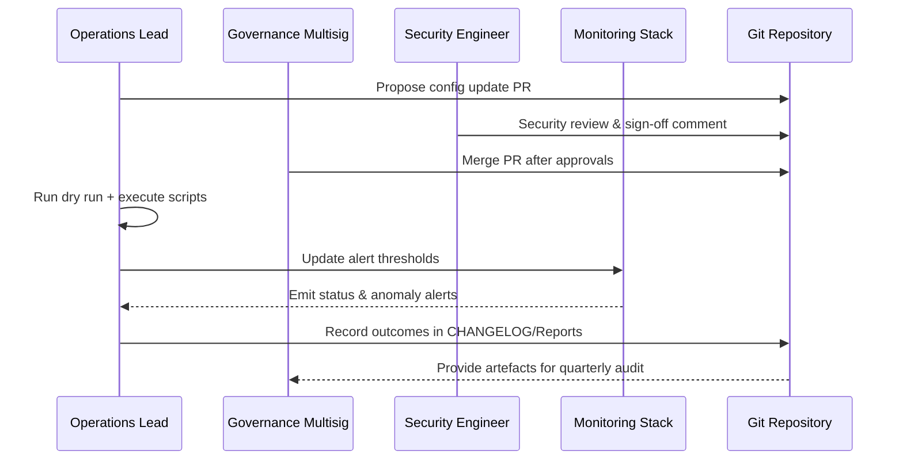

# Production Deployment Handbook

> **Audience:** Protocol owners, operations leads, and non-technical coordinators who must ship and
> maintain AGIJobs v2 in a production-critical environment.
>
> **Goal:** Provide an end-to-end, copy/paste-ready runbook that eliminates guesswork during
> deployment, parameter updates, and operational validation.

---

## 1. Deployment Value Stream Overview

```mermaid
flowchart LR
    classDef input fill:#e8f6ff,stroke:#0090f0,stroke-width:1px,color:#03396c;
    classDef process fill:#fff5e6,stroke:#ff9f1c,stroke-width:1px,color:#8c471c;
    classDef output fill:#f3f8f2,stroke:#2ecc71,stroke-width:1px,color:#145a32;
    classDef control fill:#f8efff,stroke:#8e44ad,stroke-width:1px,color:#4a148c;

    Submissions:::input -->|Git + config/*.json| Planning[Parameter Planning\n& Governance Sign-off]:::process
    Planning --> DryRun[Dry Run Validation\n`npm run owner:update-all`\n`--network <network>`]:::process
    DryRun --> Deploy[Deploy Contracts\n`npx hardhat run scripts/v2/deployDefaults.ts`\n`--network <network>`]:::process
    Deploy --> WireCheck[Wire Verification\n`npm run wire:verify`]:::control
    WireCheck -->|Contracts + Config| PostDeploy[Post-Deployment Audit\n`npm run owner:surface -- --network <network>`]:::process
    PostDeploy --> Snapshot[Operational Snapshot\n`--format markdown --out reports/<network>-surface.md`]:::output
    Snapshot --> Handover[Owner Control Handover\nMultisig / Timelock Rotation\n`npm run owner:rotate -- --network <network>`]:::process
    Handover --> Monitoring[Continuous Monitoring\nPrometheus, Alerts, Dashboards]:::control
```



The diagram captures the **required checkpoints** for every network launch. Each block references
scripts that already exist in the repository so the contract owner never writes ad-hoc scripts.

---

## 2. Pre-Flight Checklist (Non-Technical Friendly)

| Status | Task | Command / Location | Notes |
| ------ | ---- | ------------------ | ----- |
| [ ] | Confirm ENS subdomains issued to all agents/validators | [ENS identity setup guide](ens-identity-setup.md) | Required before onboarding labour market participants. |
| [ ] | Finalise `$AGIALPHA` token metadata | `config/agialpha.json` | Run `npm run compile` immediately after edits. |
| [ ] | Fill governance + owner targets | `config/owner-control.json` | Use multisig addresses where possible. |
| [ ] | Calibrate thermodynamic incentives | `config/thermodynamics.json` | Document rationale inside PR description. |
| [ ] | Configure fee treasury + burn split | `config/fee-pool.json` | Treasury must never equal owner address. |
| [ ] | Authorise energy oracle signers | `config/energy-oracle.json` | Require off-chain attestations for every signer. |
| [ ] | Set job registry caps and cooldowns | `config/job-registry.json` | Align with liquidity constraints. |
| [ ] | Complete deployment configuration | `deployment-config/<network>.json` | Points scripts to RPC URLs and namehash parameters. |
| [ ] | Provision secrets | `.env.production` (not committed) | Contains RPC URLs, private keys, monitoring tokens. |

> **Sign-off pattern:** Each row must be initialled by the responsible stakeholder (legal, finance,
> operations). Store signed copies in the compliance vault before executing deployments.

---

## 3. High-Signal Architecture Snapshot



This diagram links every named configuration file and tool to its on-chain counterpart, giving the
owner immediate situational awareness. Place it in onboarding decks so new hires understand control
boundaries within minutes.

---

## 4. Execution Runbook

### Step 1 – Dry Run Configuration

1. Commit all configuration changes to a feature branch.
2. Execute `npm run owner:update-all -- --network <network>`.
3. Capture the console output to `reports/<date>-<network>-dry-run.log`.
4. Reject the run if **any** transaction is marked `! WILL EXECUTE` without prior governance approval.

### Step 2 – Deployment & Wiring

1. Deploy using `npx hardhat run scripts/v2/deployDefaults.ts --network <network> --governance <address>`.
2. Immediately run `npm run wire:verify` to validate inter-module addresses.
3. If wiring fails, call `npm run owner:surface -- --network <network>` and inspect the offending module.

### Step 3 – Ownership Finalisation

1. Rotate ownership with `npm run owner:rotate -- --network <network> --safe owner-rotation.json --safe-name "AGIJobs Governance Rotation"`.
2. Multisig signers review the generated Safe bundle; broadcast once unanimously approved.
3. Confirm success via `npm run owner:verify-control -- --network <network>`.
4. When each module lists `SystemPause` as owner/governance, execute
   `SystemPause.refreshPausers()` (for example via
   `npx hardhat run scripts/v2/updateSystemPause.ts --network <network> --refresh --execute`)
   so the pause helper regains pauser rights before the next incident drill.

### Step 4 – Monitoring Enablement

1. Deploy Prometheus scrapers described in `deployment-config/operator-telemetry.yml`.
2. Configure alert thresholds:
   - `SystemPause` ownership changes.
   - Reward distribution anomalies (difference between expected and actual shares > 2%).
   - Energy oracle signer churn.
3. Store Grafana dashboards under `monitoring/<network>/dashboards.json` (create the folder if absent).

### Step 5 – Post-Deployment Review

1. Generate the Markdown control surface:
   ```bash
   npm run owner:surface -- --network <network> --format markdown --out reports/<network>-owner-surface.md
   ```
2. Share the report with finance, legal, and operations for sign-off.
3. File receipts, Safe transaction hashes, and surface reports in the compliance vault.

---

## 5. Parameter Change Safe-Launch Protocol

When editing any `config/*.json`, follow the phased release below:

| Phase | Purpose | Commands |
| ----- | ------- | -------- |
| **Staging Dry Run** | Detect schema errors without touching mainnet. | `npm run owner:update-all -- --network sepolia` |
| **Shadow Deployment** | Deploy to a forked mainnet for integration tests. | `FORK_RPC_URL=<mainnet> npx hardhat node --fork $FORK_RPC_URL` + run relevant scripts. |
| **Production Launch** | Execute against target network with Safe approval. | `npm run owner:update-all -- --network <network> --execute --safe ...` |
| **Validation Window** | Monitor metrics for 48 hours, auto-rollback if anomalies exceed thresholds. | `npm run owner:dashboard -- --network <network>` + alert thresholds. |

> **Rollback Guardrail:** Keep the previous configuration JSONs tagged (e.g. `config-backups/<date>`). If
> a change regresses, re-run `npm run owner:update-all` using the tagged configuration to restore.

---

## 6. Risk Matrix & Mitigations

| Risk | Impact | Mitigation |
| ---- | ------ | ---------- |
| Misconfigured treasury routing | Funds diverted or burned | `npm run owner:surface` highlights treasury address mismatches; require dual review before execution. |
| Unauthorised energy oracle signer | Incorrect rewards or spam | Maintain signer roster under `config/energy-oracle.json`; monitor for unexpected on-chain additions. |
| Lost governance keys | Permanent loss of control | Enforce multisig rotation via `owner:rotate`; keep emergency timelock in cold storage. |
| Pause mechanism misconfigured | Unable to halt during incident | Run `npx hardhat run scripts/v2/updateSystemPause.ts --network <network>` in dry run monthly; schedule acceptance tests. |
| Stale thermodynamic parameters | Reward imbalance | Automate quarterly review with `npm run owner:mission-control -- --network <network>`. |

---

## 7. Owner Control Command Palette (Cheat Sheet)

| Scenario | Script | Flags |
| -------- | ------ | ----- |
| Discover everything owned by governance | `npm run owner:surface` | `--network <network>` |
| Apply full configuration suite | `npm run owner:update-all` | `--network <network> [--execute]` |
| Rotate to fresh multisig | `npm run owner:rotate` | `--network <network> --safe owner-rotation.json --safe-name "AGIJobs Rotation"` |
| Generate executive summary PDF | `npm run owner:dashboard` | `--network <network> --out reports/<network>-dashboard.pdf` |
| Verify $AGIALPHA alignment | `npm run verify:agialpha` | `--rpc <https-url>` |
| Refresh ENS registry | `npm run identity:update` | `--network <network> [--execute]` |

Print and laminate this palette for the operations desk. Every command is deterministic and idempotent,
allowing non-technical staff to follow procedures without improvisation.

---

## 8. Continuous Improvement Loop



Embedding the loop in retrospectives ensures every deployment increases institutional knowledge while
keeping auditors satisfied.

---

## 9. Appendix – Reference Locations

- `config/` – Canonical on-chain parameter files; each key mirrors a contract setter.
- `deployment-config/` – Network bootstrap data (ENS namehashes, RPC endpoints, telemetry services).
- `scripts/v2/` – TypeScript + Hardhat helpers used in this handbook.
- `reports/` (create as needed) – Long-lived artefacts produced by owner tooling.
- `monitoring/` – Recommended folder for dashboards and alert definitions (not tracked by default).

> **Next Action:** After adopting this handbook, schedule a quarterly game-day using the scenario deck in
> [Owner mission control](owner-mission-control.md) to rehearse incident response with the latest parameters.

---

**Version Control Tip:** Commit updates to this handbook whenever new scripts or parameters are added.
Reference the commit hash in change-management tickets so operations always knows which revision is
current.
