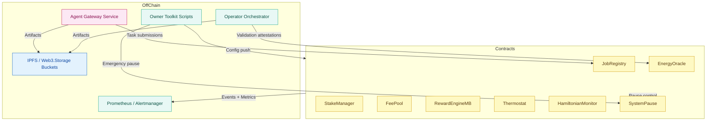
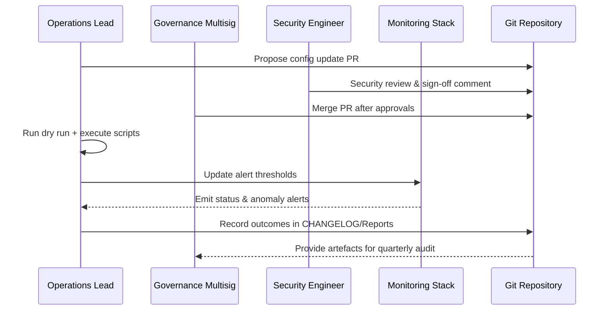

# Production deployment handbook

This is the operator handoff checklist for the [current staged Hardhat deployment](deployment-v2-agialpha.md). Use the [readiness report](production/readiness.md) for current blockers and the [coordinator guide](production/nontechnical-mainnet-deployment.md) for a plain-language explanation.

## Prepare

1. Record the exact source commit and release trust evidence.
2. Install the pinned Node/npm lockfile with `npm ci` and run `npm run ci:preflight`.
3. Compile with `npm run compile:sepolia` or `npm run compile:mainnet`. These commands generate the selected token constants before compiling locally.
4. Review the network-specific JSON and run `npm run deploy:plan -- --network sepolia --config deployment-config/reviewed-sepolia.json --out reports/sepolia-plan.json` for the chosen target.
5. Retain exact-commit CI, bytecode-size evidence, dependency audit and independent review. Passing a read-only plan is not authority to broadcast.

## Execute and retain evidence

Use only the environment variables and supported command in [the current guide](deployment-v2-agialpha.md#4-execute-only-after-approval). The script reserves a new report before broadcasting, records submitted transactions, binds the resolved configuration on the coordinator, and keeps all eight managed modules paused through finalization.

The tax URI and acknowledgement are constructor inputs. Review them before deployment. A governance account different from the deployer receives explicit pending acceptance records instead of an attempted impersonation.

## Inspect the result

| Item | Required check |
| --- | --- |
| Coordinator | Correct runtime, deployment signer and committed plan digest |
| Components | Recorded creation-code hashes and exact constructor arguments |
| Implementations | All ten fixed addresses and verified runtime/source |
| Economics | Confirmed on-chain values; understand zero-as-default coordinator semantics |
| Governance | Eight managed module owners equal SystemPause; SystemPause owner equals governance |
| Acceptance | IdentityRegistry and TaxPolicy ownership accepted by the designated governance |
| Launch | Eight pause states true; requested limits reviewed and applied through governance |
| Explorer | Every verification result complete; `pending` or `skipped` is unresolved |

For setters on a managed module, the governance account uses `SystemPause.executeGovernanceCall`. Direct-owner helpers from a different deployment path cannot be assumed compatible. Preserve the SystemPause topology.

## Recover

A timeout can happen after broadcast. Reconcile transaction hashes, nonce and coordinator state before retrying. Keep the interrupted report and use a new output path for recovery. The same source/configuration/coordinator must be used; configuration changes are refused. Follow [the complete recovery procedure](deployment-v2-agialpha.md#5-recover-without-losing-evidence).

Recovery reconstructs evidence; it does not roll back confirmed blockchain transactions. Restoring an old JSON configuration is also not a rollback of jobs, balances or payments.

## Commission

Complete source and ownership verification, actual token burnability, ENS/identity admission, worker isolation, spending/stop controls, independent review, settlement and recovery drills. Configure monitoring and check alerts using the actual deployment addresses. Only governance authorizes unpausing after all gates pass. No fixed observation period alone proves safety.

For later operations, consult [security and deployment controls](security-deployment-guide.md), [owner control](owner-control-playbook.md) and the command-specific runbooks. Commands differ in whether they inspect, propose or send transactions.

## Preserved historical diagrams

These diagrams retain the repository’s original architectural record. Any commands inside them describe the historical workflow; use the current Hardhat guide above for execution.

```mermaid
flowchart LR
    classDef input fill:#e8f6ff,stroke:#0090f0,stroke-width:1px,color:#03396c;
    classDef process fill:#fff5e6,stroke:#ff9f1c,stroke-width:1px,color:#8c471c;
    classDef output fill:#f3f8f2,stroke:#2ecc71,stroke-width:1px,color:#145a32;
    classDef control fill:#f8efff,stroke:#8e44ad,stroke-width:1px,color:#4a148c;

    Submissions:::input -->|Git + config/*.json| Planning[Parameter Planning\n& Governance Sign-off]:::process
    Planning --> DryRun[Dry Run Validation\n`npm run owner:update-all`\n`--network <network>`]:::process
    DryRun --> Deploy[Deploy Contracts\n`npx hardhat run scripts/v2/deployDefaults.ts`\n`--network <network>`]:::process
    Deploy --> WireCheck[Wire Verification\n`npm run wire:verify`]:::control
    WireCheck -->|Contracts + Config| PostDeploy[Post-Deployment Audit\n`npm run owner:surface -- --network <network>`]:::process
    PostDeploy --> Snapshot[Operational Snapshot\n`--format markdown --out reports/<network>-surface.md`]:::output
    Snapshot --> Handover[Owner Control Handover\nMultisig / Timelock Rotation\n`npm run owner:rotate -- --network <network>`]:::process
    Handover --> Monitoring[Continuous Monitoring\nPrometheus, Alerts, Dashboards]:::control
```

```mermaid
flowchart TD
    classDef contract fill:#fef9c3,stroke:#d4a017,stroke-width:1px,color:#5b3c11;
    classDef service fill:#e8f8f5,stroke:#17a589,stroke-width:1px,color:#0b5345;
    classDef gateway fill:#fce8f4,stroke:#c2185b,stroke-width:1px,color:#880e4f;
    classDef storage fill:#e3f2fd,stroke:#1565c0,stroke-width:1px,color:#0d47a1;

    subgraph Contracts
        JR[JobRegistry]:::contract
        SM[StakeManager]:::contract
        FP[FeePool]:::contract
        RE[RewardEngineMB]:::contract
        TH[Thermostat]:::contract
        HM[HamiltonianMonitor]:::contract
        EO[EnergyOracle]:::contract
        SP[SystemPause]:::contract
    end

    subgraph OffChain
        OG[Owner Toolkit Scripts]:::service
        AG[Agent Gateway Service]:::gateway
        OR[Operator Orchestrator]:::service
        MON[Prometheus / Alertmanager]:::service
        IPFS[IPFS / Web3.Storage Buckets]:::storage
    end

    OG -->|Config push| Contracts
    Contracts -->|Events + Metrics| MON
    AG -->|Task submissions| JR
    OR -->|Validation attestations| EO
    Contracts -->|Pause control| SP
    OG -->|Emergency pause| SP
    AG -->|Artifacts| IPFS
    OR -->|Artifacts| IPFS
```

```mermaid
sequenceDiagram
    participant Ops as Operations Lead
    participant Gov as Governance Multisig
    participant Sec as Security Engineer
    participant Mon as Monitoring Stack
    participant Repo as Git Repository

    Ops->>Repo: Propose config update PR
    Sec->>Repo: Security review & sign-off comment
    Gov->>Repo: Merge PR after approvals
    Ops->>Ops: Run dry run + execute scripts
    Ops->>Mon: Update alert thresholds
    Mon-->>Ops: Emit status & anomaly alerts
    Ops->>Repo: Record outcomes in CHANGELOG/Reports
    Repo-->>Gov: Provide artefacts for quarterly audit
```
