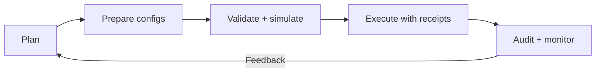
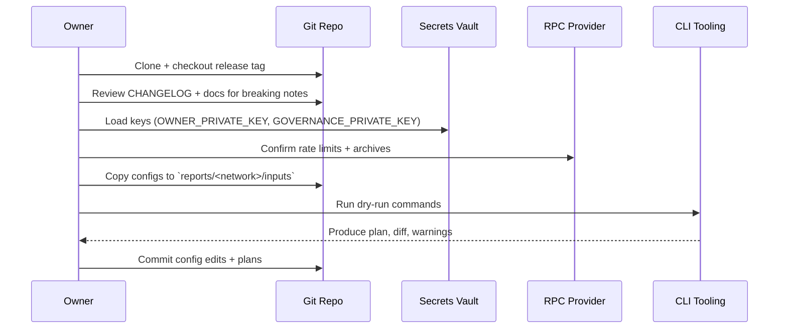
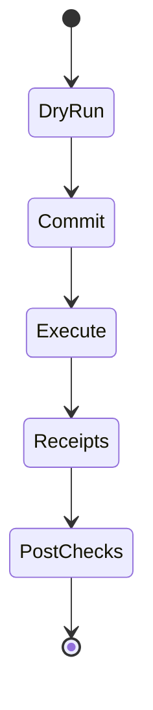
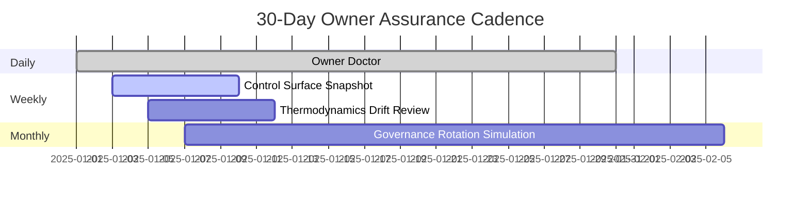

# Production Launch Blueprint

> **Audience:** Contract owners and programme managers preparing a production roll-out or
> major parameter update without sacrificing safety, observability or control.
>
> **Outcome:** A repeatable runbook that a non-technical operator can execute end-to-end
> while keeping every adjustable knob under explicit owner control.

---

## 1. Mission Snapshot



- **Plan:** Capture the business goal, blast radius and rollback checkpoints.
- **Prepare configs:** Stage edits in version-controlled JSON files so you can diff every
  knob before touching the chain.
- **Validate:** Use the provided wizards and dry runs to surface missing approvals,
  misconfigured addresses and regressions before spending gas.
- **Execute:** Promote the plan with explicit receipts and Safe bundles where needed.
- **Audit:** Store artefacts, dashboards and metrics so the next change starts from a
  known-good baseline.

---

## 2. Owner Control Console

| Control Surface | Configuration File(s) | Primary Script | Owner Adjusts |
| --- | --- | --- | --- |
| Governance + ownership | `config/owner-control.json`, `config/owner/*.json` overrides | `npm run owner:wizard` or `npm run owner:rotate` | Target multisigs, pausers, emergency operators |
| Treasury and fee policy | `config/fee-pool.json`, `config/job-registry.json`, network overrides | `npx hardhat run scripts/v2/updateFeePool.ts --network <network>` | Burn percentages, treasury safe, rounding strategy |
| Reward thermodynamics | `config/thermodynamics.json` | `npx hardhat run scripts/v2/updateThermodynamics.ts --network <network>` | Role shares, PID controller, damping factors |
| Energy oracle signers | `config/energy-oracle.json` | `npx hardhat run scripts/v2/updateEnergyOracle.ts --network <network>` | Signer addresses, threshold, retain policy |
| Token constants | `config/agialpha.json` | `npm run compile` + `npm run verify:agialpha -- --rpc <url>` | Token address, decimals, naming, burn sink |
| Identity registry | `config/identity-registry.<network>.json` | `npm run identity:update -- --network <network>` | ENS subdomain mapping, emergency allowlist |
| Pause graph | `config/agialpha.json` (`modules.systemPause`) | `npx hardhat run scripts/v2/updateSystemPause.ts --network <network>` | Pausable modules, guardians, acceptance windows |

> **Tip:** Every script accepts `--dry-run` (default) or `--execute`. Never bypass the dry
> run when operating against a production network.

---

## 3. Preparation Checklist



1. **Clone at the release tag** you intend to deploy. Rebase your configuration branch on
   top of the latest hotfix or security patch before executing.
2. **Review security notices** in `SECURITY.md` and the latest release notes in
   `CHANGELOG.md` to understand mandatory mitigations.
3. **Export credentials** from an encrypted secret manager. Populate:
   - `RPC_URL` for read/write JSON-RPC access.
   - `OWNER_PRIVATE_KEY` for Ownable modules.
   - `GOVERNANCE_PRIVATE_KEY` for Governable modules (timelock/multisig relayer).
4. **Stage configuration edits** inside `reports/<network>/inputs/` for peer review.
5. **Open a change ticket** capturing the motivation, blast radius, rollback strategy and
   validation plan. Attach it to the Git branch.
6. **Dry run every script** listed in the Owner Control Console. Save outputs to
   `reports/<network>/plans/`.

> **Guard rail:** Reject any plan that produces warnings until they are resolved or
> explicitly accepted by governance with a risk memo.

---

## 4. Execution Ladder



1. **DryRun:**
   ```bash
   npm run owner:wizard -- --network <network>
   npm run owner:rotate -- --network <network>
   npx hardhat run scripts/v2/updateThermodynamics.ts --network <network>
   ```
   - Generate Markdown plans with `--plan` or `--out` flags.
   - Validate gas cost estimates and ownership prerequisites.

2. **Commit:**
   ```bash
   git add config reports/<network>/plans
   git commit -m "chore(config): stage production launch"
   ```
   - Capture the exact JSON + plan files for auditability.

3. **Execute:**
   ```bash
   npm run owner:wizard -- --network <network> --execute \
     --receipt reports/<network>/receipts/owner-wizard-$(date +%Y%m%d%H%M).json
   npx hardhat run scripts/v2/updateEnergyOracle.ts --network <network> --execute \
     --json reports/<network>/receipts/energy-oracle.json
   ```
   - Leverage `--safe <file>` to emit Gnosis Safe bundles when using multi-sig guardians.

4. **Receipts:**
   - Archive console transcripts, Safe bundles and JSON receipts in
     `reports/<network>/receipts/`.
   - Use checksum filenames (`sha256sum`) to make tampering obvious.

5. **PostChecks:**
   ```bash
   npm run owner:verify-control -- --network <network>
   npm run owner:dashboard -- --network <network> \
     > reports/<network>/dashboards/owner-dashboard.md
   npm run owner:diagram -- --network <network> --format mermaid \
     --out reports/<network>/dashboards/control-surface.mmd
   ```
   - Diff outputs against the pre-change state and staple both to the change ticket.

---

## 5. Non-Technical Recovery Plan

| Scenario | Immediate Action | Command | Expected Output |
| --- | --- | --- | --- |
| Wrong treasury address deployed | Pause fee routing | `npx hardhat run scripts/v2/updateFeePool.ts --network <network> --dry-run` | Highlights offending address and required transaction |
| Missing signer in energy oracle | Rotate signer set | `npx hardhat run scripts/v2/updateEnergyOracle.ts --network <network> --execute --retainUnknown false` | Transaction receipt and final signer list |
| Ownership stuck in pending accept | Force accept step | `npm run owner:surface -- --network <network> --focus pending` | Shows module + action to accept |
| System pause not wired correctly | Reapply pause graph | `npx hardhat run scripts/v2/updateSystemPause.ts --network <network> --execute` | Confirms module list + ownership proofs |
| Governance drift detected | Restore policy | `npm run owner:verify-control -- --network <network>` | Fails loudly until module matches configuration |

> **Escalation:** If post-checks fail, revert to the last known-good commit, re-run the dry
> runs and escalate through your incident process.

---

## 6. Continuous Monitoring Hooks

- **Prometheus metrics:** Deploy `monitoring/` stack to expose job throughput, oracle
  latency and queue health. Owners decide retention and alert thresholds inside
  `monitoring/prometheus/prometheus.yml`.
- **Event log scrapers:** The `subgraph/` package ships ready-to-run manifest files for
  indexing agent lifecycle events. Regenerate after contract upgrades.
- **On-chain verifiers:** Schedule `npm run owner:doctor -- --network <network>` to spot
  drifts (mis-set decimals, stale addresses, missing roles) daily.



---

## 7. Launch Readiness Gate

Before opening the system to external participants, confirm the following:

- [ ] `npm run owner:verify-control -- --network <network>` passes without warnings.
- [ ] `npm run owner:dashboard -- --network <network>` shows every module under the
      expected owner or governance address.
- [ ] `npm run verify:agialpha -- --rpc <url>` matches the token metadata used in
      production.
- [ ] `npm run identity:update -- --network <network>` reports zero diffs or only the
      intended ENS changes.
- [ ] `npx hardhat run scripts/v2/updateThermodynamics.ts --network <network>` dry run
      matches the desired reward distribution.
- [ ] Validate release signatures and provenance following
      `docs/release-signing.md` before distributing artefacts.
- [ ] Incident response runbook stored in `docs/` references this blueprint and the latest
      Safe bundles.

Once all boxes tick, merge the configuration branch, tag the release and broadcast the
launch notice to stakeholders.

---

## 8. Appendix: Frequently Used Paths

- `config/` — canonical JSON knobs; always commit changes.
- `deployment-config/` — network-specific wiring used during initial deploys.
- `reports/<network>/` — operator-created artefacts (plans, receipts, dashboards).
- `scripts/v2/` — type-safe automation scripts invoked by npm run helpers.
- `monitoring/` — Prometheus + Grafana stack for runtime assurance.
- `docs/` — authoritative playbooks and guides (including this blueprint).

> Keep this file under version control. Every time you adjust the playbook, include the
> rationale inside the commit message so future operators understand the context.
