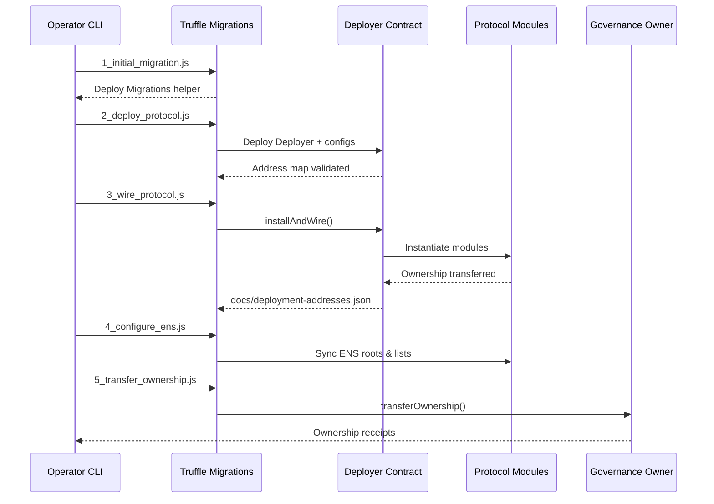

# Institutional Truffle Mainnet Playbook

> **Audience:** Program managers, legal/compliance reviewers, and non-technical operators who must launch the AGIJobs v2 protocol on Ethereum mainnet using Truffle while meeting institutional change-control requirements.
>
> **Outcome:** A verifiable, production-ready deployment that leaves the owner (governance) in full control of every economic, identity, and emergency parameter.

---

## 1. Executive summary

| Stage | Goal | Command palette | Artefacts |
| --- | --- | --- | --- |
| Preflight | Confirm workstation hygiene and configuration parity | `npm run deploy:checklist` | `logs/deploy-checklist-*.json` |
| Compile | Generate Solidity constants and bytecode with optimizer | `npm run compile:mainnet` | `artifacts/` + `contracts/v2/Constants.sol` |
| Deploy | Execute deterministic Truffle migrations (1–5) | `npm run migrate:mainnet` | `docs/deployment-addresses.json`, Truffle receipts |
| Verify | Assert wiring, owners, and token metadata | `npm run wire:verify` & `npm run verify:agialpha -- --skip-onchain` | Verification transcripts |
| Owner health | Prove owner can adjust every parameter | `npm run owner:health` & `npm run owner:plan` | `owner-plan.csv`, Safe bundle |
| Hand-off | Capture runbook, addresses, and pause procedures | Manual entry | Change-control ticket, vault notes |

Every command is idempotent and safe to re-run. Treat warnings as a request to halt and investigate before continuing.

```mermaid
flowchart LR
    subgraph Preflight
        A[Harden workstation]
        B[Fill .env]
        C[Sync configs]
    end
    subgraph Compile
        D[Generate Constants.sol]
        E[Hardhat compile + viaIR]
    end
    subgraph Deploy
        F[Migrations 1-5]
        G[Emit addresses JSON]
    end
    subgraph Verify
        H[Wire verifier]
        I[AGIALPHA metadata check]
    end
    subgraph OwnerHealth
        J[owner:health]
        K[owner:plan + Safe bundle]
    end
    subgraph HandOff
        L[Archive artefacts]
        M[Update runbook]
    end

    A --> B --> C --> D --> E --> F --> G --> H --> I --> J --> K --> L --> M
```



---

## 2. Environment preparation checklist

1. **Hardware security module ready** – Ledger, Safe, or other signer funded with ≥0.5 ETH.
2. **Secondary reviewer on standby** – Governance must co-sign addresses before enabling production traffic.
3. **Node.js & npm** – Run `nvm use` to match `.nvmrc`, then `npm install`.
4. **`.env` hygiene** – Copy `.env.example` to `.env` and fill only the deployment wallet private key.
5. **Backups** – Ensure password manager entry for the deployment includes RPC endpoint, governance address, and ENS roots.
6. **Dry-run target** – Complete the entire flow on Sepolia (`npm run migrate:sepolia`) before touching mainnet.

Document completion of each bullet inside your change-control ticket.

---

## 3. Critical variables

| Variable | Required | Description | Example |
| --- | --- | --- | --- |
| `MAINNET_RPC_URL` | ✅ | HTTPS RPC endpoint with archival access | `https://mainnet.infura.io/v3/<key>` |
| `MAINNET_PRIVATE_KEY` | ✅ | Deployer wallet key (no commas/spaces) | `0xabc...` |
| `GOVERNANCE_ADDRESS` | ✅ | Multisig or timelock that should own every module | `0x1234...` |
| `ETHERSCAN_API_KEY` | ✅ | Enables automatic source-code verification | `ABCD1234...` |
| `FEE_PCT`, `BURN_PCT` | Optional | Override protocol economics (% integers) | `5` |
| `NO_TAX` | Optional | Set to `1` to skip TaxPolicy | `1` |

Store these values in `.env` and reference them in incident reports.

---

## 4. Deployment configuration files

1. **`config/agialpha.json`** – Canonical AGIALPHA token metadata (address, decimals, symbol). Run `npm run compile` after edits.
2. **`deployment-config/mainnet.json`** – Governance address, ENS roots, Merkle roots, and economic overrides. Supports natural-language durations (`"48h"`) and AGIALPHA-denominated stakes (`"1500"`).
3. **`config/ens.mainnet.json`** – ENS registry and name wrapper addresses plus canonical agent/club roots. Refresh hashes via `npm run namehash:mainnet`.

All three files are consumed by the migrations and owner tooling—keep them in Git for reproducibility.

---

## 5. Migration scripts overview

| Migration | Purpose | Key environment hooks |
| --- | --- | --- |
| `1_initial_migration.js` | Standard Truffle housekeeping; deploys `Migrations` helper | None |
| `2_deploy_protocol.js` | Deploys `Deployer` and validates AGIALPHA config alignment | `config/agialpha.json`, `deployment-config/mainnet.json` |
| `2b_deploy_test_token_if_needed.js` | (Testnets) Deploys mock AGIALPHA token when `DEPLOY_LOCAL_ERC20=1` | `DEPLOY_LOCAL_ERC20` |
| `3_wire_protocol.js` | Invokes `Deployer` to fan out all modules with deterministic addresses, writes `docs/deployment-addresses.json` | `GOVERNANCE_ADDRESS`, `FEE_PCT`, `BURN_PCT`, `NO_TAX`, `deployment-config/mainnet.json` |
| `4_configure_ens.js` | Syncs `IdentityRegistry` ENS + Merkle roots from config | `config/ens.<network>.json` |
| `5_transfer_ownership.js` | Hands ownership to governance, pauser, and multisig accounts | `deployment-config/<network>.json`, `GOVERNANCE_ADDRESS` |

Keep the migrations folder under version control. The workflow `npm run migrate:mainnet` runs them sequentially with verbose logging.



---

## 6. End-to-end mainnet procedure

1. **Preflight** – `env DOTENV_PATH=.env npm run deploy:checklist`
   - Resolve every ❌ before proceeding. The script catches RPC misconfigurations, missing migrations, and inconsistent config files.
2. **Compile** – `npm run compile:mainnet`
   - Re-generates constants and ensures Solidity optimizer/viaIR are applied.
3. **Deploy** – `npm run migrate:mainnet`
   - Wraps `truffle migrate --network mainnet --reset` and reruns wiring verification automatically.
   - Capture `docs/deployment-addresses.json`, transaction hashes, and console output in the change log.
4. **Verify contracts** – `npx truffle run verify ... --network mainnet`
   - Re-run on failure; verification is idempotent.
5. **Owner assertions** –
   - `npm run owner:health` – proves each setter succeeds after ownership hand-off.
   - `npm run owner:plan > owner-plan.csv` – produces a transaction checklist and (optionally) Safe bundle via `npm run owner:plan:safe`.
   - `npm run owner:wizard` – opens an interactive, non-technical workflow to adjust fees, stake floors, ENS registrars, pauser accounts, and treasury allowlists with built-in validation.
6. **Documentation** – Update the operational vault with addresses, pauser instructions, and emergency contacts. Link artefacts to the change ticket.

> 💡 **Tip for time-pressed reviewers:** Run `npm run migrate:preflight` before `npm run migrate:mainnet` to produce a JSON preview of every migration step. Attach the output to the change request so compliance can confirm intended actions before any ETH is spent.

---

## 7. Non-technical guardrails

- **Pause switch** – The `SystemPause` contract owns all pauseable modules. Store its address and the pauser key in a secure vault. Practice `npx hardhat run scripts/v2/updateSystemPause.ts --network mainnet --pause` on a testnet.
- **Parameter adjustments** – Use `npm run owner:wizard` for a guided walkthrough to change fees, stakes, ENS registrars, pauser accounts, and treasury allowlists without writing calldata.
- **Change logging** – Preserve JSON outputs and CLI transcripts. They provide evidence for auditors and simplify incident response.
- **Rollback plan** – If any module is misconfigured, pause the system first, then execute the Safe bundle generated by `owner:plan:safe` to restore the intended configuration.

### 7a. One-transaction owner bundles

The 2024-Q2 release adds aggregated governance entry points so a multisig can retune critical parameters with a single Safe transaction. The helpers accept toggles for each field and reuse the same validation logic as the individual setters.

```mermaid
flowchart LR
    subgraph StakeManager.applyConfiguration
        SMCFG[ConfigUpdate
        • treasury & allowlist
        • fee/burn/validator %
        • pauser & auto-tuning
        • job/dispute modules]
        AL[AllowlistUpdate[]]
        SMCFG -->|1.| StakeManager
        AL -->|pre-apply allowlist| StakeManager
    end

    subgraph JobRegistry.applyConfiguration
        JRCFG[ConfigUpdate
        • module bundle
        • ENS roots & caches
        • fee / reward splits
        • job limits & treasury]
        ACK[AcknowledgerUpdate[]]
        MODS[ackModules[]]
        ACK -->|allow/deny| JobRegistry
        MODS -->|enable| JobRegistry
        JRCFG -->|1.| JobRegistry
    end

    SMCFG -.via Safe bundle .-> GOV[(Governance Multisig)]
    JRCFG -.via Safe bundle .-> GOV
```

**StakeManager** – call `applyConfiguration(ConfigUpdate, TreasuryAllowlistUpdate[])` when you need to adjust protocol fees, pauser keys, dispute modules, or auto-stake tuning thresholds. Populate the `allowlistUpdates` array first so new treasury addresses are authorised before being set.

**JobRegistry** – call `applyConfiguration(ConfigUpdate, AcknowledgerUpdate[], address[] ackModules)` to refresh ENS roots, rotate modules, update fee splits, or bump the agent authorisation cache. Passing `setModuleBundle=true` rewires the entire module graph and validates every version atomically.

1. Run `npm run owner:wizard` and capture the printed aggregated `ConfigUpdate` JSON for each contract at the summary step.
2. Execute `npm run owner:plan:safe -- --safe "AGIJobs Owner Bundle" --json` to generate a Safe Transaction Builder file containing the encoded `applyConfiguration` calls.
3. Upload the generated JSON to [txbuilder.safe.global](https://txbuilder.safe.global/), gather approvals, and execute once reviewers sign off.

> ✅ **Post-update check:** run `npm run owner:health` after every aggregated transaction. The script replays the configuration on a fork to ensure no guard conditions were tripped.

---

## 8. Operational QA sign-off

Complete the following checklist before closing the deployment ticket:

- [ ] `docs/deployment-addresses.json` stored in the vault and reviewed by governance.
- [ ] `owner-plan.csv` reviewed and uploaded to the Safe Transaction Builder.
- [ ] Etherscan verification status recorded (link to verified contracts).
- [ ] `npm run owner:health` log archived.
- [ ] Emergency pause drill performed on Sepolia within the last 30 days.
- [ ] Runbook updated with contact tree and on-call rotation.

Sign-off requires signatures from the deployment operator, governance representative, and compliance reviewer.

---

## 9. Troubleshooting quick reference

| Symptom | Likely cause | Resolution |
| --- | --- | --- |
| `AGIALPHA token address missing` | `config/agialpha.json` lacks address or decimals mismatch | Update config and rerun `npm run compile` |
| `deployment-config ... not found` warning | Missing per-network overrides | Copy `deployment-config/template.json` to `mainnet.json` and customise |
| `GOVERNANCE_ADDRESS must be provided` error | Environment variable unset during migration | Export `GOVERNANCE_ADDRESS` before running `npm run migrate:mainnet` |
| ENS root mismatch | Stale hash in `config/ens.mainnet.json` | Run `npm run namehash:mainnet` and commit the updated file |
| Owner healthcheck revert | Ownership transfer incomplete | Execute `npm run owner:plan` and follow generated transactions |
| Wire verifier mismatch | Address drift or mid-flight module change | Re-run `npm run wire:verify`; if still failing, restore `docs/deployment-addresses.json` from source control and redeploy |

Escalate unresolved issues to the security contact listed in [`SECURITY.md`](../../SECURITY.md).

---

## 10. Owner control matrix (visual)

The diagram below maps the governance owner to the most frequently adjusted modules. Each arrow corresponds to a pre-built CLI action (`npm run owner:wizard`, `npm run owner:plan`, or the generated Safe bundle), so non-technical operators never need to craft calldata manually.

```mermaid
graph TD
    Gov[Governance / Owner Wallet]
    SM[StakeManager]
    JR[JobRegistry]
    FP[FeePool]
    PR[PlatformRegistry]
    TP[TaxPolicy]
    SP[SystemPause]
    IR[IdentityRegistry]

    Gov -->|setMinStake, setTreasury, setPauser| SM
    Gov -->|setFeePct, setBurnPct, setTreasury| JR
    Gov -->|setBurnPct, setTreasuryAllowlist| FP
    Gov -->|applyConfiguration (registrars, blacklist, pauser)| PR
    Gov -->|setPolicy, acknowledgeUpgrades| TP
    Gov -->|setModules, pause/unpause| SP
    Gov -->|setEnsRoots, addAdditionalAgent/Validator| IR
```

> ✅ **Verification shortcut:** After any update, rerun `npm run owner:health`. The script deploys a temporary fork, executes every privileged setter, and prints a ✅/❌ table so operators immediately confirm that governance retains full control.

---

## 11. Further reading

- [Non-Technical Mainnet Deployment Runbook (Truffle)](./nontechnical-mainnet-deployment.md)
- [Deploying AGIJobs v2 to Ethereum Mainnet (CLI Guide)](../deploying-agijobs-v2-truffle-cli.md)
- [`migrations/` folder](../../migrations) for exact execution logic.
- [`docs/production/deployment-production-guide.md`](./deployment-production-guide.md) for broader operational context.

Maintain this playbook as a living document—update it after every production launch to capture lessons learned and keep the process audit-ready.
