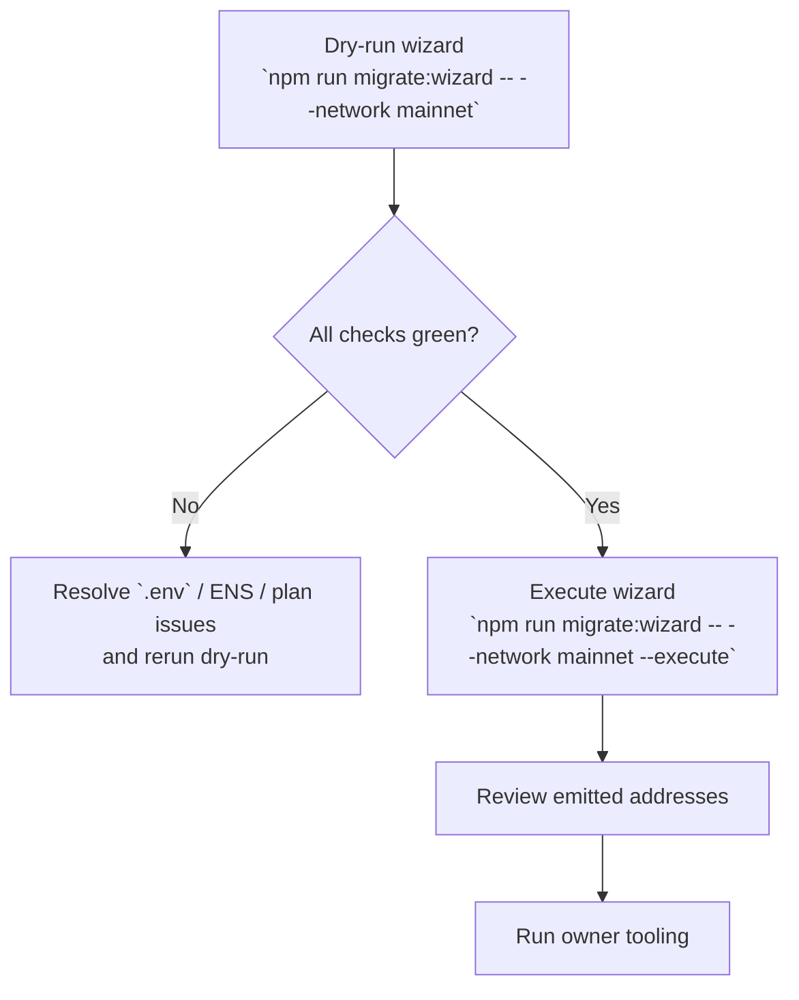

# Non-Technical Mainnet Deployment Runbook (Truffle)

> **Audience:** Operations or business stakeholders who must ship AGIJobs v2 to Ethereum mainnet without deep Solidity expertise.
> **Goal:** Perform a safe, fully verified, institution-grade deployment using the existing Truffle migrations and post-deployment owner tooling.

---

## Deployment subtasks at a glance

1. **Harden the workstation** – confirm hardware wallet custody, reviewer availability, Node.js version, and `.env` hygiene.
2. **Author the deployment plan** – populate `deployment-config/mainnet.json` with governance, ENS roots, and economic overrides that the migrations will enforce automatically.
3. **Prove readiness** – run `npm run deploy:checklist` until every automated preflight (RPC reachability, config validation, migrations present) reports ✅.
4. **Execute migrations** – compile with optimizer, apply Truffle migrations 1–5, and record the emitted module addresses for review.
5. **Validate owner control** – run the post-deployment owner tooling (`npm run owner:health`, `npm run owner:plan`, Safe bundle export) to guarantee upgrade authority and emergency controls.
6. **Document and hand off** – update the operational vault with addresses, pause procedures, and governance next steps.

Each stage is designed to expose a distinct failure mode: configuration drift, RPC connectivity, ENS mis-hashing, or ownership misconfiguration. Treat any warning as a trigger to pause and reassess before continuing.

---

## 1. Safety checklist (print and tick off)

1. ✅ You control a hardware wallet (Ledger, Safe, or similar) funded with >0.5 ETH for gas and protocol bootstrap costs.
2. ✅ A second reviewer is on-call to confirm contract addresses and governance ownership before production traffic is enabled.
3. ✅ You have cloned `https://github.com/MontrealAI/AGIJobsv0` to a secure workstation with Node.js **20.18.1** installed.
4. ✅ The `.env` file is stored in an encrypted volume and never committed to Git.
5. ✅ All commands below are executed from the repository root (`/workspace/AGIJobsv0`).

If any item is unchecked, pause and resolve it before continuing.

---

## 2. Prepare credentials and configuration

| Item | Why it is needed | How to obtain |
| --- | --- | --- |
| `MAINNET_RPC_URL` | Allows Truffle to broadcast transactions | Create an HTTPS endpoint from Infura, Alchemy, or QuickNode |
| `MAINNET_PRIVATE_KEY` | Signs deployment transactions | Export the key from a dedicated deployer wallet; keep < 1 ETH to limit risk |
| `ETHERSCAN_API_KEY` | Enables automatic source-code verification | Generate a key at [Etherscan.io](https://etherscan.io/myapikey) |
| Governance address | Owns every protocol module | Use your multisig / timelock address (e.g., Safe or OZ Timelock) |
| ENS namehash data | Unlocks agent & club registrations | Update `deployment-config/mainnet.json` with the correct ENS roots and hashes |

1. Copy `.env.example` to `.env` and fill in the blanks. For production, **never** store the seed phrase; only the deployer key.
2. Open `deployment-config/mainnet.json` and set:
   - `governance` → your multisig/timelock address (leave blank only for dry runs).
   - `overrides.feePct` / `overrides.burnPct` → integers in percent (e.g., `5` for five percent). Values between `0` and `1` are interpreted as fractional percents (`0.05` → `5`).
   - Optional timing and stake overrides: `commitWindow` / `revealWindow` accept natural-language durations (`"24h"`, `"2 days"`), `minStake` and `jobStake` accept human-readable AGIALPHA amounts (`"1500"`, `"0.5"`).
   - ENS roots under `overrides.ensRoots` (`agentRoot`, `clubRoot`, optional `alphaAgentRoot` / `alphaClubRoot`). Each entry may specify a `name` plus `node`/`hash` (32-byte namehash). Use `npm run namehash:mainnet` after editing names to refresh the hashes.
   - Optional `withTax` boolean flag to disable the tax policy module for test environments.
3. Ensure the AGIALPHA token address in `deployment-config/mainnet.json` matches `config/agialpha.mainnet.json`. The migrations will refuse to continue if they diverge.
4. Ask governance to pre-authorise the deployer wallet if your Safe requires modules/owners to be added.

> ℹ️ ENS hashes must be 32-byte values (starts with `0x` and 64 hex characters). The helper script rewrites them automatically.

---

## 3. Run the automated deployment checklist

The repository ships with a guided validator to catch misconfiguration before any ETH is spent.

```bash
npm install           # install dependencies if you have not already
env DOTENV_PATH=.env npm run deploy:checklist
```

What to expect:

- A console table summarising private key format, RPC reachability, Node.js version, deployment JSON validity, and migration script availability.
- The script exits with `❌` on any fatal issue. Resolve all failures before continuing. Warnings (⚠️) highlight optional items that improve safety (for example, ENS hashes).
- Re-run the checklist until it prints `✅ Deployment checklist passed.`

---

## 4. Execute the Truffle mainnet migration (wizard-first)



1. **Lock down your workstation** (enable VPN, disable screen sharing).
2. Export the governance address so the migration scripts can wire ownership:

   ```bash
   export GOVERNANCE_ADDRESS=0xYourMultiSig
   ```

3. Preview the deployment pipeline without spending gas:

   ```bash
   npm run migrate:wizard -- --network mainnet
   ```

   Confirm the table shows `PASS`/`WARN` only. `FAIL` indicates missing configuration—fix the environment, ENS hashes, or deployment plan before proceeding.

4. Run the deployment. This compiles via Hardhat (with optimizer/viaIR), executes every Truffle migration, and verifies wiring afterwards. The wizard wraps the same commands and prints each step before execution.

   ```bash
   npm run migrate:wizard -- --network mainnet --execute
   ```

   What the script does:

   - `npm run compile:mainnet` – generates constants, compiles Solidity 0.8.25 with optimizer enabled.
   - `truffle migrate --network mainnet --reset` – deploys Deployer + modules and applies migrations 1–5, consuming overrides from `deployment-config/mainnet.json` (governance, fee/burn percentages, stake floors, timing windows, ENS roots).
   - `npm run wire:verify` – runs the health-check harness ensuring every module is connected and owner privileges are intact.
   - `npx truffle run verify Deployer --network mainnet` – triggers automated Etherscan verification when `ETHERSCAN_API_KEY` is present (the wizard skips this step automatically if the key is absent).

5. Copy the emitted contract addresses from the console output and share them with the reviewer. Store them in your deployment vault (e.g., 1Password Secure Note).

6. Run the optional Etherscan verification again if you skipped automatic verification or need to re-run for additional modules:

   ```bash
   npx truffle run verify Deployer --network mainnet
   ```

   Repeat for additional contracts as needed (StakeManager, JobRegistry, etc.).

---

## 5. Post-deployment owner validation

The platform owner must be able to adjust fees, stakes, and modules immediately. Use the shipped tooling:

```bash
# Summarise every module owner and privileged setter
npm run owner:health

# Generate a governance change plan (CSV) that can be executed via Safe or OZ timelock
npm run owner:plan > owner-plan.csv

# Export a Safe Transaction Builder bundle for multisig execution
npm run owner:plan:safe

# Optional guided wizard to enact common changes (stake floor, fee %, ENS registrars)
npm run owner:wizard
```

Review the CSV with your governance team and store it in the same vault as the deployment report.

Upload the generated `owner-safe-bundle.json` to the [Safe Transaction Builder](https://app.safe.global/transactions/builder)
interface when your multisig needs to batch the updates without writing calldata manually.

---

## 6. Operational hand-off

1. Update the production runbook with:
   - Contract addresses.
   - `SystemPause` account (acts as central switch for emergencies).
   - Pauser accounts (`StakeManager`, `SystemPause`).
2. Fund the `StakeManager` treasury wallet as required for slashing distribution.
3. Notify platform operators that the system is live.
4. Schedule the first governance meeting to ratify economics (fees, burn %, stake requirements).

---

## 7. Emergency back-out procedure

- If a migration step reverts, **do not** retry immediately. Capture the error, re-run `npm run deploy:checklist`, and fix the cause offline.
- If ownership is incorrect after deployment, use `SystemPause` to freeze the system:

  ```bash
  npx hardhat run scripts/v2/updateSystemPause.ts --network mainnet --pause
  ```

- Coordinate with governance to execute the generated `owner-plan.csv` transactions that re-assign ownership.

---

## 8. Quick reference command palette

| Scenario | Command |
| --- | --- |
| Re-run checklist after editing `.env` or `deployment-config/mainnet.json` | `npm run deploy:checklist` |
| Dry-run deployment on Sepolia (uses `deployment-config/sepolia.json`) | `npm run migrate:sepolia` |
| Verify wiring post-upgrade | `npm run wire:verify` |
| Inspect module ownership | `npm run owner:health` |
| Update economics | `npm run owner:wizard` |
| Produce Safe bundle for multisig | `npm run owner:plan:safe` |
| Pause the system | `npx hardhat run scripts/v2/updateSystemPause.ts --network mainnet --pause` |

Keep this cheat-sheet near the operations console. Every command is safe to run multiple times and produces deterministic output when the environment is configured correctly.

---

## 9. Support

- **Security contact:** see [`SECURITY.md`](../../SECURITY.md) for responsible disclosure.
- **Operational docs:** the `docs/` folder contains module-level guides (`stake-manager-configuration.md`, `owner-control-playbook.md`, etc.).
- **CI health:** GitHub Actions workflow `CI` runs linting, unit tests, Slither, and Echidna smoke tests. Monitor the badge in the repository README to confirm the main branch is green before deploying.

Stay disciplined, keep an audit trail, and treat every mainnet deployment as a regulated change control event.
