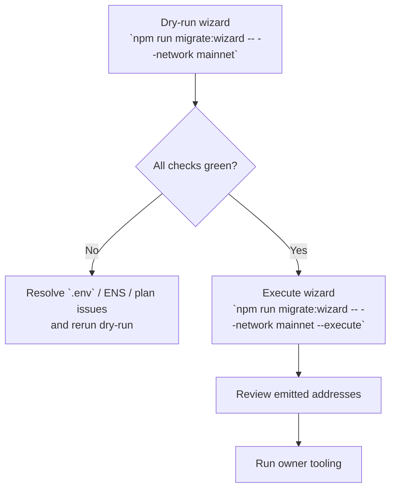

# Deployment guide for nontechnical coordinators

**Your job is to approve a clear plan and check the result.** A qualified operator performs the contract transactions. Begin with the [current readiness report](readiness.md) and the [current Hardhat deployment guide](../deployment-v2-agialpha.md).

The current publication is a source prerelease. A green local demonstration is not a live launch approval. The signing key, dependency findings, independent security review and commissioning requirements must be cleared first.

## The six checkpoints

1. **Try it locally.** The operator runs `npm ci`, `npm run compile` and `npm run deploy:local`. No real wallet or funds are needed. Ask to see the JSON report.
2. **Review one plan.** Confirm the network, token, governance address, ENS roots, fees, stakes, tax wording and launch limits. These belong in one reviewed JSON file. Never send private keys through a document or chat.
3. **Inspect before spending.** `npm run deploy:plan` produces a read-only report. Ask the operator to explain every blocker. Offline inspection cannot verify a blockchain.
4. **Deploy while paused.** After approvals, the operator uses the staged Hardhat command from the current guide. It records transactions and keeps the eight managed modules paused through handoff.
5. **Check governance.** Compare the real owners and pending acceptances with the report. Governance owns SystemPause; SystemPause owns the eight operational modules. Do not request a blanket transfer of every module to a wallet.
6. **Commission and authorize opening.** Verify real workers, independent review, settlement, monitoring and emergency recovery before governance unpauses. Keep the signed review and receipts together.

## What to ask for

| Evidence | What you should see |
| --- | --- |
| Source | Exact release tag and commit; valid production signatures when commissioning |
| Checks | CI for that exact commit, contract sizes, dependency audit and security review |
| Plan | Correct network/token, approved economics and real addresses |
| Deployment report | Coordinator, configuration hash, transaction hashes, actual module addresses and all eight pause states |
| Ownership | Correct SystemPause/governance topology and completed two-step acceptances |
| Explorer | Verified source and constructor arguments for controllers and implementations |
| Recovery | A tested procedure that retains earlier evidence and reconciles uncertain transactions |

## If something stops

Keep the report. Do not ask the operator to rerun the entire deployment blindly: transactions may already have succeeded. Resume using the same source, configuration and coordinator with a new report filename, following [the recovery steps](../deployment-v2-agialpha.md#5-recover-without-losing-evidence).

There is no universal fixed ETH budget. Costs depend on chain conditions and the reviewed transaction set. A restart is not an instruction to unpause.

## Earlier Truffle instructions

The older Truffle workflow is retained only as a historical reference in [the CLI archive](../deploying-agijobs-v2-truffle-cli.md). It is not the recommended path for a new deployment. Do not mix its constructor lists or ownership assumptions with the current staged contracts.

## Preserved historical diagrams

These diagrams retain the repository’s original architectural record. Any commands inside them describe the historical workflow; use the current Hardhat guide above for execution.

```mermaid
flowchart TD
    A[Dry-run wizard\n`npm run migrate:wizard -- --network mainnet`] --> B{All checks green?}
    B -- No --> C[Resolve `.env` / ENS / plan issues\nand rerun dry-run]
    B -- Yes --> D[Execute wizard\n`npm run migrate:wizard -- --network mainnet --execute`]
    D --> E[Review emitted addresses]
    E --> F[Run owner tooling]
```
