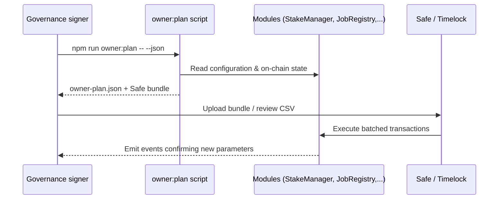

# AGIJobs v2 Truffle Mainnet Blueprint (Non-Technical Edition)

> **Purpose:** Provide an operations-ready, zero-assumption deployment and owner-control playbook for launching AGIJobs v2 on Ethereum mainnet using Truffle, including interactive scripts and visual checklists that a non-technical coordinator can follow without improvisation.
>
> **Companion tooling:** `npm run migrate:wizard`, `npm run owner:plan`, `npm run owner:dashboard`, and the owner configuration plans enhanced in this release.

---

## 1. Deployment storyboard (at a glance)

```mermaid
flowchart TD
    subgraph Prep[Preparation]
        A[Clone repo \n & install deps]
        B[Populate .env \n (RPC, key, governance)]
        C[Review deployment-config/mainnet.json]
    end
    subgraph DryRun[Dry-run & Checklist]
        D[npm run deploy:checklist]
        E[npm run migrate:wizard -- --network mainnet]
    end
    subgraph Execute[Execute & Verify]
        F[npm run migrate:wizard -- --network mainnet --execute]
        G[npm run wire:verify]
        H[npm run owner:dashboard]
    end
    subgraph Control[Owner Control]
        I[npm run owner:plan -- --out plan.json]
        J[Review Safe bundle / CSV]
        K[Execute via Safe or Timelock]
    end

    A --> B --> C --> D --> E --> F --> G --> H --> I --> J --> K
```

Keep this storyboard near the console. Every command is idempotent and prints a status banner before doing anything potentially irreversible.

---

## 2. Zero-assumption prerequisites

| Item                                                                                                      | Why it matters                                         | How to confirm                                            |
| --------------------------------------------------------------------------------------------------------- | ------------------------------------------------------ | --------------------------------------------------------- |
| Hardware signer with ≥0.5 ETH                                                                             | Funds deployment and emergency pause ops               | Unlock device, verify balance on Etherscan                |
| `.env` populated with `MAINNET_RPC_URL`, `MAINNET_PRIVATE_KEY`, `GOVERNANCE_ADDRESS`, `ETHERSCAN_API_KEY` | Feeds Truffle, verification, and owner tooling         | Run `grep -v '^#' .env` and ensure no blanks              |
| `deployment-config/mainnet.json` reviewed                                                                 | Aligns ENS roots, economic overrides, governance owner | Open file in editor; ensure addresses match change ticket |
| `config/agialpha.json` modules blank/known                                                                | Guarantees migrations write deterministic addresses    | Confirm each module entry is `0x000…` before deploying    |
| Secondary reviewer on-call                                                                                | Required for institutional change-control              | Book a video bridge before starting                       |

---

## 3. Launch procedure (non-technical walkthrough)

1. **Dry-run the entire pipeline.**

   ```bash
   env DOTENV_PATH=.env npm run deploy:checklist
   npm run migrate:wizard -- --network mainnet
   ```

   - ✅ Expect a green table summarising RPC reachability, config diffs, ENS hashes, and migration availability.
   - ⚠️ Any `WARN` row indicates an optional improvement (e.g., ENS aliases missing). `FAIL` means stop and remediate.

2. **Execute the mainnet deployment when reviewers approve.**

   ```bash
   npm run migrate:wizard -- --network mainnet --execute
   ```

   The wizard handles: Hardhat compilation (`viaIR`), Truffle migrations 1–5, wiring verification, and Etherscan submission (if the API key is present).

3. **Capture artefacts immediately.**

   - `docs/deployment-addresses.json` – generated automatically by migration 3; upload to the change ticket.
   - Console output – copy/paste into the deployment log (contains tx hashes and final module map).

4. **Validate post-deployment health.**
   ```bash
   npm run owner:dashboard
   ```
   The dashboard prints the governance owner and key parameters for StakeManager, FeePool, JobRegistry, ValidationModule, PlatformRegistry, TaxPolicy, and SystemPause.

---

## 4. Owner control plan – now covering every governance-critical module

The improved owner plan generator inspects and proposes transactions for:

- `JobRegistry`
- `StakeManager`
- `FeePool`
- `PlatformRegistry`
- `PlatformIncentives`
- `TaxPolicy`
- `IdentityRegistry`
- `RewardEngineMB`
- `Thermostat`

### 4.1 Generate the change set

```bash
npm run owner:plan -- --json --out owner-plan.json --safe owner-safe-bundle.json
```

- `owner-plan.json` – machine-readable summary for audits and offline review.
- `owner-safe-bundle.json` – ready to import into Safe Transaction Builder for multisig execution.
- The JSON now includes alias updates, tax acknowledger permissions, thermodynamic levers (reward shares, PID controls), and identity allowlists derived directly from the config files under `config/`.

### 4.2 Visualising the owner actions



Use the generated CSV to brief compliance teams; every row includes the module, function, previous value, and new value.

---

## 5. Identity Registry checklist (new in this release)

The plan generator now inspects ENS roots, aliases, Merkle roots, agent allowlists, agent types, and profile URIs. Keep the following table handy when reviewing:

| Config file key                                | On-chain setter                                                   | Notes                                                        |
| ---------------------------------------------- | ----------------------------------------------------------------- | ------------------------------------------------------------ |
| `config/identity-registry.json → ens.registry` | `setENS(address)`                                                 | Must be the canonical ENS registry; zero address is rejected |
| `ens.agentRoot.node`                           | `setAgentRootNode(bytes32)`                                       | Provide the ENS namehash (e.g., `agent.agi.eth`)             |
| `ens.agentRoot.aliases` & `ens.agentAliases`   | `add/removeAgentRootNodeAlias(bytes32)`                           | The plan adds/removes entries to match config                |
| `merkle.agent` / `merkle.validator`            | `setAgentMerkleRoot(bytes32)` / `setValidatorMerkleRoot(bytes32)` | Accepts 32-byte hex strings                                  |
| `additionalAgents` & `additionalValidators`    | `add/removeAdditionalAgent`, `add/removeAdditionalValidator`      | Boolean map: `true` grants allowlist, `false` revokes        |
| `agentTypes`                                   | `setAgentType(address,uint8)`                                     | Values: `0` Human, `1` AI                                    |
| `agentProfiles`                                | `setAgentProfileURI(address,string)`                              | Empty string clears metadata                                 |

Before executing the plan, open `config/identity-registry.json` to ensure every override is deliberate. The script will highlight additions and removals in the console.

---

## 6. Hand-off artefact bundle

After execution, archive the following in your change ticket:

1. `docs/deployment-addresses.json`
2. `owner-plan.json`
3. `owner-safe-bundle.json`
4. Console transcript from `npm run owner:dashboard`
5. Signed approvals from reviewers (screenshots or exported Safe transaction)

Store the bundle in your institution’s vault alongside emergency pause instructions.

---

## 7. Emergency response playbook (condensed)

```mermaid
gantt
    title First 15 minutes after discovering a misconfiguration
    dateFormat  mm-dd HH:MM
    axisFormat  %H:%M
    section Detection
    Alert raised           :active, 00-00 00:00, 5m
    section Containment
    Pause SystemPause      :crit, 00-00 00:05, 2m
    Notify operators       :after Pause SystemPause, 3m
    section Remediation
    Execute owner-plan fix :after Notify operators, 5m
    Verify with dashboard  :after Execute owner-plan fix, 5m
```

Commands to keep on a sticky note:

```bash
# Freeze all modules via SystemPause
eval "$(npx hardhat run scripts/v2/updateSystemPause.ts --network mainnet --pause)"

# Re-apply governance-approved configuration
npm run owner:plan -- --execute --out executed-plan.json
```

Document the block number at which the pause happened and share it with stakeholders.

---

## 8. Cross-check matrix

| Step                | Tooling                                                 | Evidence                   |
| ------------------- | ------------------------------------------------------- | -------------------------- |
| Deployment dry-run  | `npm run migrate:wizard -- --network mainnet`           | Wizard transcript saved    |
| Production deploy   | `npm run migrate:wizard -- --network mainnet --execute` | Tx hashes + addresses JSON |
| Wiring verification | `npm run wire:verify`                                   | Console output captured    |
| Owner authority     | `npm run owner:dashboard`                               | Screenshot or console log  |
| Owner plan          | `npm run owner:plan -- --json`                          | `owner-plan.json` + CSV    |
| Safe bundle import  | Safe Transaction Builder                                | Screenshot of queued batch |

---

## 9. Support and escalation

- **Security issues:** Follow the disclosure process in [`SECURITY.md`](../../SECURITY.md).
- **Operational questions:** Start with `docs/production/institutional-truffle-mainnet-playbook.md` and `docs/production/nontechnical-mainnet-deployment.md`.
- **Change management:** Attach this blueprint and the generated artefacts to every production change request.

Stay disciplined, collect artefacts, and treat every parameter change as a regulated event.
